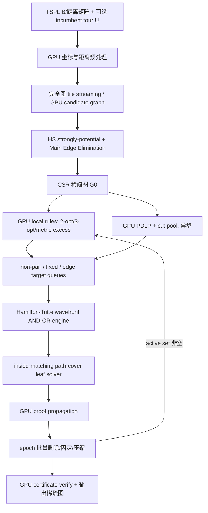

# FGPU-Elim：面向大规模对称 TSP 的全 GPU 边消除、固定与证明搜索框架

> **文档性质**：完整 Method 设计、端到端算法说明、伪代码、数据结构、数值策略、实验方案与一次性实现计划。
> **研究基础**：Hougardy–Schroeder 2014、Cook–Helsgaun–Hougardy–Schroeder 2023、`TSP-code-2014`、`bicobico2/ElimTSP`，以及 NVIDIA cuOpt/PDLP 的 GPU 工程范式。
> **核心约束**：主方法不进行逐任务 CPU 回退；几何判定、图构造、组合证明、局部优化、LP 指导、图压缩与证书生成均在 GPU 上完成。CPU 只负责输入解析、CUDA Graph/Kernel 启动、最终文件写出，以及论文中的 CPU baseline/ablation。

---

## 摘要

本文提出 **FGPU-Elim（Fully GPU-Resident Elimination）**，一个面向大规模对称旅行商问题（TSP）的全 GPU 边消除与固定框架。方法同时吸收两条经典技术路线：

1. Hougardy–Schroeder 2014 的 strongly potential point、Main Edge Elimination、Close Point Elimination、metric excess 与有界深度路径系统搜索；
2. Cook 等 2023 的 nowhere \(k\)-optimality、Hamilton–Tutte witness tree、outside/inside matching 复用、non-pair 与 edge fixing；
3. cuOpt 中 GPU 稀疏线性代数、批处理、混合精度、显存池、活跃集合与多 GPU 调度的工程经验。

FGPU-Elim 不对原 CPU 代码做逐函数 CUDA 翻译，而是把原有“单边、深度优先、递归、提前退出、链表和动态内存”的执行模式重构为：

- 流式完全图或候选图生成；
- 固定长度 SoA 状态池；
- 分桶 wavefront AND–OR 搜索；
- 常量重连表与位集合归约；
- 多输出 inside-matching path-cover 局部求解；
- GPU PDLP 提供并行的 dual guidance 与 Lagrangian 下界；
- 不可变图快照、epoch 化批量更新和 GPU 证书。

本文的一个关键算法重构是：不再针对每个 outside matching 分别调用局部 TSP，而是一次性寻找更短的 **inside path-cover**，并利用预计算的 matching compatibility bitset 同时覆盖大量 path orderings。这样可以把 CPU 代码中串行的 `done[]` 逻辑变成 GPU 上的 map–reduce/bitwise-OR。

数值方面，主方法采用 GPU mixed precision：FP32 负责大部分筛选，边界样本在 GPU 上重算为 FP64 或定向舍入区间；所有最终 \(k\)-opt/path-cover 改进均使用整数距离和 `int64` 精确比较。对于 LP，PDLP 本身可使用 FP32/mixed precision，但最终筛边使用 GPU 上计算的 box-Lagrangian 下界和显式容差。整个主流程不存在 CPU 数值补救路径。

---

## 1. 研究目标与范围

### 1.1 目标

给定一个对称 TSP 实例 \(K_n=(V,E)\)、距离函数 \(d\)，以及可选的已知 tour 上界 \(U\)，目标是构造稀疏图

\[
G'=(V,E'),\qquad E'\subseteq E,
\]

并尽可能给出：

- 可消除边集合 \(E\setminus E'\)；
- 必须固定的边集合 \(E_{\mathrm{fix}}\)；
- 不可能同时出现在最优 tour 中的相邻边对（non-pairs）；
- 每个结论对应的 GPU 证书或可重放 proof trace。

### 1.2 “全 GPU”的定义

本文所说的全 GPU 指：

- 所有随问题规模增长的计算都在 GPU 上执行；
- 不允许“困难边交给 CPU DFS”“边界浮点谓词交给 CPU exact arithmetic”“局部 TSP 失败后调用 CPU Concorde”等回退；
- CPU 只做有限控制工作：读取 TSPLIB、初始化设备、重放 CUDA Graph、读取终止标量、输出结果；
- CPU 版本仅出现在实验对照和 ablation 中。

### 1.3 支持范围

首要支持：

- EUC_2D；
- CEIL_2D；
- 整数对称距离矩阵；
- 稀疏候选图输入；
- 单 GPU 与多 GPU。

对于非欧几何实例，关闭 strongly-potential 几何模块，保留 GPU 1-tree/PDLP、组合消除与 Hamilton–Tutte 搜索。

---

## 2. 从现有设计方案中可直接借鉴的内容

所给设计方案中有六个判断应直接保留，且构成本文架构的主体。

### 2.1 不能“移植”，必须改变执行形态

原代码的瓶颈不是一个单独函数，而是整体执行模型：递归 DFS、频繁提前退出、链表、动态数组、逐实例小矩阵分配和极不均匀任务长度。GPU 版本必须把搜索改造成批量状态扩展和归约。

### 2.2 SoA、零指针、零设备端 malloc

路径系统和 proof state 应使用固定容量、分桶的 Structure-of-Arrays。局部节点、路径偏移、父节点、状态、深度、unresolved ordering bitset 等字段按字段连续存储，避免 AoS 中跨 warp 的 stride 访问。

### 2.3 常量重连表与位掩码覆盖

3-opt、4-opt、5-opt 的重连模板数量小且固定，适合存放在 constant memory。每个 improving move 产生一个 inside matching ID，再查表得到可覆盖的 outside-ordering bitset。GPU 通过 warp/block OR 归约完成覆盖，不再逐 ordering 串行处理。

### 2.4 Hamilton–Tutte 搜索应采用 wavefront AND–OR 传播

Tutte 候选是 OR，固定 Tutte move 的全部 Hamilton replies 是 AND。GPU 应显式存储 F-node、A-node 和父子计数器，使用队列、scan、compaction 和原子状态传播，而不是 device recursion。

### 2.5 不可变图快照与 epoch 批量更新

一轮搜索只读取 \(G_k\)，所有删除、固定和 non-pair 结论写入位图；轮末统一构造 \(G_{k+1}\)。这既提高确定性，也避免证明之间出现循环依赖。

### 2.6 活跃集合、难度分桶与共享内存局部工作集

边删除只影响局部邻域，因此后续 epoch 只重检 active targets。局部距离矩阵应在 block 内构造到 shared memory。任务按路径数、局部节点数、端点度数、unresolved ordering 数和深度分桶。

---

## 3. 对原设计方案的关键修正与扩展

### 3.1 不采用纯层同步 BFS，而采用“分桶 wavefront + 延迟 OR 展开”

纯 BFS 会同时展开所有 Tutte 候选和所有 Hamilton replies，容易导致指数级显存膨胀。本文使用：

- AND replies 批量并行；
- OR 候选按评分排序，先展开 top-\(B\)；
- 当前候选失败后，再把父 F-node 放回候选队列；
- 对 unresolved ordering 很少的状态转入 order-specific queue；
- 对工作量过大的状态不回退 CPU，而是保持 unresolved、增加 GPU budget 或直接保留目标边。

### 3.2 `degree <= 16` 不能作为全局假设

稀疏后平均度通常较小，但局部最大度可能显著高于 16。本文采用度数分桶：

- \(d\le 32\)：每行一个 `uint32_t`；
- \(32<d\le64\)：每行一个 `uint64_t`；
- \(d>64\)：分段 bitset 或压缩合法 pair 列表。

因此 non-pair/reveal 数据结构对高阶节点仍然正确。

### 3.3 局部 Held–Karp 不简单替换成“一个固定 DP”

删除 \(k\) 条路径边后会形成多个带方向片段，目标是构造若干路径而不只是一个回路。本文把局部求解器定义成 **multi-output path-cover solver**：它可以使用模板枚举、bitmask DP、beam/B&B 三种 GPU kernel，但统一输出 inside matching 与改进路径覆盖。最终改进必须由整数成本比较验证。

### 3.4 LP 不作为前置阻塞步骤，但保留为并发 GPU 模块

完全删除 LP 对欧几里得实例可能可行，但会损失非欧实例的通用性，也放弃 reduced-cost/dual information 对困难状态排序的价值。本文将 LP 改为：

- 不阻塞组合消除；
- 在当前稀疏图上异步运行 GPU PDLP；
- 输出 edge score、path-system score 和 box-Lagrangian lower bound；
- dual snapshot 就绪时被组合搜索消费；未就绪时组合搜索继续。

### 3.5 不承诺未经实测的固定加速倍数

完全图有 \(O(n^2)\) 对，空间查询和几何谓词的实际吞吐取决于坐标分布、GPU 架构、候选点检索、分支比例和输出压缩。本文把加速比作为实验指标，不在 Method 中把理论 FLOP 峰值直接换算为 wall-clock 结论。

### 3.6 完整图处理采用 tile streaming，并允许可证明的 tile-level pruning

不物化 \(n(n-1)/2\) 条边。每张 GPU 处理一组上三角 tiles：

1. 在 tile 内生成点对；
2. 查询边中点附近的 potential-point candidates；
3. 执行 HS 快速消除；
4. 仅压缩写出无法证明可消除的边。

若 AABB/几何下界能对整个 tile 形成充分消除条件，则整 tile 跳过；否则逐边计算。近似 candidate-graph 模式可作为高速配置，但必须与完整流式模式分开报告。

---

## 4. 理论基础与统一问题表达

### 4.1 边兼容性

对两条不相邻边 \(pq\) 和 \(xy\)，若

\[
\max\{d(p,x)+d(q,y),\ d(p,y)+d(q,x)\}
< d(p,q)+d(x,y),
\]

则任意同时包含它们的 tour 都存在改进 2-opt，因此二者不相容。

定义布尔谓词：

\[
\operatorname{Compat}(pq,xy)=1
\]

表示尚不能通过该 2-opt 条件证明不相容。

### 4.2 Strongly potential point 与 Main Edge Elimination

对目标边 \(pq\) 和节点 \(r\)，HS-2014 构造两个 covering regions \(R_p,R_q\)，若任何包含 \(pq\) 的最优 tour 在 \(r\) 的两条邻边必须分别落入两侧，则称 \(r\) 对 \(pq\) potential。满足常数时间几何条件的点称 strongly potential。

若找到两个 potential points \(r,s\)，并且对应两个 3-opt 改进下界均严格为正，则 \(pq\) 可消除。GPU 只需找到一对满足条件的 \((r,s)\)，无需枚举全部点。

### 4.3 Path system 与 nowhere \(k\)-optimality

设 \(F\) 是若干节点不相交路径的并：

\[
P_F=\{p_1,\ldots,p_m\}.
\]

任何包含 \(F\) 的 tour 都以某个路径顺序和方向遍历这些路径。路径顺序数量为

\[
N_{\mathrm{out}}(m)=2^{m-1}(m-1)!.
\]

如果每一种 path ordering 都存在一个只删除 \(F\) 中边的改进 \(k\)-opt move，则 \(F\) nowhere \(k\)-optimal，因此与 TSP 最优性不相容。

### 4.4 Hamilton–Tutte AND–OR 语义

- 一个 F-state 表示当前揭示的路径系统；
- Tutte 选择一个节点或路径端点，是 OR 选择；
- 对该节点所有合法 Hamilton reveals 都必须被关闭，是 AND 条件；
- 一个 leaf 被关闭，表示当前 \(F\) 已被证明不相容；
- 根状态被关闭，表示目标边可消除、目标 pair 为 non-pair，或目标边可固定。

### 4.5 Outside matching 与 inside matching

对 \(m\) 条路径的 \(2m\) 个端点，一个 path ordering 对应 outside matching \(O\)，原路径系统与 \(O\) 组成局部 tour。一个改进 tour 删除 \(O\) 后形成 \(m\) 条新路径，其端点配对定义 inside matching \(I\)。若 \(O\cup I\) 在 \(2m\) 个端点上构成单环，则该 inside matching 可以覆盖对应 ordering。

inside perfect matching 数为

\[
N_{\mathrm{in}}(m)=(2m-1)!!.
\]

例如：

| \(m\) | outside orderings | inside matchings | 完整 coverage 表 |
|---:|---:|---:|---:|
| 5 | 384 | 945 | 约 44.3 KiB |
| 6 | 3840 | 10395 | 约 4.76 MiB |

这些表可预计算并常驻 GPU。

---

## 5. 核心新表述：多输出 inside path-cover

### 5.1 定义

设路径系统 \(F\) 的节点集合为 \(V_F\)，路径总成本为 \(c(F)\)。对每一个 inside matching \(I\)，定义

\[
C_F(I)=\min\{c(P):P\text{ 覆盖 }V_F，\ P\text{ 为 }m\text{ 条无交路径，端点匹配为 }I\}.
\]

若不存在这样的路径覆盖，则 \(C_F(I)=+\infty\)。

### 5.2 覆盖定理

令 \(\Omega_m\) 为全部 outside matchings，定义

\[
\operatorname{Cover}(I)=\{O\in\Omega_m:O\cup I\text{ 在端点上形成一个单环}\}.
\]

则有：

\[
F\text{ nowhere optimal}
\iff
\bigcup_{I:C_F(I)<c(F)}\operatorname{Cover}(I)=\Omega_m.
\]

### 5.3 证明要点

- 对固定 outside matching \(O\)，任何比 \(F\cup O\) 更短且保留 \(O\) 的 tour，在删除 \(O\) 后都会得到覆盖 \(V_F\) 的 \(m\) 条路径；其端点配对就是某个 \(I\)，且 \(c(P)<c(F)\)。
- 反过来，若存在更短 path-cover \(P\) 且 \(O\cup I(P)\) 构成单环，则 \(P\cup O\) 是比 \(F\cup O\) 更短的 tour。

### 5.4 GPU 意义

CPU 原逻辑是：

```text
逐个 outside matching O
    求一个局部改进 tour
    提取 inside matching I
    扫描剩余 O 并标记 done
```

FGPU-Elim 改为：

```text
并行枚举/搜索更短 path-cover P
    得到 inside matching I(P)
    killed |= COVERAGE[I(P)]
```

这样最内层成为无依赖的 bitset OR 归约。即使不同线程发现同一个 inside matching，也只需 `atomicMin(best_cost[I], cost)` 或 block 内局部归约。

---

## 6. 端到端 Method 总览



整体算法是一个统一的 GPU epoch loop，而不是若干独立 CPU 程序串联。几何、局部规则、PDLP 与 Hamilton–Tutte 共享同一张设备图、同一套 edge IDs、同一套 alive/fixed/non-pair 位图。

---

## 7. 设备端数据模型

### 7.1 图结构

```cpp
struct DeviceGraph {
    int32_t  n;
    int64_t  m;
    int64_t* row_offsets;       // CSR, n+1
    int32_t* col_indices;       // 2m arcs
    int32_t* arc_edge_id;       // arc -> undirected edge
    int32_t* edge_u;            // m
    int32_t* edge_v;            // m
    int32_t* edge_cost;         // m
    uint32_t* alive_mask;       // edge bitset
    uint32_t* fixed_mask;       // edge bitset
    uint32_t* active_mask;      // target bitset
    uint32_t epoch;
};
```

要求：

- 每个 epoch 内 CSR 不变；
- `alive_mask` 的更新是幂等的；
- 轮末通过 scan+scatter 重建 CSR；
- 边 ID 在 epoch 内稳定，跨 epoch 使用映射表或 persistent global ID。

### 7.2 坐标与距离 oracle

```cpp
struct DeviceMetric {
    MetricType type;            // EUC_2D / CEIL_2D / MATRIX
    int32_t* x;
    int32_t* y;
    int32_t* matrix;
};
```

局部距离不存全矩阵，而是在 block 内把 \(q\le 16\) 或 \(q\le32\) 个局部节点的 \(q\times q\) 距离矩阵构造到 shared memory。

### 7.3 分桶 TaskPool

不能用一个过大的固定结构覆盖所有状态。设置两个主桶：

- `SmallPool`：\(m\le5,q\le16\)，覆盖绝大多数状态；
- `ExtendedPool`：\(m\le6,q\le32\)，处理困难状态。

```cpp
struct FStatePoolView {
    int32_t* global_node;       // [QMAX][capacity], SoA
    int8_t*  nbr0;              // local path adjacency
    int8_t*  nbr1;
    uint8_t* degree_F;
    uint8_t* nlocal;
    uint8_t* npaths;
    uint8_t* nedges_F;
    uint8_t* depth;

    int32_t* target_id;
    uint8_t* target_type;       // EDGE / NONPAIR / FIX
    int32_t* parent_A;
    uint32_t* epoch;
    uint8_t* status;            // OPEN/PROVED/FAILED/CANCELLED

    uint64_t* unresolved;       // [mask_words][capacity]
    int32_t* candidate_cursor;
    int32_t* proof_ref;
};
```

```cpp
struct AStatePoolView {
    int32_t* parent_F;
    int32_t* tutte_vertex;
    int32_t* child_begin;
    int32_t* child_count;
    int32_t* remaining_children;
    uint8_t* status;
};
```

### 7.4 Reveal/non-pair 表

对每个节点，以当前 CSR 邻居位置为局部索引。按度数分桶存储合法邻边对：

```text
d <= 32:  rows32[v][i] 的第 j 位表示 pair(i,j) 仍合法
d <= 64:  rows64[v][i]
d > 64 :  segmented rows 或 compact pair list
```

每次图 compact 后重建局部 neighbor-position mapping。

### 7.5 Matching 常量表

常量或只读数据包括：

- `RECONNECT_3/4/5`；
- `OUTSIDE_MATCHING[m]`；
- `INSIDE_MATCHING[m]`；
- `COVERAGE[m][inside_id][word]`；
- path-system canonicalization 辅助表；
- popcount 分层的 subset index 表。

---

## 8. 全 GPU 数值策略

### 8.1 距离计算

EUC_2D 的最终距离必须是整数。推荐使用 double sqrt 加整数修正：

```cuda
__device__ __forceinline__ int32_t euc2d_exact(
    int32_t x1, int32_t y1, int32_t x2, int32_t y2)
{
    int64_t dx = int64_t(x1) - int64_t(x2);
    int64_t dy = int64_t(y1) - int64_t(y2);
    uint64_t s = uint64_t(dx * dx + dy * dy);

    int64_t r = (int64_t)__dsqrt_rn((double)s);
    // 最近整数：比较 4s 与 (2r±1)^2
    while (uint64_t((2*r-1)*(2*r-1)) > 4*s) --r;
    while (uint64_t((2*r+1)*(2*r+1)) <= 4*s) ++r;
    return (int32_t)r;
}
```

若输入范围可能导致 `4*s` 溢出 `uint64_t`，则使用无乘法溢出的比较函数或限制坐标范围并显式检查。

### 8.2 几何 filtered predicates

主方法无 CPU fallback：

1. FP32 计算区间或带误差界的快速谓词；
2. 距离阈值较近时，在 GPU 上使用 FP64 重新计算；
3. 仍不确定时保留边，而不是送 CPU；
4. 可选 `--aggressive-fp32` 用普通 FP32 和经验容差，作为更快但非严格模式。

对 HS 角度条件尽量消去 `acos`：利用余弦在 \([0,\pi]\) 上单调，将角度比较改成代数式和余弦比较。

### 8.3 组合改进的最终验证

无论候选由 FP32、DP、beam search 还是 PDLP score 产生，最终必须用整数距离验证：

\[
\sum_{e\in E_{\mathrm{add}}}d_e
<
\sum_{e\in E_{\mathrm{del}}}d_e.
\]

这一步使用 `int64_t`，因此局部 move 不会因为浮点误差被误判为改进。

### 8.4 LP 数值策略

PDLP 可使用 FP32/mixed precision，但用于筛边的下界在 GPU 上使用 FP64 reduction、显式 residual margin 和 `nextafter` 向保守方向修正。主程序不调用 CPU crossover。

---

## 9. 完全图流式几何消除

### 9.1 空间预处理

- Morton code 排序或 LBVH；
- GPU kNN/最近邻距离，用于 \(\delta_r\)；
- 每个点的局部邻域索引；
- 可选 tile AABB。

### 9.2 Edge tile

对上三角点对矩阵使用固定 tile，例如 \(B=256\) 或 \(512\)。每个 block/CTA 处理 tile 内多个点对。每条边：

1. 计算 \(d(p,q)\)；
2. 查询边中点附近最多 \(K_r\) 个 potential candidates；
3. 对每个候选 \(r\) 计算 strongly-potential record：可行标志、`min_p`、`min_q`；
4. 在候选记录中寻找一对 \((r,s)\) 满足 Main Edge Elimination；
5. 若找到证明，写 proof code；否则写 survivor。

### 9.3 输出压缩

每个 tile 先在 block 内做 ballot/prefix；再写入 tile survivor buffer。整个 batch 使用 CUB scan 计算全局偏移，避免对每条 survivor 使用全局 atomic append。

---

## 10. GPU 局部规则与 non-pair 构造

### 10.1 2-opt incompatibility

对目标边 \(ab\) 与候选边 \(xy\)，每个 lane 计算两个重连代价并设置 incompatibility bit。

### 10.2 3-opt、Close Point 与 metric excess

对节点 \(r\) 的合法邻边 pair \((rx,ry)\)，并行测试：

\[
d(x,y)+d(p,r)+d(q,r)
<d(p,q)+d(r,x)+d(r,y).
\]

metric excess 可作为额外 fast closure。所有结果直接更新 reveal bit rows。

### 10.3 non-pair

对每个两边路径 \(x-y-z\)，创建 `TARGET_NONPAIR` 根状态。首先执行快速 2/3/4/5-opt 关闭；剩余 pair 进入统一 Hamilton–Tutte 引擎。成功则清除 `reveal_row[y][x,z]`。

### 10.4 fixing

对候选边 \(ab\)，需要证明所有“不使用 \(ab\)”的 a-side 邻边对和 b-side 邻边对组合都不相容。将每个组合构成路径系统根状态，并复用同一 leaf solver 与 AND–OR engine。全部组合关闭后设置 `fixed_mask[ab]`。

---

## 11. k-opt 常量表与 ordering bitset

### 11.1 模板化重连

编译期生成：

```cpp
__constant__ uint8_t RECONNECT3[4][6];
__constant__ uint8_t RECONNECT4[25][8];
__constant__ uint8_t RECONNECT5[208][10];
```

每个模板只描述端点下标，不含分支代码。

### 11.2 线程映射

推荐映射：

- 一个 block 处理一个 F-state；
- warp 处理一个 \(k\)；
- lane 处理不同删除子集；
- warp 按模板循环，constant cache 广播模板；
- 成功 move 计算 inside matching ID；
- block 内对 coverage bitset 做 OR reduction。

### 11.3 目标边约束

为了复现原实现的快速策略，可优先只枚举包含目标边的删除集合。本文同时支持：

- `targeted`：必须删除目标边，速度快；
- `full-F`：允许删除 \(F\) 中任意边，证明能力强。

主方法先 targeted；只有 unresolved mask 仍较大且预算允许时才运行 full-F。两者都在 GPU 上。

---

## 12. Multi-output path-cover 微型求解器

### 12.1 输入与输出

输入：

- 当前 path system \(F\)；
- 局部距离矩阵 \(M\)；
- 当前 unresolved outside-ordering bitset；
- 成本阈值 \(c(F)\)。

输出：

- 若干 `(inside_id, best_cost, reconstruction)`；
- 更新后的 killed/unresolved bitset；
- 可选 proof trace。

### 12.2 删除边后片段模型

选择删除集合 \(D\subseteq F\) 后，原路径系统分裂为若干有方向的 fragments。每个 fragment 有两个开放端点。添加 \(|D|\) 条边后，应重新形成恰好 \(m\) 条路径，不能提前形成封闭环。

### 12.3 GPU 搜索状态

对小规模 fragment 数，用 packed state：

```cpp
struct PackedPCState {
    uint64_t open_mask;
    uint64_t degree_bits;       // 每个端点 0/1
    uint64_t dsu_parent_bits;   // 小 DSU，防止提前成环
    int32_t  cost;
    int32_t  lower_bound;
    int32_t  parent;
    uint16_t added_edge;
};
```

一个 warp 处理一个 state，lane 并行评估可添加边。合法性检查包括：

- 端点度不超过 1；
- 不形成禁止的闭环；
- 最终组件数量为 \(m\)；
- 原始 \(2m\) 个 path endpoints 成为最终路径端点。

### 12.4 下界

可用下界：

\[
LB=\frac12\sum_{u\in\text{open endpoints}}
\min_{v\in A(u)}d(u,v),
\]

并加上：

- component-aware 最近异组件端点；
- 对原始 endpoint 的剩余配对下界；
- 若有 PDLP reduced score，可加入非负 guidance，但不能替代成本验证。

若

\[
c_{\mathrm{partial}}+LB\ge c(F),
\]

则剪枝。

### 12.5 Beam 与 exact micro-DP

- fragment 数较小时运行 exact bitmask DP；
- fragment 数较大时运行 GPU beam/B&B；
- beam 失败仅表示未找到证明，不允许据此消除；
- 一旦 coverage 已覆盖全部 unresolved orderings，立即停止该 F-state。

---

## 13. Hamilton–Tutte wavefront AND–OR 引擎

### 13.1 状态类型

**F-node**：当前 path system，语义是“此状态是否可被证明不相容”。

**A-node**：固定一个 Tutte move，语义是“该 move 的所有 Hamilton replies 是否都可被证明不相容”。

状态规则：

```text
A-node:
    任一 child F-node FAILED  -> A FAILED
    全部 child F-node PROVED  -> A PROVED

F-node:
    leaf closure 成功         -> F PROVED
    任一 A-node PROVED        -> F PROVED
    所有候选 A-node FAILED    -> F FAILED
```

### 13.2 Tutte move 评分

对候选节点 \(v\)，计算：

- 当前合法 reveal 数 `branching(v)`；
- 与目标边中点的距离或图距离；
- 被 fast predicates 立即关闭的比例；
- PDLP/metric score；
- 是否为当前路径端点；
- 历史同类节点成功率。

基础评分：

\[
S(v)=w_1\log(1+\operatorname{branching}(v))
+w_2\operatorname{dist}(v,ab)
-w_3\operatorname{fastCloseRate}(v)
-w_4\operatorname{dualScore}(v).
\]

选择最小的若干候选。评分只影响搜索效率，不影响证明有效性。

### 13.3 Order-specific queue

当 unresolved ordering 数量小于阈值 \(\tau_o\) 时，不再扩展整个 path system，而是针对单个失败 ordering 搜索插入式 Tutte move。一个 Hamilton reveal 对固定 ordering 的插入位置至多为 \(2m\)，可显著降低分支数。

### 13.4 Canonicalization 与去重

每个 child F-state 在入队前规范化：

1. 每条路径选择较小端点在前的方向；
2. 按端点对字典序排序路径；
3. 映射局部节点编号；
4. 对 `(target, path system, unresolved mask, epoch)` 计算 128-bit hash；
5. 在 GPU hash table 中 atomic CAS 去重。

hash 相同但内容不同时必须做短数组二次比较，避免碰撞导致错误复用。

### 13.5 队列分桶

队列键：

\[
(m,q,\deg(v)\text{ bucket},\operatorname{popcount}(unresolved),depth,targetType).
\]

典型队列：

```text
small_m3
small_m4
m5_mask_small
m5_mask_large
extended_m6
order_specific
micro_pc_exact
micro_pc_beam
propagation
```

---

## 14. 异步 GPU PDLP 与 Lagrangian 证书

### 14.1 稀疏 TSP LP

在当前稀疏图上考虑：

\[
\min c^Tx
\]

满足：

\[
Bx=2,
\qquad
Cx\ge b,
\qquad
0\le x\le1.
\]

其中 \(B\) 是 degree constraints，\(C\) 是当前 cut pool。

### 14.2 不要求 PDLP dual 精确可行

取任意 equality multiplier \(\pi\) 和 \(\lambda\ge0\)，令

\[
r=c-B^T\pi-C^T\lambda.
\]

定义 box-Lagrangian 下界：

\[
L(\pi,\lambda)
=2^T\pi+b^T\lambda+
\sum_e\min(0,r_e).
\]

在精确算术下，这是原 LP 的合法下界。其价值在于：PDLP 迭代给出的 multiplier 即使不是精确最优 dual，也可以直接转成下界，只需保证 cut multiplier 的符号并处理数值误差。

### 14.3 边消除、固定和路径系统关闭

强制 \(x_e=1\) 的下界：

\[
L_e^{(1)}=L+\max(0,r_e).
\]

强制 \(x_e=0\) 的下界：

\[
L_e^{(0)}=L+\max(0,-r_e).
\]

强制路径系统 \(F\subseteq T\) 的下界：

\[
L_F=L+\sum_{e\in F}\max(0,r_e).
\]

因此：

\[
L_e^{(1)}>U \Rightarrow e\text{ 可消除},
\]

\[
L_e^{(0)}>U \Rightarrow e\text{ 可固定},
\]

\[
L_F>U \Rightarrow F\text{ 可直接关闭}.
\]

### 14.4 GPU cut separation

主方法不调用 CPU separator。cut pool 来源：

- fractional support graph connected components；
- GPU 并行 BFS/label propagation 产生 subtour cuts；
- 对若干 seed 运行 batched approximate min-cut/push-relabel；
- 只有在 GPU 上重新计算并确认 \(x(\delta(S))<2-\epsilon\) 时才加入 cut。

漏掉 cut 只会使下界较弱，不会使组合证明无效。

### 14.5 并发执行

PDLP 在独立 CUDA stream 或独立 GPU 上运行。每隔固定 major iterations 生成 dual snapshot：

```text
{L, r_e, edge_score, path_score, residual_margin, snapshot_epoch}
```

Hamilton–Tutte 只消费与当前或更早图快照一致的 snapshot。

---

## 15. 不可变 epoch、增量 active set 与图压缩

### 15.1 Epoch 规则

第 \(k\) 轮：

1. 固定读取 \(G_k\)；
2. 所有 proof 基于 \(G_k\)；
3. 删除写 `elim_mask_k`；
4. 固定写 `fix_mask_k`；
5. non-pair 写 `pair_mask_k`；
6. 轮末统一生成 \(G_{k+1}\)。

### 15.2 Active set

删除边 \((x,y)\) 后，把以下对象标记 active：

- 与 \(x,y\) 相邻的边；
- 两跳邻域中的边；
- 经过 \(x,y\) 邻域的 pair；
- 依赖相关 edge IDs 的未完成 target。

若后期 active set 很小，只重放这些 targets。

### 15.3 显存压力处理

主方法不把困难状态转给 CPU。处理顺序：

1. 对根 targets 分 batch；
2. 限制每个 batch 的 state pool；
3. OR 候选延迟展开；
4. 删除 cancelled states 的引用并 compact pool；
5. 多 GPU 分摊 root batches；
6. 若预算耗尽，保留该边，而不是产生不可靠结论。

---

## 16. GPU 证书

### 16.1 证书类型

```text
GEOM_MAIN        两个 strongly-potential points + 不等式值
PAIR_2OPT        两条边 + 两个重连代价
TRIPLE_3OPT      三条删除边 + 三条添加边
KOPT_TEMPLATE    删除集合 + 模板 ID + inside ID
PATH_COVER       添加/删除边 + inside ID + cost
HT_NODE          Tutte move + Hamilton reveal + parent/children
LP_BOX_BOUND     snapshot ID + F 中 edge IDs + L_F
FIX_ROOT         a/b 两侧 pair 组合的子证明
NONPAIR_ROOT     两边路径的子证明
```

### 16.2 扁平 DAG

证书不存指针，使用：

- `node_id`；
- `parent_id`；
- `child_begin/child_count`；
- `proof_type`；
- 紧凑 payload。

重复 F-state 只存一次，形成 DAG。inside matching coverage 用 set-cover 压缩，只保留足以覆盖全部 outside orderings 的 path-cover 集合。

### 16.3 GPU 验证

验证 kernel 重新计算：

- 几何不等式；
- 添加/删除边成本；
- matching compatibility；
- Hamilton replies 是否完整；
- AND/OR 传播；
- LP snapshot 下界。

CPU verifier 只作为论文中的独立对照工具，不是主算法的一部分。

---

## 17. 主要伪代码

### Algorithm 1：FGPU-Elim 总算法

```text
procedure FGPU_ELIM(instance, optional_tour U, params)
    upload metric data to all GPUs
    build GPU spatial index and nearest-neighbor radii delta
    precompute reconnect tables and matching coverage tables

    G <- STREAM_GEOMETRIC_REDUCTION(instance, params)
    build CSR(G), alive/fixed/active masks and reveal tables on GPU

    start asynchronous GPU_PDLP_SERVICE(G, U)

    repeat
        S <- immutable snapshot of G

        FAST_RESULTS <- GPU_LOCAL_RULES(S, active_targets)
        update provisional elim/fix/nonpair masks

        ROOTS <- BUILD_TARGET_ROOTS(S, active_targets, FAST_RESULTS)
        PROOFS <- GPU_HAMILTON_TUTTE(ROOTS, S, latest_compatible_dual_snapshot)

        GPU_VERIFY_NEW_PROOFS(PROOFS, S)
        merge verified elim/fix/nonpair masks

        G_new <- GPU_COMPACT_GRAPH(S, masks)
        active_targets <- MARK_TWO_HOP_ACTIVE(S, G_new, masks)
        G <- G_new

        notify PDLP service of new graph epoch or warm-start update
    until active_targets empty
          or no verified change above stopping threshold
          or global GPU budget exhausted

    stop PDLP service
    GPU_FINAL_VERIFY(all certificates, G)
    output sparse edges, fixed edges, non-pairs and certificates
end procedure
```

### Algorithm 2：完全图流式几何消除

```text
procedure STREAM_GEOMETRIC_REDUCTION(instance, params)
    survivor_buffers <- empty device buffers

    parallel for each upper-triangular tile T assigned to this GPU
        if SAFE_TILE_ELIMINATION_BOUND(T) then
            continue

        parallel for each edge pq in T
            candidates <- K nearest points to midpoint(p,q), excluding p,q
            records <- empty

            for r in candidates do
                rec <- STRONGLY_POTENTIAL_GPU(p,q,r)
                if rec.valid then append rec
            end for

            eliminated <- false
            parallel for pairs (r,s) in records do
                if MAIN_EDGE_INEQUALITIES_GPU(p,q,r,s) then
                    eliminated <- true
                    proof[pq] <- (r,s, inequality margins)
                end if
            end parallel

            if not eliminated then mark pq as survivor
        end parallel

        block/segment scan and compact survivors
    end parallel

    concatenate survivor buffers and build undirected edge arrays
    return graph
end procedure
```

### Algorithm 3：Leaf closure

```text
procedure LEAF_CLOSE(F, graph S, dual snapshot D)
    if F contains an incompatible edge pair then
        return PROVED(PAIR_2OPT)
    end if

    if F satisfies a direct 3-opt / metric-excess predicate then
        return PROVED(TRIPLE_3OPT)
    end if

    if D is valid and L_D(F) > U + lp_margin then
        return PROVED(LP_BOX_BOUND)
    end if

    M <- construct local integer distance matrix in shared memory
    killed <- complement(F.unresolved)  // already covered bits

    for k in {3,4,5} do
        parallel for deletion subset R of size k do
            parallel for reconnect template t in RECONNECT[k] do
                candidate <- APPLY_TEMPLATE(F, R, t)
                if candidate is a valid path cover and
                   integer_cost(candidate) < integer_cost(F) then
                    I <- INSIDE_MATCHING_ID(candidate)
                    killed <- killed OR COVERAGE[F.npaths][I]
                    record candidate proof
                end if
            end parallel
        end parallel

        if killed covers all outside orderings then
            return PROVED(KOPT_TEMPLATE proofs)
        end if
    end for

    unresolved <- ALL_ORDERINGS minus killed

    if popcount(unresolved) <= order_specific_threshold then
        result <- ORDER_SPECIFIC_GPU_SEARCH(F, unresolved, M)
    else
        result <- MULTI_OUTPUT_PATH_COVER_GPU(F, unresolved, M)
    end if

    update unresolved using result.inside_matchings
    if unresolved is empty then
        return PROVED(result proofs)
    else
        return OPEN(updated unresolved)
    end if
end procedure
```

### Algorithm 4：Hamilton–Tutte wavefront

```text
procedure GPU_HAMILTON_TUTTE(root_states, graph S, dual snapshot D)
    Q_leaf <- root_states
    Q_rank, Q_count, Q_expand, Q_prop <- empty

    while some queue nonempty and budget remains do
        parallel process Q_leaf:
            result <- LEAF_CLOSE(F, S, D)
            if result == PROVED then
                status[F] <- PROVED
                enqueue parent_A(F) into Q_prop
            else if complexity threshold exceeded then
                status[F] <- FAILED
                enqueue parent_A(F) into Q_prop
            else
                canonicalize and enqueue F into Q_rank
            end if

        parallel process Q_rank:
            candidates <- SCORE_TUTTE_CANDIDATES(F, S)
            select next top-B untried candidates
            create A-nodes and enqueue into Q_count

        parallel process Q_count:
            count legal Hamilton reveals for each A-node
            exclusive-scan counts to allocate child ranges
            enqueue A-nodes into Q_expand

        parallel process Q_expand:
            enumerate all legal reveals
            create canonical child F-states
            deduplicate child states
            initialize A.remaining_children
            enqueue new child F-states into appropriate Q_leaf bucket

        parallel process Q_prop:
            if child F is FAILED then
                atomically set parent A to FAILED
                notify parent F
            else if child F is PROVED then
                if atomicSub(A.remaining_children,1) == 1 then
                    set A to PROVED
                    atomically set parent F to PROVED
                    cancel sibling A-nodes lazily by epoch/status
                    propagate upward
                end if
            end if

            if A FAILED then
                if parent F has untried Tutte candidates then
                    enqueue parent F into Q_rank
                else if every candidate failed then
                    set parent F to FAILED and propagate upward
                end if
            end if
    end while

    unresolved roots are retained, never declared eliminated
    return statuses and proof references
end procedure
```

### Algorithm 5：Multi-output path-cover

```text
procedure MULTI_OUTPUT_PATH_COVER_GPU(F, unresolved, M)
    best_cost[I] <- +infinity for all relevant inside matchings I
    proof_ref[I] <- null

    generate promising deletion sets D using long-edge order,
        target-edge priority, and lower-bound screening

    parallel for each deletion set D do
        fragments <- SPLIT_PATH_SYSTEM(F, D)

        if fragment_count <= exact_limit then
            solutions <- BITMASK_PATH_COVER_DP(fragments, M, cost(F))
        else
            solutions <- WARP_BEAM_BNB(fragments, M, cost(F))
        end if

        for each complete path cover P in solutions do
            if integer_cost(P) < integer_cost(F) then
                I <- inside_matching_id(P)
                atomicMin(best_cost[I], integer_cost(P))
                store reconstruction for winning value
            end if
        end for
    end parallel

    killed <- zero bitset
    parallel for each I with best_cost[I] < cost(F) do
        killed <- killed OR COVERAGE[F.npaths][I]
    end parallel

    return killed, selected proofs
end procedure
```

### Algorithm 6：GPU PDLP snapshot 与 box-Lagrangian

```text
procedure GPU_PDLP_SERVICE(initial_graph G, upper_bound U)
    initialize sparse LP on G
    initialize cut pool and PDLP warm start

    while service not stopped do
        run a batch of PDHG/PDLP iterations on GPU

        if separation interval reached then
            x <- current primal iterate
            cuts <- GPU_SUBTOUR_SEPARATION(x, G)
            append verified cuts and warm-start PDLP
        end if

        if snapshot interval reached then
            (pi, lambda) <- current multiplier estimates
            lambda <- max(lambda, 0)
            r <- c - B^T*pi - C^T*lambda       // cuSPARSE
            L <- 2^T*pi + b^T*lambda + sum(min(0,r))
            L_safe <- CONSERVATIVE_GPU_CORRECTION(L, residuals)
            publish snapshot {epoch, L_safe, r, residual_margin}
        end if

        if graph epoch changed then
            remap surviving variables/cuts and warm-start
        end if
    end while
end procedure
```

### Algorithm 7：Epoch 图压缩

```text
procedure GPU_COMPACT_GRAPH(S, masks)
    keep[e] <- alive_S[e]
               and not verified_eliminated[e]

    edge_offsets <- exclusive_scan(keep)
    scatter surviving edge_u, edge_v, cost and global_id

    count new degrees with atomics or sort-reduce
    row_offsets <- exclusive_scan(degrees)
    scatter arcs and sort each adjacency segment

    apply verified fixed bits
    rebuild neighbor-position maps and reveal bit rows
    return new immutable graph snapshot
end procedure
```

---

## 18. Kernel 映射建议

| Kernel | GPU 粒度 | 主要存储 | 主要原语 |
|---|---|---|---|
| edge tile generation | CTA/tile | registers + global | grid-stride loop |
| strongly potential | thread/edge-candidate | registers | FP32/FP64 filtered predicate |
| Main Edge pair test | warp/edge | shared candidate records | ballot/any |
| local distance matrix | block/F-state | shared memory | cooperative fill |
| 3/4/5-opt | block/F-state | shared M + constant templates | warp reduce/OR |
| reveal count | warp/Tutte candidate | read-only bit rows | popcount/ffs |
| child expansion | CTA/A-node | state pool | scan/scatter |
| proof propagation | thread/event | global status | atomicCAS/atomicSub |
| canonical hash | warp/F-state | registers/shared | 128-bit hash + CAS |
| path-cover exact DP | block/deletion set | shared DP | layered synchronization |
| path-cover beam/B&B | warp/state | global pool | ballot/top-k |
| LP SpMV | library | CSR | cuSPARSE/cuOpt PDLP |
| graph compaction | edge/arc | global | CUB scan/select |
| certificate verify | proof node | read-only proof | map/reduce |

---

## 19. 多 GPU 设计

### 19.1 完全图 tiles

按 tile ID 静态划分，避免重复计算。survivors 以 global edge pair 编号合并。

### 19.2 组合搜索

每张 GPU 复制当前稀疏图，按 root target 分区。每个 epoch 末：

- NCCL AllReduce/AllGather 合并 elim/fix bitmaps；
- 合并 non-pair updates；
- 每张 GPU 独立重建相同 CSR；
- 通过确定性排序保证快照一致。

困难 root batches 可在 epoch 边界重新分配。主方法不要求细粒度跨 GPU state stealing；若使用 NVSHMEM，可进一步实现 device-resident work stealing，但不作为正确性依赖。

### 19.3 LP 资源分配

两种设备内并发方式均保持全 GPU：

- 一张 GPU 主要运行 PDLP，其余 GPU 运行组合搜索；
- 或在每张 GPU 上通过低优先级 stream 运行 PDLP shard/SpMV，与搜索并发。

公开 cuOpt API 的多 GPU 能力随版本变化，工程上应 pin 一个具体 commit，并把 PDLP 封装在独立 adapter 中。

---

## 20. 复杂度与显存

设最终稀疏图边数为 \(m_G\)，平均度为 \(\bar d\)，Hamilton–Tutte 实际产生的 F-states 为 \(T_F\)。

### 20.1 完全图几何

- 时间：最坏 \(O(n^2K_r)\)；
- 显存：\(O(n+m_G)\)，不保存完整图；
- 并行度：\(O(n^2)\) edge tasks。

### 20.2 局部规则

近似工作量取决于 degree：

\[
O\!\left(\sum_{ab\in E} K_{cd}\,d(c)^2d(d)^2\right),
\]

但 GPU 将 pair product 分摊到 lane/warp，且大量 pair 在早期谓词中关闭。

### 20.3 Hamilton–Tutte

最坏仍指数级，实际由以下参数控制：

- \(m\le P_{\max}\)；
- \(|F|\le E_{\max}\)；
- OR beam 宽度；
- per-root work budget；
- non-pair 与 leaf closure 强度；
- state dedup。

显存主项约为：

\[
T_F\times\text{bytesPerState}.
\]

若每个 small state 约 128–192 B，500 万 states 约占 0.6–1.0 GB；proof payload 和 hash table 另计。实际实现应通过 profile 确认。

### 20.4 Matching 表

\(m\le6\) 时 coverage 表不足 5 MiB，可常驻每张 GPU。

---

## 21. 一次性完整实现计划

本计划不采用“先做 MVP、再逐阶段补齐”的交付方式。第一个正式目标就是一个端到端可运行的全 GPU 程序；各工作包并行开发，并通过固定接口在同一代码库集成。

### 21.1 最终可执行程序

```bash
fgpu-elim \
  --instance instance.tsp \
  --tour incumbent.tour \
  --gpus 0,1,2,3 \
  --numeric mixed-safe \
  --max-paths 6 \
  --max-local-nodes 32 \
  --enable-pdlp \
  --certificate out.fgcert \
  --edges out.edg \
  --fixed out.fix \
  --nonpairs out.np
```

### 21.2 代码结构

```text
fgpu-elim/
├── CMakeLists.txt
├── cmake/
├── include/fgpu/
│   ├── metric.cuh
│   ├── graph.cuh
│   ├── task_pool.cuh
│   ├── matching_tables.cuh
│   ├── proof.cuh
│   └── config.hpp
├── src/
│   ├── io/
│   ├── runtime/          # RMM, streams, CUDA Graph, errors
│   ├── metric/           # exact distance, spatial index
│   ├── geometry/         # strongly potential, Main Edge
│   ├── graph/            # CSR, bitsets, compaction, active set
│   ├── local_rules/      # 2/3-opt, metric excess, non-pair
│   ├── matching/         # outside/inside tables, coverage
│   ├── hamilton_tutte/   # F/A states, queues, propagation
│   ├── path_cover/       # templates, DP, beam/B&B
│   ├── pdlp/             # cuOpt adapter, cuts, box bound
│   ├── multigpu/         # NCCL synchronization
│   ├── certificate/      # encode, GPU verify
│   └── app/
├── tools/
│   ├── generate_reconnect_tables.py
│   ├── generate_matching_tables.py
│   └── convert_certificate.py
├── tests/
├── benchmarks/
└── third_party/
```

### 21.3 并行工作包与接口

| 工作包 | 必须交付 | 与其他模块的接口 | 完成判据 |
|---|---|---|---|
| Runtime | RMM pool、stream、CUDA Graph、错误处理 | 所有模块 | 无 device malloc；可重复运行无泄漏 |
| Metric | EUC_2D/CEIL_2D/MATRIX | geometry、leaf solver | 与 TSPLIB 距离逐边一致 |
| Graph | CSR、stable edge ID、bitset、compact | 全部 | epoch 重建确定性一致 |
| Geometry | strongly potential/Main Edge | initial graph | 小实例逐边 proof 可重算 |
| Local rules | 2/3-opt、Close Point、metric excess | reveal/leaf | 整数改进验证通过 |
| Matching | inside/outside 编号与 coverage | leaf/path-cover | 全表组合检查通过 |
| HT Engine | F/A pools、queues、propagation | local rules/path-cover | AND–OR 单元测试覆盖成功/失败/取消 |
| Path-cover | template、exact DP、beam/B&B | leaf | 输出路径覆盖合法且成本更低 |
| PDLP | sparse LP、cut pool、box bound | target rank/leaf | GPU 重算下界与残差检查通过 |
| Certificate | flat DAG、GPU verifier | 所有 proof | 重新验证后结果逐位一致 |
| Multi-GPU | tile partition、bitmap merge | graph/runtime | 1/2/4/8 GPU 输出一致 |
| Evaluation | benchmark、profiling、CPU baseline | 全部 | 自动生成论文表格原始数据 |

### 21.4 统一集成契约

所有证明模块只返回三态：

```text
PROVED      已有可重放证据，可删除/固定/关闭
OPEN        尚未证明，可继续扩展
FAILED      在当前候选/预算下无法证明；不能删除
```

任何启发式、近似 DP、FP32 判定或 PDLP score 均不能直接返回 `PROVED`，除非附带可在 GPU 上重新验证的局部不等式、合法 path-cover 或下界。

### 21.5 Definition of Done

第一个正式版本同时满足：

1. 单命令从 TSPLIB 输入运行到 `.edg/.fix/.np/.fgcert` 输出；
2. 主路径无 CPU per-edge/per-state 回调；
3. 支持至少一个 100k 级 EUC_2D 实例；
4. 支持单 GPU 和至少 4 GPU；
5. 所有消除/固定结论通过 GPU verifier；
6. 已知最优 tour 边回归测试无错误消除；
7. 可对照运行原 2014/2023 CPU 程序；
8. Nsight Systems 中主要运行时间位于 GPU kernel/cuSPARSE/NCCL；
9. 显存达到上限时保留 unresolved target，不崩溃、不转 CPU；
10. 同硬件、同参数、同输入输出逐位可复现。

---

## 22. 实验设计

### 22.1 数据集

- TSPLIB 中 EUC_2D/CEIL_2D 大实例；
- pcb3038、fnl4461、fl3795、rl5915、d15112、d18512；
- pla33810、pla85900；
- E100k.0、mona-lisa100k、usa115475；
- 随机 EUC_2D：\(n=100,1000,10000,100000\)；
- 非欧或显式距离矩阵实例，用于验证无几何模块时的通用性。

### 22.2 主指标

- wall-clock；
- GPU-seconds / GPU-hours；
- 峰值显存；
- edges/\(n\)；
- fixed/\(n\)；
- non-pair ratio；
- proof states/s；
- path-cover candidates/s；
- PDLP iterations/s 与 gap；
- certificate size 与 GPU verification time；
- 多 GPU strong/weak scaling；
- 已知最优 tour 边错误消除数。

### 22.3 CPU baselines

CPU 仅作为对照：

- TSP-code-2014 Step 1/2/3；
- ElimTSP `KH-elim`；
- ElimTSP full `elim`；
- 原 `cc_heldkarp.c`；
- Concorde reduced-cost preprocessing；
- cuOpt/其他 LP 配置的独立对照。

### 22.4 Ablation

| Ablation | 目的 |
|---|---|
| 去掉 HS 几何 | 测量完全依赖 LP/组合搜索的代价 |
| 去掉 non-pair | 测量 reveal bitset 的分支缩减 |
| outside-by-outside 替代 inside path-cover | 验证核心重构收益 |
| CPU Held–Karp B&B 替代 GPU path-cover | 对照局部求解器 |
| CPU DFS 替代 GPU wavefront | 对照执行形态 |
| 无 state canonicalization | 测量重复状态比例 |
| 无 order-specific queue | 测量小 unresolved mask 优化 |
| 无 PDLP | 测量 LP guidance/leaf bound 的增益 |
| FP32-only / mixed-safe / FP64 | 测量速度、proof 数和数值稳定性 |
| 单 GPU / 多 GPU | 测量扩展性 |

### 22.5 正确性与误差报告

主论文应分别报告：

- `mixed-safe`：GPU FP32 filter + GPU FP64/区间边界重算；
- `aggressive-fp32`：允许较小数值风险；
- 所有模式的 known-tour violation count；
- 不把“未发现错误”表述为严格数学保证；
- 对 exact integer move verification 与近似几何/LP 判定分别统计。

---

## 23. 风险与处理

| 风险 | 后果 | 全 GPU 处理方式 |
|---|---|---|
| 完全图 pair 数过大 | 初始扫描时间长 | 多 GPU tiles、空间排序、可证明 tile pruning、候选模式单独报告 |
| Wavefront 状态爆炸 | 显存耗尽 | 延迟 OR、root batching、state compact、budget 后保留边 |
| 高阶节点 reveal 太多 | 分支因子大 | degree bucket、non-pair、candidate rank、order-specific search |
| Path-cover 长尾 | 少量状态很慢 | exact/beam 分桶、coverage early-stop、只保留未证明边 |
| FP32 几何误差 | 错误 potential 判断 | GPU FP64/区间重算与 margin；无 CPU 回退 |
| PDLP 近似 | 下界不可靠 | box-Lagrangian 重算、residual margin、只消费兼容 snapshot |
| hash 碰撞 | 错误状态复用 | 128-bit hash + 内容二次比较 |
| 证书过大 | I/O 和验证慢 | DAG、模板 ID、inside set-cover、GPU/GDS 流式输出 |
| 多 GPU 不均衡 | 扩展性差 | root 难度预测、epoch 边界重分配、粗粒度 stealing |

---

## 24. 预期研究贡献

FGPU-Elim 的潜在论文贡献不只是“CUDA 加速旧代码”，而是以下算法与系统创新：

1. **Hamilton–Tutte 的 GPU wavefront AND–OR 表达**；
2. **outside-ordering 到 inside path-cover 的多输出重构**；
3. **常量重连模板与 matching coverage bitset 的并行闭包**；
4. **2014 几何 potential 证明与 2023 witness 搜索的统一设备图框架**；
5. **PDLP multiplier 到 edge/path-system box-Lagrangian bound 的 GPU 集成**；
6. **不可变 epoch、增量 active set 与 GPU proof DAG**；
7. **无 CPU fallback 的混合精度大规模 TSP 边消除系统**。

---

## 25. 参考文献与源码

1. S. Hougardy, R. T. Schroeder. *Edge Elimination in TSP Instances*. WG 2014, LNCS 8747, 275–286.
2. W. Cook, K. Helsgaun, S. Hougardy, R. T. Schroeder. *Local elimination in the traveling salesman problem*. arXiv:2307.07054, 2023.
3. `TSP-code-2014`：随本项目材料提供的 2014 源码压缩包。
4. [bicobico2/ElimTSP](https://github.com/bicobico2/ElimTSP).
5. [NVIDIA/cuOpt](https://github.com/NVIDIA/cuopt).
6. [NVIDIA cuOpt LP/QP Features](https://docs.nvidia.com/cuopt/user-guide/latest/lp-qp-features.html).
7. D. L. Applegate, R. E. Bixby, V. Chvátal, W. Cook. *The Traveling Salesman Problem: A Computational Study*. Princeton University Press, 2006.
8. M. Held, R. M. Karp. *The Traveling-Salesman Problem and Minimum Spanning Trees: Part II*. Mathematical Programming, 1971.

---

## 附录 A：关键参数建议

| 参数 | 默认值 | 说明 |
|---|---:|---|
| `potential_k` | 10 | 边中点附近 potential candidates |
| `max_paths` | 5，扩展 6 | 2023 默认 5；困难池允许 6 |
| `small_local_nodes` | 16 | shared-memory 快路径 |
| `extended_local_nodes` | 32 | 扩展池 |
| `or_beam` | 2–4 | 同时展开的 Tutte 候选数 |
| `order_specific_threshold` | 8–16 | unresolved ordering 很少时切换 |
| `exact_fragment_limit` | 10–12 | path-cover exact DP 上限 |
| `pc_beam_width` | 可调 | 困难 path-cover beam 宽度 |
| `targeted_kopt_first` | true | 先要求删除目标边 |
| `numeric` | mixed-safe | FP32 filter + GPU FP64/区间 |
| `epoch_min_change` | 0.5%–2% | 停止阈值之一 |
| `state_pool_bytes` | 显存的 30%–50% | 其余留给图、LP、proof |

## 附录 B：主方法与对照边界

```text
主方法：
    GPU geometry
    GPU graph construction
    GPU local rules
    GPU non-pair/fixing
    GPU Hamilton-Tutte
    GPU path-cover
    GPU PDLP/SpMV/cut separation
    GPU compaction
    GPU certificate verification

CPU 仅用于：
    TSPLIB 解析与输出
    kernel/CUDA Graph 调度
    CPU baseline
    ablation 与独立验证实验
```
