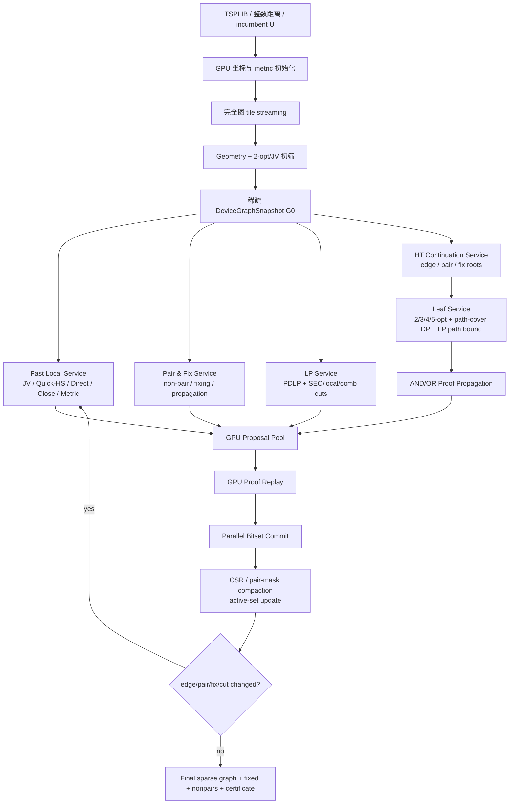
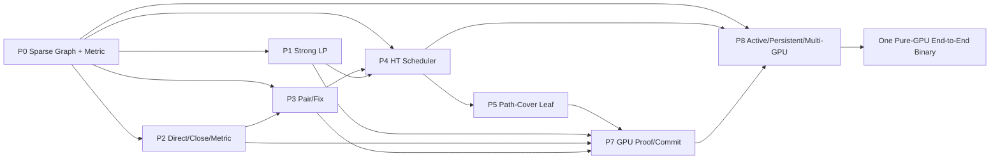

# FGPU-Elim 强度升级方案：纯 GPU 端到端架构、算法改进与并行加速设计

> **文档定位**：针对 `cudaEdgeElimination` 分支 `research/fgpu-fully-resident-single-gpu` 的静态源码审阅、仓库基准记录与 2014/2023 两篇方法论文，给出一份按重要程度排序的完整改进方案，并重新定义纯 GPU 端到端主架构。
> **审阅基线**：分支提交 `84e3d4520a940b34f5a174dba3adc2c29603d78d`。
> **边界说明**：本文没有在当前环境重新运行 GPU 基准；“当前结果”来自该分支已提交的文档和源码。“建议方案”是基于这些证据提出的算法与工程设计。
> **计划方式**：下文的 P0–P8 是重要程度和依赖关系，不是分阶段发布计划。最终交付仍是一条完整、统一、纯 GPU 的端到端执行链。

---

## 摘要

当前 `resident` 路径已经证明了三件重要的事情：

1. 完整图上的 GPU 几何消除可以在很短时间内删除绝大多数边；
2. CUDA 版 JV 与 Quick-HS 可以稳定运行到固定点；
3. 在论文提供的同一张 LP 稀疏图上，当前 resident 结果与作者 `KH -Jq` 基本等强，说明 Quick-HS 的核心重构是可信的。

但当前结果在 `pcb3038` 完整图上停在 `23,720` 条边，而 2023 论文完整 bootstrap 结果为 `5,548` 条边。这个差距不是由显存、外层轮数、PDLP 迭代次数或 CPU 审计造成的，而是由**模型与算法覆盖不足**造成的：

- resident LP 只有 degree-equality + box relaxation；
- Quick-HS 只覆盖 `m<=3`、至多 8 个局部节点和少量 `(c,d)` 候选；
- resident 没有把 non-pair、一般 fixing、Direct/Close Point、metric excess 和完整 Hamilton–Tutte 搜索接入固定点主循环；
- 已有 `ht_*`、`kopt_cost`、`path_compatibility` 和 exact DP 组件仍主要处于 host 驱动或混合验证路径；
- 当前 resident 图结构包含多个 `n×n` 数组，不能扩展到 100k 节点级别。

因此，下一版不能继续依赖“更多轮次、更多 potential candidates、或更宽的单目标 reply 并行”来提高强度。需要同时完成以下核心升级：

1. **强 GPU cutting-plane LP 与路径系统 Lagrangian 关闭**；
2. **2014 Direct/Close Point/metric-excess 的独立 GPU pair engine**；
3. **non-pair 与 fixing 成为固定点中的一等状态**；
4. **带短路、延迟 OR 展开和 generation cancellation 的完整 GPU Hamilton–Tutte continuation engine**；
5. **多输出 inside-matching path-cover 叶子求解器**；
6. **稀疏、可扩展、全常驻的数据结构与 GPU 证书验证/提交**。

新的总体思想不是简单地“把更多 CPU 函数翻译成 CUDA”，而是把强度和性能统一起来：

- 强 LP 将平均度压低；
- pair elimination 将每个 Tutte 节点的合法 reply 数压低；
- inside-matching coverage 让一个局部改进同时覆盖大量 path orderings；
- continuation scheduler 在大量目标之间并行，同时保留原算法最有价值的首失败短路；
- LP reduced cost 不仅直接删边，还可以一次性关闭整个 path system；
- 所有图、状态、cut、dual、proof 和 active set 在 GPU 上常驻，CPU 不参与逐边或逐状态决策。

---

## 1. 当前实现的证据化诊断

### 1.1 当前 resident 主链

当前主链为：

```text
完整图
  -> CUDA FP64 有向舍入 Geometry
  -> device-resident degree-box dual / PDLP-style update
  -> exhaustive CUDA JV fixed point
  -> CUDA Quick-HS fixed point
  -> 最终 device mask
```

`pcb3038` 的仓库记录为：

| 阶段 | 删除边 | 阶段后剩余边 |
|---|---:|---:|
| 完整图 | — | 4,613,203 |
| Geometry | 4,544,561 | 68,642 |
| degree-box | 20 | 68,622 |
| JV | 841 | 67,781 |
| Quick-HS | 44,061 | **23,720** |

单张 RTX 4000 Ada 的七次 clean raw 中位进程 wall 为约 `56.33 s`，常驻显存约 `308.3 MiB`。Quick-HS 约占 GPU solve 的 `90.6%`。

这个结果说明：

- Geometry 已经很强；
- Quick-HS 也删除了大量边；
- LP 几乎没有作用；
- 深层局部证明仍是剩余主缺口。

### 1.2 Quick-HS 不是主要强度问题

最关键的对照是：

| 输入图 | 作者 `KH -Jq` | 当前 resident raw |
|---|---:|---:|
| 论文 `pcb3038` LP 图 | 6,466 | **6,461** |

在完全相同的论文 LP 图上，当前 Quick-HS 与作者快速方法等强，甚至少保留 5 条边。因此不能把 `23,720` 的主要责任归因于 Quick-HS CUDA 化失真。

真正差异在输入图：

- 当前 Geometry 图：`68,642` 条边，平均度约 `45.19`；
- 论文 Concorde LP 图：`6,883` 条边，平均度约 `4.53`。

两个 Tutte 中心的 Hamilton replies 在最坏情况下接近邻边对笛卡尔积，工作量可粗略看成随平均度的四次方增长。平均度相差约 10 倍，不仅让搜索慢，也会让大量候选在当前复杂度限制下无法被证明。

### 1.3 当前 LP 已经达到自身模型的天花板

仓库中的诊断表明：

- resident degree-box 删除 20 条；
- cuOpt 把同一个 degree equality + box 模型解到最优，也只能删除 22 条；
- 500 次 Held–Karp 1-tree 诊断约提出 268 条；
- subtour cutting-plane 约 639–650 个 cuts 后，也只提出约 289–292 条。

因此继续增加当前 `pdlp_iterations`、调整 step size 或把所有更新改成更高精度，不会带来数量级的删边提升。主要问题是**缺少 local cuts、comb/blossom、domino-parity 等更强约束，以及 LP 结果没有用于关闭 path systems**。

### 1.4 当前 Quick-HS 的明确能力上限

`src/fgpu/quick_hs_predicate.hpp` 当前固定：

```cpp
kMaxPathCount      = 3;
kMaxPathNodes      = 8;
kMaxPotentialNodes = 10;
```

并且只尝试前 10 个 `(c,d)` pair。主要叶子形状为：

```text
2+2+2
2+3+2
2+3+3
```

这对应作者 `KH -q` 的浅层快速路径，但不等价于 2023 完整方法中的：

- `|P_F| <= 5`；
- extra-point Tutte move；
- path-end Tutte move；
- 深度 4–6 搜索；
- 3/4/5-opt 后的局部 TSP；
- non-pair 与 fixing bootstrap。

### 1.5 resident 主循环缺失的状态

当前 `ResidentGpuOptions` 与主调度仅直接覆盖：

```text
Geometry
LP_BOX
JV
Quick-HS
```

而 resident 输出中：

- non-pairs 仍写为空；
- fixed edges 主要从 degree-2 派生；
- 完整 `ht_cd.cu`、`ht_replies.cu`、`ht_path_append.cu`、`kopt_cost.cu`、`path_compatibility.cu`、`exact_tour_dp.cu` 尚未形成同一 device-resident continuation 主链。

### 1.6 当前 dense resident 表示无法扩展到 100k

当前实现会构造或上传多个 `n×n` 对象：

- `int64` distance matrix；
- active matrix；
- 定长 neighbor matrix。

若 `n=100,000`，仅这三类对象就可能达到约 130 GB，尚未计算 edge arrays、proof、cut pool 和状态队列。因此现有数据结构适合验证 3k 级算法闭环，但不能作为最终 100k 级纯 GPU 架构。

### 1.7 结论

当前 resident 应重新定位为：

```text
强几何 presolver
+ degree dual initializer
+ JV presolver
+ KH -q 级快速局部 presolver
```

而不是完整 FGPU-Elim。它不需要推倒重来，但必须成为新架构中的快速前端，而不是最终强度上限。

---

## 2. 目标、非目标与“纯 GPU”定义

### 2.1 主目标

给定对称 TSP 实例、整数距离函数和一个可选 incumbent tour 上界 `U`，输出：

- 保留边集；
- fixed edges；
- non-pairs；
- GPU proof/certificate；
- 完整运行与强度画像。

目标图应包含所有最优 tour。主方法应在单 GPU 上完成所有随规模增长的计算，并可自然扩展到多 GPU。

### 2.2 纯 GPU 的准确含义

允许 CPU：

- 解析 TSPLIB 与输入文件；
- 分配显存；
- 创建 CUDA streams / CUDA Graph；
- 发起有限次数的 epoch replay；
- 最终写出结果。

不允许 CPU：

- 逐边复核后再决定是否删除；
- 为困难边执行 DFS、Held–Karp 或 Concorde fallback；
- 为每个 path system 重建 witness；
- 参与 Tutte candidate 排序或 Hamilton reply 选择；
- 作为 LP separator 或精确定价的主路径；
- 把 GPU 候选当作提示、再由 CPU 完成真正搜索。

因此“纯 GPU”强调的是：**搜索轨迹、算法分支、证书授权、图更新和固定点收敛都由 GPU 决定**，而不是字面意义上的零 host kernel launch。

### 2.3 数值策略

主方法采用三层 GPU 数值路径：

1. FP32/普通 FP64：候选排序与启发式；
2. FP64 directed rounding：几何严格谓词；
3. `int64` 或 GPU 两 limb 定点整数：k-opt、path-cover、LP bound 和最终授权。

浮点误差只允许影响：

- 搜索顺序；
- 候选优先级；
- 是否错过某个证明。

浮点误差不得直接授权错误删边。边界不确定时保留边，但不会回退 CPU。

### 2.4 非目标

本文不要求第一版就逐 cut 类别完全复刻 Concorde，也不要求每个实例达到完全相同的边集。目标是：

- 每个新增模块都有可测的强度贡献；
- 在相同输入和相同可信条件下，逐步达到或超过论文基线；
- 主流程始终保持全 GPU，不因难例切回 CPU。

---

## 3. 按重要程度排序的改进总表

> P0–P8 表示重要程度和依赖关系，不表示单独交付阶段。

| 优先级 | 改进 | 对删边强度的作用 | 对性能/规模的作用 | 结论 |
|---:|---|---|---|---|
| **P0** | 稀疏全常驻图、局部距离 oracle、并行 commit | 间接 | 100k 级必要条件 | 架构前提 |
| **P1** | 强 GPU cutting-plane LP + path-system Lagrangian closure | 最大 | 大幅降低平均度与 HT 分支 | 第一强度主线 |
| **P2** | 2014 Direct/Close Point/metric-excess GPU pair engine | 很大 | 在深搜前大量降低 pair 数 | 第一组合主线 |
| **P3** | non-pair 与一般 fixing 固定点 | 大且乘法性 | 减少所有后续 Hamilton replies | 必须是一等状态 |
| **P4** | 完整 GPU Hamilton–Tutte continuation engine | 大 | 替代浅层 Quick-HS 上限 | 深层主引擎 |
| **P5** | 多输出 inside-matching path-cover 叶子 | 中到大 | 一次覆盖大量 orderings | 深搜叶子核心 |
| **P6** | surviving-reply、dual 与历史统计驱动的排序 | 中 | 显著减少状态数和尾部 | 强度与速度共同优化 |
| **P7** | GPU 证书重放、两 limb 定点、全并行提交 | 间接 | 去除 CPU 信任边界与串行提交 | 纯 GPU 必需 |
| **P8** | active set、persistent queues、CUDA Graph、多 GPU | 间接 | 端到端加速与扩展 | 性能收尾但全程设计 |

---

## 4. P0：稀疏全常驻图与可扩展基础设施

### 4.1 为什么它是 P0

P0 本身不增加新的数学消除定理，但没有它，P1–P8 无法在 100k 节点上成立。当前 `n×n` 设计必须整体替换。

### 4.2 新图表示

```cpp
struct DeviceGraphSnapshot {
    int32_t  n;
    int64_t  m_capacity;
    int64_t  m_alive;

    // 稳定无向边 SoA
    int32_t* edge_u;
    int32_t* edge_v;
    int32_t* edge_cost;
    uint32_t* alive_bits;
    uint32_t* fixed_bits;
    uint32_t* protected_bits;

    // 当前 epoch 的紧凑 CSR
    int64_t* row_offsets;       // n + 1
    int32_t* col_indices;       // 2*m_alive
    int32_t* arc_edge_id;       // 2*m_alive

    // 顶点状态
    int32_t* degree;
    int32_t* fixed_degree;
    uint32_t* dirty_vertex_bits;

    // 坐标/距离
    int64_t* x;
    int64_t* y;
    MetricType metric;

    uint64_t snapshot_hash;
    uint32_t epoch;
};
```

### 4.3 不再保存全距离矩阵

全局距离按需计算：

```cpp
__device__ int32_t Distance(u, v, metric, x, y);
```

对于局部 path system：

1. block 将局部节点坐标拷入 shared memory；
2. 并行构造 `q×q` 小距离矩阵；
3. 3/4/5-opt、path-cover DP 和 proof replay 复用该矩阵。

典型 `q<=16` 时仅约 1 KiB；`q<=32` 时约 4 KiB。

### 4.4 邻接排序只做一次或低频 compact

边权不会变化，因此可在初始稀疏图上按 `(cost,node)` 建立静态顺序。每个 epoch 有两种策略：

- dead-edge 比例低：遍历静态行并跳过 dead bits；
- dead-edge 比例高：CUB/Thrust segmented compaction 重建紧凑 CSR。

禁止使用当前 `BuildAdjacencyKernel` 的逐顶点全 `n` 扫描与插入排序。

### 4.5 活动边查询

`Active(u,v)` 不再依赖 `n×n` matrix。可采用：

- CSR 行内二分搜索；
- 每顶点小型 robin-hood hash；
- 全局 undirected pair → stable edge-id hash；
- 对局部节点集合，构建 shared-memory active matrix。

内层 path proof 优先使用最后一种方式，将全局不规则查询转换为局部连续查询。

### 4.6 并行图提交

在同一不可变快照上通过严格 GPU proof 的边可以整体删除，不需要单线程逐 edge-id 扫描。新提交为：

```text
verified_delete_bits = geometry | lp | direct | ht
alive_bits &= ~verified_delete_bits
fixed_bits |= verified_fix_bits
pair_bits  &= ~verified_nonpair_bits
```

随后并行 degree histogram、prefix sum 和 CSR scatter。

若提供受保护 incumbent，则其边永不进入 delete bits。degree-2 门禁保留为 assertion/诊断，不再作为串行主提交算法。

### 4.7 P0 完成门禁

- `pcb3038` 不再分配任何 `n×n` 数组；
- 同一输入的 stable edge IDs、最终图和 hash 确定性一致；
- 100k 节点、平均度 20–40 的图可装入单卡；
- 图重建时间低于主搜索时间的 5%；
- 所有后续模块只接受 `DeviceGraphSnapshot`，不自行复制图。

---

## 5. P1：强 GPU cutting-plane LP 与路径系统关闭

### 5.1 为什么是最高强度优先级

`pcb3038` 当前 Geometry 图比论文 LP 图多约 10 倍平均度；同一论文 LP 图上的 Quick-HS 已经等强。说明**先降低 LP 图密度是从 23,720 接近 5,548 的最大单一杠杆**。

### 5.2 默认采用全 active-edge 列模型

Geometry 已经给出一个包含所有最优 tour 的稀疏图 `G`，因此 LP 默认直接把 `G` 的全部活动边作为 columns：

\[
\min c^T x
\]

满足：

\[
B x = 2,
\]

\[
A_{cut} x \ge b,
\]

\[
0 \le x \le 1.
\]

这样不需要在主路径中做 CPU 列生成。只有在超大图上采用 restricted-column 模式时，才增加 GPU pricing over surviving edges。

### 5.3 cut 类别按重要性

#### 5.3.1 SEC / connectivity cuts

GPU 分离：

- support connected components；
- 多阈值 support components；
- batched source–sink mincut candidates；
- global mincut 或近似候选 + 精确容量复核。

任何输出 cut 必须在 GPU 上重新计算边界容量，并确认是合法 subtour inequality。

#### 5.3.2 Local cuts，chunk size 16–48

2023 论文的 Concorde 运行使用 `-mC48` local cuts。建议 GPU 化为大量独立局部 chunk：

1. 依据 LP support、几何邻域和图 BFS 生成重叠 chunk；
2. 每个 CTA 处理一个 16/24/32/48 节点 chunk；
3. shared memory 中构造诱导 support graph；
4. 枚举/分离有效局部 cut；
5. 输出稀疏 crossing-edge row。

这是比继续完善 degree PDLP 更重要的 LP 工作。

#### 5.3.3 Simple blossom / 2-matching / comb

使用阈值图的 odd components、候选 handles 与 teeth：

- GPU 并行生成候选；
- 每个候选独立验证 comb 结构和 RHS；
- 只有合法 inequality 进入 cut pool。

#### 5.3.4 Domino-parity

优先级低于 local/comb，但应在架构中保留接口。对于接近平面的稀疏图可使用专门 separator。

### 5.4 PDLP 只负责寻找好的 multiplier

PDLP 可使用 FP32/mixed/FP64，warm start 跨 epoch 保留。它的输出不直接授权删边，而是量化为固定点 dual：

- degree equality dual `π` 为自由变量；
- `Ax >= b` cut dual `λ >= 0`；
- 分母 `Q=2^k`；
- 所有累加使用 GPU 两 limb 有符号定点或严格的 64-bit overflow gate。

定义：

\[
r = c - B^T\pi - A^T\lambda.
\]

则 box-Lagrangian 下界为：

\[
L(\pi,\lambda)
=2^T\pi+b^T\lambda+\sum_e\min(0,r_e).
\]

对任意 multiplier，只要 `λ>=0`，这是合法下界；不要求 PDLP 已精确最优。

### 5.5 单边、固定边和 path-system 统一授权

强制 `x_e=1`：

\[
L_e^{(1)}=L+\max(0,r_e).
\]

若：

\[
L_e^{(1)}>U,
\]

则删除 `e`。

强制 `x_e=0`：

\[
L_e^{(0)}=L+\max(0,-r_e).
\]

若：

\[
L_e^{(0)}>U,
\]

则固定 `e`。

对 path system `F`：

\[
L_F=L+\sum_{e\in F}\max(0,r_e).
\]

若：

\[
L_F>U,
\]

则整个 HT leaf 立即关闭，不再运行 3/4/5-opt 或 DP。

这一点会把 LP 从“前处理删边器”升级为“深搜叶子关闭器”。

### 5.6 GPU cut pool

```cpp
struct DeviceCutPool {
    int32_t* row_type;
    int32_t* rhs_num;
    int32_t* rhs_den;
    int64_t* row_offsets;
    int32_t* edge_ids;
    int32_t* coefficients;
    uint32_t* alive_cut_bits;
    uint64_t* cut_hash;
};
```

cut 去重使用规范 hash；低活跃度或长期零 dual 的 cuts 可低频 retire，但 certificate 使用的 cut 不得在同一 dual snapshot 内失效。

### 5.7 P1 伪代码

```text
function GPU_STRONG_LP(snapshot G, incumbent U, warm dual, cut_pool):
    model <- all alive edges of G + current cut_pool

    repeat
        (x, pi, lambda) <- PDLP_GPU(model, warm_start)

        new_SEC    <- SEPARATE_SEC_GPU(G, x)
        new_LOCAL  <- SEPARATE_LOCAL_CHUNKS_GPU(G, x)
        new_COMB   <- SEPARATE_SIMPLE_COMBS_GPU(G, x)

        new_cuts <- VERIFY_AND_DEDUP_CUTS_GPU(
                        new_SEC union new_LOCAL union new_COMB)
        cut_pool <- cut_pool union new_cuts
        model <- append rows for new_cuts
        warm_start <- project(x, pi, lambda)
    until new_cuts is empty or cut improvement is negligible

    q_pi, q_lambda <- QUANTIZE_DUAL_GPU(pi, max(lambda, 0))
    (L, reduced_cost) <- EXACT_BOX_BOUND_GPU(G, cut_pool, q_pi, q_lambda)

    delete[e] <- L + max(0, reduced_cost[e]) > U
    fix[e]    <- L + max(0,-reduced_cost[e]) > U

    return DualSnapshot(L, reduced_cost, q_pi, q_lambda), delete, fix, cut_pool
```

### 5.8 P1 完成门禁

对 `pcb3038` Geometry 图逐层报告：

| 模型 | lower bound | gap | 直接删除 | path-system 关闭 |
|---|---:|---:|---:|---:|
| degree-box |  |  |  |  |
| +SEC |  |  |  |  |
| +local cuts |  |  |  |  |
| +simple comb/blossom |  |  |  |  |

核心门禁：

- 强 LP 输出边量应向论文的 `6,883` 条靠近；
- 每类 cut 必须有单独增量；
- LP path closure 必须报告关闭了多少 HT states；
- 主运行不能依赖 CPU separator 或 CPU exact pricing。

---

## 6. P2：2014 Direct/Close Point/metric-excess GPU pair engine

### 6.1 为什么它应独立于 Quick-HS

2014 方法的 Step 2 在 `pcb3038` 中将 Step 1 的 `95,576` 条边降到 `17,940` 条，说明 Direct/Close Point 是强度很高的中间层。它不是 Quick-HS 的重复实现，而是先对中心点的所有 incident edge pairs 做消除，再对剩余 pair 组合应用 Main Edge Elimination。

### 6.2 中心 surviving pair 集

对目标边 `ab` 和中心 `v`，定义：

\[
R(ab,v)=\{(v_i,v_j):
(vv_i,vv_j)\text{ 尚未被快速规则证明与 }ab\text{ 不相容}\}.
\]

快速关闭规则依次包括：

1. 2-opt incompatibility；
2. universal 3-opt 条件；
3. Close Point Lemma；
4. metric excess；
5. 已知 non-pair；
6. fixed-edge 冲突；
7. LP path-system bound；
8. 3/4/5-opt 模板。

### 6.3 GPU 映射

```text
Task granularity: (target edge ab, center v)
Lane/thread granularity: one neighbor pair (vi,vj)
Reduction: surviving pair bitset + popcount
```

度数分桶：

- `d<=32`：一个 warp 处理中心；
- `32<d<=64`：两个或四个 warp；
- `d>64`：先由 non-pair/2-opt 生成 compact pair list，再处理列表。

### 6.4 两中心 Main Edge 检查

若任一中心 `R(ab,v)` 为空，则 `ab` 直接删除。

否则对中心对 `(r,s)`，只处理：

\[
R(ab,r)\times R(ab,s).
\]

每个 pair-of-pairs 检查两个 Main Edge 3-opt 改进条件。全部回复被关闭时，目标边可删。

### 6.5 metric excess GPU 化

metric excess 所需的最小/最大表达式是邻接 pair 上的 reduction，适合分成：

1. 每中心预计算 `m_pq(z)` 或相关 lower bound；
2. 目标边与 path edge 组合时做常数时间查询；
3. 严格整数比较授权。

### 6.6 Direct/Close 伪代码

```text
function BUILD_SURVIVING_PAIRS(ab, center v, snapshot G, pair_mask, dual):
    local_pairs <- all allowed unordered neighbor pairs of v

    parallel for pair (x,y) in local_pairs:
        killed <- NONPAIR(v,x,y)
               or TWO_OPT_INCOMPATIBLE(ab, vx)
               or TWO_OPT_INCOMPATIBLE(ab, vy)
               or UNIVERSAL_THREE_OPT(ab, x-v-y)
               or CLOSE_POINT(ab, x-v-y)
               or METRIC_EXCESS(ab, x-v-y)
               or LP_PATH_BOUND({ab,vx,vy}, dual)

        survive[pair] <- not killed

    return compact(survive), popcount(survive)

function DIRECT_ELIMINATE(ab):
    candidates <- nearby centers ranked by cheap score

    for top center r:
        Rr <- BUILD_SURVIVING_PAIRS(ab,r)
        if Rr empty: return PROVED

    for top center pair (r,s) ordered by |Rr|*|Rs|:
        all_closed <- parallel_all((pr,ps) in Rr x Rs,
                                   MAIN_EDGE_PAIR_TEST(ab,r,s,pr,ps))
        if all_closed: return PROVED

    return UNRESOLVED
```

### 6.7 P2 完成门禁

- 在 2014 测试实例上逐边对照 Direct/Close/metric-excess；
- 报告每条规则单独删除量；
- `pcb3038` 无强 LP 配置的目标参考为向 `14,869` 条靠近；
- surviving pair 数应成为后续 HT 的输入，而不是仅作临时统计。

---

## 7. P3：non-pair 与一般 fixing 成为固定点核心状态

### 7.1 为什么 non-pair 是乘法项

2023 论文中 `pcb3038` 的 non-pair 比例约为 `49.4%`。non-pair 不仅直接减少二边路径，还会减少：

- Quick-HS replies；
- Direct/Close surviving pairs；
- extra-point Hamilton reveals；
- fixing 中的 endpoint pair 组合；
- HT 树宽度；
- path-cover leaf 数量。

因此它对强度与速度都是乘法增益。

### 7.2 pair mask 表示

对顶点 `v`，邻居位置为 `0..deg(v)-1`。使用三类存储：

```text
d <= 32 : uint32 row[d]
32<d<=64: uint64 row[d]
d > 64  : segmented bitset or compact allowed-pair list
```

`row[i]` 的 bit `j` 表示 pair `(i,j)` 当前仍允许。

### 7.3 non-pair 目标

对二边路径 `x-y-z`：

```text
target type = NONPAIR
initial path system = {x-y-z}
```

先运行：

- 2/3-opt；
- Direct/Close/metric；
- LP path closure；
- 浅层 HT；
- 必要时完整 HT。

证明成功后清除 pair bit。

### 7.4 fixing 目标

要固定边 `ab`，需要证明所有不使用 `ab` 的 endpoint incident pair 组合都不可能属于最优 tour。实现上：

```text
target type = FIX_EDGE
A-side alternatives = allowed pairs at a excluding b
B-side alternatives = allowed pairs at b excluding a
```

对所有组合构造两个二边路径的 path system，使用相同 leaf/HT 引擎。如果全部关闭，则固定 `ab`。

此外 LP 的 `L_e^(0)>U` 可以直接固定边。

### 7.5 fixed edge 的传播

显式维护：

```cpp
fixed_bits[e]
fixed_degree[v]
```

传播规则：

- `fixed_degree[v] == 2`：删除 `v` 的其他非固定 incident edges；
- `fixed_degree[v] > 2`：proof inconsistency，停止当前 epoch；
- 固定边在 path normalization 时强制合并；
- fixed 与 non-pair 更新后重新激活受影响目标。

不能再仅以 `degree[v]==2` 代替 fixed 语义。

### 7.6 固定点顺序

```text
edge deletion
 -> new non-pairs
 -> new fixed edges
 -> fixed-edge propagation
 -> more edge deletion
 -> repeat
```

所有更新仍以 immutable epoch 为单位提交。

### 7.7 P3 完成门禁

- resident 不再写空 non-pair 文件；
- 对 `pcb3038` 报告 non-pair 比例，并以论文 `49.4%` 为参考；
- fixed edges 不再只来自 degree 2；
- pair mask 必须被 Quick-HS、Direct、HT reply generator 和 fixing 共同消费；
- 每轮报告 pair 删除对平均 reply 数的实际下降。

---

## 8. P4：完整 GPU Hamilton–Tutte continuation engine

### 8.1 Quick-HS 的新定位

保留现有 `quick_hs_predicate.hpp`，但将其定位为：

- 根级 fast presolver；
- HT 状态的 fast leaf closure；
- candidate ranking 的 look-ahead 组件。

它不再承担“完整 Local Elimination”的角色。所有 Quick-HS unresolved 目标进入完整 continuation engine。

### 8.2 根目标类型统一

```cpp
enum class TargetType : uint8_t {
    EDGE_DELETE,
    EDGE_FIX,
    NONPAIR
};
```

三种目标共享同一套：

- path-system canonicalization；
- leaf closure；
- Tutte candidate generation；
- Hamilton reveal generation；
- AND/OR propagation；
- certificate DAG。

差异只在根初始 witness family 和根成功条件。

### 8.3 不采用纯 BFS

现有实验已经表明：

- 完整 wavefront 预展开会产生更多状态；
- 严格短路 DFS 的逻辑工作量更小，而且在固定预算下可证明更多目标；
- 盲目并行同一候选的 32 个 replies 会破坏 first-failure 优势。

所以新引擎采用：

> **逻辑 DFS / lazy OR，物理上跨大量 target 与 candidate 并行。**

### 8.4 状态类型

```cpp
struct FState {
    PathSystemKey path;
    TargetId target;

    uint64_t unresolved[MAX_OUTSIDE_WORDS];

    int32_t parent_a;
    int32_t candidate_begin;
    int32_t candidate_count;
    int32_t candidate_cursor;
    int32_t active_a;

    uint32_t generation;
    uint16_t depth;
    uint16_t credit;
    StateStatus status;

    ProofRef proof;
};

struct AState {
    int32_t parent_f;
    TutteMove move;

    int32_t reply_begin;
    int32_t reply_count;
    int32_t next_reply;
    int32_t outstanding;

    uint32_t generation;
    StateStatus status;
};
```

### 8.5 OR 与 AND 的调度语义

#### OR：Tutte candidate

对 F-state：

1. 先做 leaf closure；
2. 若未关闭，生成并排序 Tutte candidates；
3. 只展开当前最优 candidate；
4. candidate 失败后才推进 `candidate_cursor`；
5. 任一 candidate 成功，F-state 立即成功，并取消其余 generation。

#### AND：Hamilton replies

对 A-state：

1. replies 按规范顺序排列；
2. 以小窗口 `W` 投机提交；
3. 任一 reply 失败，A-state 立即失败；
4. 全部 reply 成功，A-state 成功；
5. A-state 成功后向父 F-state 传播成功。

### 8.6 generation cancellation

每个 F/A state 有 `generation`。当状态短路后：

```cpp
atomicAdd(&generation[state], 1);
status[state] = DONE;
```

已在队列中的旧任务携带旧 generation，出队时直接丢弃：

```cpp
if (task.generation != state.generation) return;
```

这解决现有 transposed/broker 中 speculative leaf states 增加、迟到结果占用大量资源的问题。

### 8.7 continuation ready queues

```cpp
enum class WorkKind : uint8_t {
    F_LEAF,
    F_RANK_TUTTE,
    F_OPEN_NEXT_CANDIDATE,
    A_OPEN_REPLY_WINDOW,
    BUILD_CHILD_PATH,
    CHILD_LEAF,
    PROPAGATE_SUCCESS,
    PROPAGATE_FAILURE,
    ORDER_SPECIFIC
};
```

不同复杂度进入不同队列：

```text
q_leaf_m1_m3
q_leaf_m4_m5
q_dp_small
q_dp_extended
q_rank_small_degree
q_rank_large_degree
q_reply_short
q_reply_long
q_order_specific
q_hard
```

persistent CTAs 从队列抢任务，任务结束后直接写入下一 ready queue，不等待 host。

### 8.8 Tutte move 类型

候选顺序建议为：

1. `(c,d)` coupled root move；
2. extra point；
3. path endpoint extension；
4. order-specific move；
5. long initial centered path alternative。

候选不是固定一种，而是由状态特征动态评分。

### 8.9 状态规范化和 transposition table

两个不同搜索分支可能产生同一个规范 path system。建立 device hash table：

```text
key = target_id
    + canonical path edges
    + fixed/nonpair epoch
    + unresolved ordering mask
```

相同状态共享 proof/result：

- 已 PROVED：直接复用；
- 已 FAILED：根据相同预算/参数复用；
- OPEN：把当前父节点登记为 waiter；
- 不同 credit/depth 策略不能错误复用失败结论。

### 8.10 order-specific Tutte moves

当：

```text
popcount(unresolved) <= T_order
```

不再扩展整个 path system 的全部 orderings，而只对失败 ordering 建立局部 Tutte move。一个 Hamilton reveal 对固定 ordering 的插入位置至多约 `2m`，可显著降低分支。

状态中保存：

```cpp
outside_id;
ordered_endpoint_sequence;
insertion_mask;
```

### 8.11 credit 与 hard queue

不使用固定全局深度作为唯一预算。每个状态有 credit：

```text
credit cost =
    generated replies
  + leaf template cells / scale
  + DP states / scale
  + new local nodes penalty
```

credit 耗尽后进入 `q_hard`，由更大资源的 CTA 或下一轮处理。仍然不存在 CPU fallback；最终耗尽总 GPU 预算时保留目标边。

### 8.12 HT scheduler 伪代码

```text
function PROCESS_F_STATE(f):
    if stale(f): return

    result <- LEAF_CLOSE(f.path, f.unresolved)
    f.unresolved &= ~result.covered

    if f.unresolved is empty:
        COMPLETE_F_SUCCESS(f, result.proof)
        return

    if LP_PATH_BOUND(f.path) > incumbent:
        COMPLETE_F_SUCCESS(f, lp_proof)
        return

    if complexity_limit(f.path) exceeded:
        COMPLETE_F_FAILURE(f)
        return

    if popcount(f.unresolved) <= ORDER_THRESHOLD:
        push(q_order_specific, f)
        return

    if candidates not built:
        f.candidates <- RANK_TUTTE_MOVES_GPU(f)

    if f.candidate_cursor == f.candidate_count:
        COMPLETE_F_FAILURE(f)
        return

    a <- OPEN_A_STATE(f, f.candidates[f.candidate_cursor])
    push(q_reply, a)

function PROCESS_A_REPLY_WINDOW(a):
    if stale(a): return

    window <- next W replies in canonical order
    for reply in window:
        child <- APPEND_AND_NORMALIZE(parent_path(a), reply)
        if invalid child:
            mark reply success       // reveal itself impossible
        else:
            push(q_leaf_or_child, child)

function CHILD_RESULT(a, success):
    if success:
        if atomicSub(a.outstanding, 1) == 1 and all replies issued:
            COMPLETE_A_SUCCESS(a)
    else:
        if atomicCAS(a.status, OPEN, FAILED):
            cancel_generation(a)
            parent <- a.parent_f
            parent.candidate_cursor++
            push(q_open_next_candidate, parent)

function COMPLETE_A_SUCCESS(a):
    parent <- a.parent_f
    if atomicCAS(parent.status, OPEN, PROVED):
        cancel_generation(parent)
        emit proof DAG node
        propagate success to parent A
```

### 8.13 P4 完成门禁

- 相同预算下，逻辑状态数不高于 strict DFS oracle；
- speculative physical states 相对逻辑 states 的增量低于 10%；
- 同一论文 LP 图上，完整 edge elimination 从约 `6,461` 继续向 `5,548` 靠近；
- `m<=5`、depth 4–6、extra point/end 均进入纯 GPU 主路径；
- queue overflow 或预算耗尽只产生 unresolved，不产生错误成功。

---

## 9. P5：多输出 inside-matching path-cover 叶子求解器

### 9.1 当前逐 ordering 叶子的局限

当前小 DP 主要对一个 path ordering 判断是否存在更短重排，而且只支持很小的三路径状态。2023 方法的 inside matching 复用说明，一个局部改进可以覆盖多个 outside orderings；GPU 应直接以 inside matching 为输出单位。

### 9.2 定义

设 path system `F` 有 `m` 条路径、局部节点集 `V_F`、路径总成本 `c(F)`。对每个 inside matching `I`：

\[
C_F(I)=\min\{c(P): P\text{ 是覆盖 }V_F\text{ 的 }m\text{ 条无交路径，端点匹配为 }I\}.
\]

如果：

\[
C_F(I)<c(F),
\]

则 `I` 覆盖所有满足 `O union I` 构成单环的 outside matching `O`。

预计算：

```text
coverage[m][inside_matching_id] -> outside-ordering bitset
```

`m=5` 时完整表约 44 KiB；`m=6` 时约 4.8 MiB，可常驻 GPU。

### 9.3 三层叶子求解

#### L1：2-opt / universal 3-opt

常数时间或小 bitset，最先执行。

#### L2：3/4/5-opt reconnect templates

所有 reconnect templates 进入 constant memory。每个候选：

```text
if added_cost < deleted_cost:
    inside_id <- matching of resulting path cover
    covered |= coverage[inside_id]
```

#### L3：exact multi-output path-cover DP

仅对剩余 outside mask 执行。

### 9.4 精确 path-cover DP

设固定端点为 `E={e_1,...,e_{2m}}`，内部节点集合为 `W`。

第一层计算所有端点对之间、经过内部节点子集的最短路径：

\[
D_s[S,v]
=
\min_{u\in S\setminus\{v\}}
D_s[S\setminus\{v\},u]+d(u,v).
\]

得到：

\[
H_{s,t}(S)=\min_{v\in S}D_s[S,v]+d(v,t).
\]

第二层对一个 inside matching：

\[
I=\{(s_1,t_1),...,(s_m,t_m)\}
\]

计算内部节点划分：

\[
C_F(I)=
\min_{S_1\dot\cup...\dot\cup S_m=W}
\sum_{j=1}^{m}H_{s_j,t_j}(S_j).
\]

只需计算仍可能覆盖 unresolved outside mask 的 inside matchings。

### 9.5 GPU 映射

| 局部规模 | 映射 |
|---|---|
| `m<=3, q<=12` | warp-per-state |
| `m<=5, q<=20` | CTA-per-state，shared DP |
| `m<=6, q<=32` | CTA-per-state，global workspace + rolling layers |
| 更大 | hard queue，beam/B&B GPU 搜索；失败保留 |

### 9.6 lower bounds

用于避免完整 DP：

- endpoint 最近异组件距离和 / 2；
- degree-2 completion bound；
- 1-tree bound on local contracted graph；
- LP reduced-cost path bound；
- partial assignment bound；
- inside matching coverage potential。

### 9.7 不要求证明“无改进”才能安全

叶子 solver 是 anytime：

- 找到改进 path-cover：GPU 整数验证并输出 proof；
- 未找到或预算耗尽：保留 unresolved ordering；
- 不将阴性结果当作 completeness 证书，除非 exact DP 已完整覆盖状态空间。

### 9.8 叶子伪代码

```text
function LEAF_CLOSE(path F, unresolved mask):
    local_matrix <- BUILD_SHARED_DISTANCE(F.nodes)
    covered <- 0
    proofs <- empty

    covered |= TWO_AND_THREE_OPT_CLOSE(F, unresolved)
    if covered covers unresolved:
        return covered, proofs

    for k in {3,4,5}:
        parallel for deletion subset S containing required edge:
            deleted_cost <- exact sum

            parallel for reconnect template T[k]:
                added_cost <- exact sum
                if added_cost < deleted_cost:
                    I <- inside_matching(S,T)
                    block_covered[I] <- true
                    remember best witness for I

        for improving I:
            covered |= COVERAGE[m][I]
            append witness(I)

        if covered covers unresolved:
            return covered, proofs

    remaining <- unresolved & ~covered
    if remaining != 0 and DP_SUPPORTED(F):
        improving_inside <- EXACT_PATH_COVER_DP(F, remaining)
        for I in improving_inside:
            covered |= COVERAGE[m][I]
            append traceback witness(I)

    return covered, proofs
```

### 9.9 P5 完成门禁

- 对 `m<=5` 的随机小 path systems 与 CPU brute force 完全一致；
- `m=6` coverage catalog hash 固定；
- 报告每个 leaf 平均由一个 inside matching 覆盖多少 outside orderings；
- 报告 template、DP、LP path closure 各自贡献；
- 叶子不再按每个 outside ordering 重复构造完整局部 TSP。

---

## 10. P6：更强的候选排序与短路感知调度

### 10.1 当前排序的问题

当前 Quick-HS 主要从 `a,b` 邻居中按绕行距离构造至多 10 个候选节点，再尝试前 10 个 pair。这适合快速路径，但不适合完整搜索。

完整 `ElimTSP` 的关键启发式之一是：先估计每个中心有多少 Hamilton replies 不能被快速关闭，再按两个中心剩余 reply 数的乘积排序。

### 10.2 surviving-reply score

对中心 `c`：

\[
s_c=|R(ab,c)|.
\]

对 `(c,d)`：

\[
score_{cd}=s_c\cdot s_d.
\]

乘积越小，AND 分支越容易完成。

### 10.3 综合评分

建议：

\[
Score(v)=
\alpha\log(1+s_v)
+\beta\,distToTarget(v)
+\gamma\,LPConflict(v)
+\eta\,ReusePenalty(v)
+\zeta\,FailureHistory(v).
\]

对 `(c,d)` 再加入：

- `cd` 不在图中的奖励；
- `cd` 与 `ab` 不相容的奖励；
- 两中心 reply bitset 的交叉可关闭比例；
- 目标 unresolved ordering 的预计 coverage；
- candidate state cache 命中概率。

### 10.4 两级 look-ahead

```text
Level A: 便宜估计 25–64 个 candidate nodes
Level B: 对前 8–16 个中心完整构造 surviving pair mask
Level C: 对前 K 个 center pairs 做小窗口试探
```

不需要为所有候选完整运行 leaf solver。

### 10.5 短路感知 speculation window

窗口 `W` 由预测失败概率决定：

```text
高失败概率 candidate: W = 1
中等:                 W = 2 or 4
高成功概率:           W = 8 or 16
```

预测特征：

- `s_c*s_d`；
- 前几 reply 的失败位置；
- depth；
- path count；
- unresolved popcount；
- LP path slack；
- 历史同桶成功率。

### 10.6 跨目标而不是单目标内盲目并行

并行优先级：

1. 不同 target；
2. 同 target 的不同高质量 `(c,d)` candidates；
3. 不同 path-system states；
4. leaf 中的 templates / DP states；
5. 最后才是同一 candidate 的多个 replies。

这样既填满 GPU，又保留 first-failure short circuit。

### 10.7 P6 完成门禁

- 记录成功 `(c,d)` 的 rank 分布；
- 相比距离-only 排序，逻辑 states 和 replies 至少降低 20%；
- speculative physical/logical state ratio 低于 1.10；
- 相同预算下 PROVED 目标数不低于 strict DFS oracle。

---

## 11. P7：GPU 证书重放、数值授权与并行提交

### 11.1 两种正式模式

#### `gpu-safe`

- 几何：FP64 directed interval；
- 距离和 k-opt：整数；
- LP：量化 dual + exact/emulated fixed-point；
- 所有 proof 在 GPU 上重放；
- 只有重放通过的 bits 才提交。

#### `gpu-fast-raw`

- 允许更宽松候选与近似排序；
- 最终局部 move 仍用整数检查；
- LP/几何可设置额外 safety margin；
- 输出明确标记 raw/approx；
- 用于研究吞吐与强度，不冒充 exact-safe 结果。

CPU verifier 仅作为 ablation 和独立测试，不在主方法中。

### 11.2 proof record

```cpp
enum class ProofType : uint8_t {
    GEOMETRY_MAIN,
    TWO_OPT,
    DIRECT_CLOSE,
    METRIC_EXCESS,
    LP_EDGE_DELETE,
    LP_EDGE_FIX,
    LP_PATH_CLOSE,
    KOPT_MOVE,
    PATH_COVER,
    HT_NODE,
    NONPAIR_ROOT,
    FIX_ROOT
};
```

扁平 SoA proof pool：

```cpp
struct ProofPool {
    uint8_t*  type;
    int32_t*  target;
    int32_t*  parent;
    int32_t*  payload_begin;
    int32_t*  payload_count;
    uint64_t* snapshot_hash;
    uint32_t* generation;
};
```

### 11.3 GPU proof replay

按 proof type 分桶：

- warp-per-geometry witness；
- thread-per-2/3-opt witness；
- CTA-per-path-cover traceback；
- edge-parallel LP reduced cost；
- bottom-up HT DAG propagation。

replay 不重新搜索，只检查记录的 witness 与完整 AND child coverage，因此规则且并行。

### 11.4 GPU 两 limb 定点

LP 下界可能超出 int64。实现：

```cpp
struct Signed128 {
    uint64_t lo;
    int64_t  hi;
};
```

支持：

- signed add/sub；
- int64×int32；
- compare；
- block reduction；
- overflow assertion。

也可通过严格 scale bound 保证 int64 足够，但不能依赖 CPU `__int128` 作为正式路径。

### 11.5 确定性并行 commit

在同一 snapshot 上：

```text
verified deletions are jointly safe
verified fixes are jointly safe
verified non-pairs are jointly safe
```

因此 commit 是位运算，不需按 edge ID 单线程循环。

冲突检测：

- fixed degree >2；
- protected edge 被删除；
- delete 与 fix 同时命中；
- snapshot hash 不一致；
- proof generation 已失效。

任一冲突使该 epoch 不提交，并保留诊断 buffer。

### 11.6 P7 完成门禁

- `gpu-safe` 不依赖 CPU audit；
- CPU verifier 作为独立程序时应与 GPU replay 逐 proof 一致；
- proof tamper 测试必须被 GPU 拒绝；
- GPU commit 输出与 serial reference 一致；
- verifier + commit 时间低于总时间 10%。

---

## 12. P8：active set、persistent execution、CUDA Graph 与多 GPU

### 12.1 增量 active roots

删除边 `(x,y)` 后，标记：

- `x,y`；
- 邻居；
- 受影响 pair mask 中心；
- 将 `x` 或 `y` 用作候选 Tutte center 的 roots；
- LP 中 reduced cost 可能变化的全部活动边。

组合部分使用局部 active set；LP major solve 可以低频全局运行。

### 12.2 reverse dependency

为避免每轮全边扫描，维护：

```text
center -> target roots that currently rank/use center
vertex -> open HT states containing vertex
edge   -> pair rows / fixed propagation dependencies
```

依赖表允许过度激活，但不能漏激活。周期性 full sweep 作为 GPU 内部安全补充。

### 12.3 persistent queue engine

每个复杂度桶启动 persistent CTAs：

```cpp
while (!global_done) {
    task = queue.pop_chunk();
    if no task:
        steal_from_neighbor_queue();
    else:
        process(task);
}
```

使用 device-side termination detection：

```text
all queue heads == tails
and in_flight == 0
and no pending graph/cut update
```

### 12.4 CUDA Graph

固定 kernel 序列捕获为 CUDA Graph：

- pair mask rebuild；
- fast local kernels；
- LP iteration bundles；
- proof replay；
- commit/compact。

动态 HT 队列由 persistent kernel 处理，不需要为每层 host launch。

### 12.5 stream 设计

```text
high priority:   local fast + HT ready queues
medium priority: proof replay and graph update
low priority:    PDLP iterations and cut separation
```

本 epoch HT 使用上一稳定 `DualSnapshot_k`；低优先级 LP 生成 `DualSnapshot_{k+1}`。这样 LP 不阻塞组合搜索。

### 12.6 多 GPU 扩展

单 GPU 是主实现。多 GPU 时：

- 每卡复制稀疏图、pair masks 和 dual snapshot；
- target roots 分片；
- proof/candidate queues 动态 work stealing；
- cut separation 按 candidate cuts 分片；
- epoch 末通过 NCCL OR 汇总 delete/fix/nonpair bits；
- dual solve可使用 distributed PDLP。

### 12.7 P8 完成门禁

- 后期 epoch 全边扫描比例显著下降；
- device queues 的空闲率和 tail latency 可观测；
- host 不参与逐状态调度；
- 单 GPU 完整主链稳定后，多 GPU 结果与单 GPU 确定性等价。

---

## 13. 重新设计的纯 GPU 端到端架构

### 13.1 总体架构图



### 13.2 架构原则

#### 原则 A：算法强度和 GPU 吞吐共同设计

不是先照搬强 CPU 算法，再寻找并行点；也不是先选择最容易 CUDA 化的弱规则。每个模块都必须回答两个问题：

1. 它减少了哪个组合因子？
2. 它如何形成规则批处理？

例如：

- LP 减少平均度；
- non-pair 减少邻边 pair；
- surviving-reply 排序减少 Tutte 候选数；
- inside matching 减少 outside ordering 数；
- active set 减少 epoch 重扫范围。

#### 原则 B：快规则与深搜索共享状态

Quick-HS、Direct、non-pair 和 HT 不再是相互独立的可执行程序。它们共享：

- stable edge ID；
- pair masks；
- explicit fixed bits；
- reduced costs；
- path state cache；
- proof pool；
- active target queues。

#### 原则 C：所有计算都绑定 immutable snapshot

在 epoch `k`：

```text
G_k、Pair_k、Fixed_k、Dual_k
```

全部只读。所有新结论进入 proposal bits，直到 proof replay 结束才原子提交为：

```text
G_{k+1}、Pair_{k+1}、Fixed_{k+1}、Dual_{k+1}
```

#### 原则 D：允许异步，但不允许语义跨快照

LP 可与 HT 并发，但：

- HT 使用完整稳定的 `Dual_k`；
- 正在生成的 `Dual_{k+1}` 不能中途改变已展开状态；
- 新 dual 只在下一 epoch 生效。

#### 原则 E：失败关闭，不回退 CPU

以下情况统一返回 unresolved：

- queue 容量不足；
- DP 规模过大；
- interval 不确定；
- cut separator 没找到 cut；
- PDLP 未收敛到目标质量；
- credit 用尽。

保留边只影响强度，不影响安全性。

### 13.3 设备服务划分

#### 13.3.1 Graph Service

职责：

- stable edge store；
- CSR；
- active/fixed/protected bits；
- pair masks；
- compact 与 hash；
- dirty dependency。

#### 13.3.2 Fast Local Service

职责：

- Geometry；
- JV；
- Quick-HS；
- Direct/Close/metric；
- triangle/diamond/fixed propagation。

#### 13.3.3 LP Service

职责：

- cut pool；
- PDLP；
- separation；
- quantized dual；
- edge/fix/path-system lower bounds；
- candidate priority scores。

#### 13.3.4 Pair/Fix Service

职责：

- non-pair root generation；
- shallow pair elimination；
- full pair HT；
- edge fixing roots；
- fixed-edge propagation。

#### 13.3.5 HT Service

职责：

- F/A state pools；
- candidate ranking；
- reply generation；
- continuation queues；
- generation cancellation；
- transposition cache；
- order-specific search。

#### 13.3.6 Leaf Service

职责：

- small incompatible sets；
- k-opt templates；
- inside coverage；
- exact path-cover DP；
- LP path bound；
- local proof record。

#### 13.3.7 Proof Service

职责：

- GPU replay；
- bottom-up AND/OR verification；
- conflict detection；
- parallel commit authorization。

### 13.4 Epoch 生命周期

```text
Epoch k begin
  1. freeze graph/pair/fixed/dual snapshot
  2. construct active root queues
  3. launch fast local, pair/fix, HT and low-priority LP work
  4. collect proof proposals entirely on device
  5. wait until local queues quiescent
  6. finish current LP dual snapshot or keep previous valid one
  7. GPU replay every proposal
  8. detect contradictions
  9. bitset commit all verified changes
 10. compact graph and pair rows
 11. rebuild impacted target queues
 12. publish next snapshot hash
Epoch k end
```

### 13.5 联合固定点

终止条件不再只是“本轮没有删边”，而是：

```text
no edge deletion
and no newly fixed edge
and no new non-pair
and no new useful cut
and no stronger dual snapshot
and no deferred hard task with remaining budget
```

可设置时间/资源预算，但预算终止必须标记为 partial，不得标记为 fixed point。

---

## 14. 并行化层次与线程映射

### 14.1 并行层次

FGPU-Elim 同时存在五层并行性：

1. **实例内目标级**：不同 edge/non-pair/fix targets；
2. **候选级**：同一 target 的不同 Tutte candidates 或 `(c,d)`；
3. **回复级**：同一 candidate 的 Hamilton replies；
4. **叶子级**：不同 outside matchings、删边子集、reconnect templates；
5. **DP 状态级**：不同 subset/last/orientation。

正确策略不是无差别展开五层，而是按短路特征选择：

```text
目标级 > 候选级 > 叶子模板/DP > 回复级
```

回复级最容易制造无效投机，因此只做窗口化并行。

### 14.2 推荐线程映射表

| 工作 | 典型映射 | 原因 |
|---|---|---|
| 完全图 tile | thread-per-edge 或 warp-per-edge | 大量独立边 |
| strongly potential | thread-per `(edge,candidate point)` | 纯算术 |
| CSR degree/count | thread-per-edge + atomics / histogram | 规则 scatter |
| 邻接 compact | warp-per-vertex / segmented select | 行式并行 |
| JV | thread-per-target | 强首失败短路 |
| surviving pair mask | warp-per `(target,center)` | ballot + popcount |
| Direct center pair | warp/CTA-per `(target,r,s)` | pair-product reduction |
| non-pair root | thread/warp-per two-edge path | 大量小任务 |
| fixing root | CTA-per target edge | endpoint pair product |
| `(target,c,d)` Quick/HT | thread或warp-per candidate | 跨 candidate 并行 |
| path append | thread-per reply | 小 canonicalization |
| 3/4/5-opt | CTA-per path state，thread-per template | constant table |
| inside coverage | warp OR reduction | 位操作 |
| exact path-cover DP | CTA-per state | shared/rolling DP |
| LP SpMV | cuSPARSE / edge-parallel | 带宽型 |
| cut candidate verify | CTA-per cut | 稀疏 reduction |
| proof replay | 按 proof type 分桶 | 同构控制流 |
| commit | word-per-bitset chunk | 完全并行 |

### 14.3 thread、warp、CTA 三种 task 形态

#### thread-per-task

适合：

- JV；
- 首失败很强的 Quick-HS candidate；
- 小 degree 的 reply chain。

优点：不同线程处理不同 target，保留串行短路。

#### warp-per-task

适合：

- pair bitset；
- 中等 `(c,d)` candidate；
- m<=3 小 DP；
- proof replay。

#### CTA-per-task

适合：

- `m>=4` k-opt；
- path-cover DP；
- local cut separation；
- fixing endpoint pair product；
- 大 degree Direct Elimination。

### 14.4 难度分桶

至少按以下键分桶：

```text
TargetType
endpoint degree bucket
path_count
local_node_count
unresolved_popcount
search depth
reply_count estimate
LP path slack bucket
```

同一 kernel 不应同时处理：

- degree 4 和 degree 80；
- m=2 和 m=6；
- 1 个 unresolved ordering 和 3,840 个 orderings。

### 14.5 shared memory 策略

每个 CTA 的常驻局部对象：

```text
local coordinates
local q×q distance matrix
path degree/component arrays
outside/unresolved bitset
inside coverage scratch
DP rolling layers
```

避免将完整状态塞进寄存器导致 occupancy 崩溃。状态 SoA 留在 global memory，热点局部片段进入 shared memory。

### 14.6 constant memory

适合：

- reconnect templates；
- inside matching catalogs；
- coverage table offsets；
- small universal 3-opt patterns；
- proof opcode metadata。

同一 warp 通常读取相同模板索引，可利用 constant-cache broadcast。

### 14.7 warp divergence 的处理

不是消除所有分支，而是让同一 warp 的任务具有相似分支统计：

- 先分桶；
- 小短路谓词 thread-per-target；
- 重型固定工作量 CTA-per-state；
- queue 中保存 continuation，而不是在一个 kernel 内无限递归；
- 超长任务放 hard queue。

---

## 15. 加速逻辑：为什么新架构会比当前版本更快且更强

### 15.1 不是单一 kernel 加速，而是组合因子的连续压缩

设某个 target 的粗略 HT 工作量为：

\[
W_{target}
\approx
\sum_{(c,d)}
R_c R_d
\cdot L(F),
\]

其中：

- `R_c`、`R_d` 是两个中心 surviving replies 数；
- `L(F)` 是每个 child 的叶子代价。

各模块分别降低：

```text
强 LP          -> 降低 degree，因此降低原始 pair 数
non-pair       -> 直接降低 R_c, R_d
Direct/Close   -> 进一步过滤 R_c, R_d
更好排序       -> 更早找到低 R_c*R_d candidate
短路 scheduler -> 不执行首失败后的 reply
inside coverage-> 降低 L(F) 中需要处理的 orderings
LP path bound  -> 将整个 L(F) 变成 O(|F|)
active set     -> 降低需要重新计算的 target 数
```

这些收益是相乘而不是简单相加。

### 15.2 强 LP 的加速作用大于 LP 自身成本

如果平均度从 45 降到 10，邻边 pair 数从约：

\[
\binom{45}{2}=990
\]

降到：

\[
\binom{10}{2}=45.
\]

两个中心的 pair product 从约 980,100 降到 2,025，理论上可缩小近 484 倍。即使强 LP 自身花费数秒或数十秒，也可能大幅降低后续 50 秒以上的 Quick/HT 工作。

### 15.3 non-pair 的乘法作用

若每个中心一半 pair 被 non-pair 或快速规则删除，则：

\[
R_cR_d
\]

约缩小到四分之一。`pcb3038` 论文约 49.4% non-pairs，说明这个量级具有现实依据。

### 15.4 inside matching 的复用作用

CPU 的串行逻辑是按 outside ordering 逐个找 move。GPU 的新逻辑是按 improving inside matching 做 OR：

```text
one improving path-cover
 -> one inside matching
 -> many outside orderings killed
```

因此叶子性能不再与 outside ordering 数线性绑定。

### 15.5 LP path closure 的整状态作用

单边 reduced cost 可能不足以删除任何一条边，但 path system 中多个正 reduced costs 的和可能超过 gap：

\[
L_F=L+\sum_{e\in F}\max(0,r_e)>U.
\]

这会直接关闭深层状态，节省后续所有 candidate、reply 与 DP。

### 15.6 短路感知的物理并行

现有失败的 warp 方案将一个 candidate 的 32 个 replies 同时展开，破坏首失败。新架构把并行度放在不同 target/candidate 上，并对 replies 使用小窗口，因此：

- GPU 仍有足够并行度；
- 首失败后只浪费 `W-1` 个以内的任务；
- generation cancellation 可丢弃迟到结果。

### 15.7 active set 的后期作用

固定点后期每轮只删除少量边。若继续扫描全部 targets，绝大多数计算重复。active dependencies 将工作集中在：

- 发生度数变化的顶点附近；
- pair mask 变化的中心附近；
- reduced cost 大幅变化的 LP targets；
- deferred hard roots。

### 15.8 数据常驻的作用

新架构避免：

- 每个 leaf H2D/D2H；
- CPU 重建 path state；
- CPU proof replay；
- 每 epoch 上传图；
- `n×n` 矩阵重建。

只有最终结果和可选统计离开 GPU。

---

## 16. 纯 GPU 总算法伪代码

```text
Algorithm FGPU_ELIM_FULL(instance, incumbent tour U)

Input:
    coordinates or symmetric integer metric
    optional incumbent tour with cost U

Output:
    sparse alive edge set
    fixed edges
    non-pairs
    GPU certificate

1: metric <- INIT_DEVICE_METRIC(instance)
2: graph  <- STREAM_COMPLETE_GRAPH_AND_GEOMETRY_FILTER(metric, U)
3: graph  <- BUILD_SPARSE_DEVICE_SNAPSHOT(graph)

4: pair_mask <- ALL_PAIRS_ALLOWED(graph)
5: fixed     <- EMPTY_FIXED_SET()
6: cut_pool  <- INITIAL_CUT_POOL()
7: dual      <- EMPTY_DUAL_SNAPSHOT()
8: proof_db  <- EMPTY_PROOF_POOL()
9: hard_queue<- EMPTY_QUEUE()

10: repeat
11:     snapshot <- FREEZE(graph, pair_mask, fixed, dual)
12:
13:     active_edge_roots <- BUILD_ACTIVE_EDGE_ROOTS(snapshot)
14:     active_pair_roots <- BUILD_ACTIVE_PAIR_ROOTS(snapshot)
15:     active_fix_roots  <- BUILD_ACTIVE_FIX_ROOTS(snapshot)
16:
17:     asynchronously on GPU:
18:         fast_proofs <- RUN_FAST_LOCAL_SERVICE(snapshot,
19:                          JV, QuickHS, Direct, Close, Metric)
20:
21:         pair_fix_proofs <- RUN_PAIR_FIX_SERVICE(snapshot,
22:                                  active_pair_roots,
23:                                  active_fix_roots)
24:
25:         ht_proofs <- RUN_HT_CONTINUATION_SERVICE(snapshot,
26:                                  active_edge_roots,
27:                                  active_pair_roots,
28:                                  active_fix_roots,
29:                                  hard_queue)
30:
31:         lp_result <- RUN_STRONG_LP_SERVICE(snapshot,
32:                                  cut_pool,
33:                                  previous dual,
34:                                  U)
35:
36:     proposals <- MERGE_DEVICE_PROPOSALS(
37:                      fast_proofs,
38:                      pair_fix_proofs,
39:                      ht_proofs,
40:                      lp_result.edge_proofs,
41:                      lp_result.fix_proofs)
42:
43:     verified <- GPU_REPLAY_ALL(snapshot, proposals, proof_db)
44:     ASSERT_NO_DEVICE_CONTRADICTION(verified, snapshot)
45:
46:     graph, pair_mask, fixed <- PARALLEL_COMMIT_AND_COMPACT(
47:                                      snapshot, verified)
48:
49:     dual     <- PUBLISH_IF_VALID(lp_result.dual_snapshot)
50:     cut_pool <- PUBLISH_VERIFIED_CUTS(lp_result.new_cuts)
51:     hard_queue <- UPDATE_DEFERRED_TASKS(ht_proofs)
52:
53:     dirty <- BUILD_IMPACTED_ACTIVE_SET(snapshot, graph,
54:                                       pair_mask, fixed, dual)
55:
56: until JOINT_FIXED_POINT(dirty, hard_queue, cut_pool, dual)
57:
58: return DOWNLOAD_FINAL_OUTPUT(graph, fixed, pair_mask, proof_db)
```

---

## 17. Geometry 到稀疏图的纯 GPU 入口

### 17.1 完全图不物化

对上三角点对分 tile：

```text
Tile(i,j), i<=j
```

每个 block 生成一批 `(u,v)`：

1. 计算整数距离；
2. 查询 midpoint neighborhood；
3. 运行 strongly-potential/Main Edge；
4. 可选 JV/2-opt 初筛；
5. surviving edge 写入 tile-local buffer；
6. CUB scan + scatter 到全局 edge SoA。

### 17.2 空间索引

优先选择：

- Morton grid；
- LBVH；
- 扁平 kd-tree。

索引只负责候选顺序，不负责授权。候选不足时只会少删边。

### 17.3 filtered geometry

```text
FP32/ordinary FP64 candidate score
 -> FP64 directed interval final predicate
 -> uncertain => keep edge
```

### 17.4 入口伪代码

```text
function STREAM_COMPLETE_GRAPH_AND_GEOMETRY_FILTER(metric, U):
    spatial_index <- BUILD_GPU_SPATIAL_INDEX(points)

    for each upper-triangle tile in GPU work queue:
        parallel for edge (p,q) in tile:
            candidate_points <- QUERY_MIDPOINT_NEIGHBORHOOD(spatial_index,p,q)
            witness <- FIND_STRONGLY_POTENTIAL_PAIR_GPU(p,q,candidate_points)

            if witness is certified:
                mark eliminated with geometry proof
            else:
                emit edge (p,q,cost)

    return compact emitted edges
```

---

## 18. Fast Local Service 的统一调度

### 18.1 顺序

对每个 active edge target：

```text
LP edge bound
 -> fixed/triangle propagation
 -> JV
 -> Quick-HS
 -> Direct/Close/Metric
 -> enqueue full HT
```

低成本规则先运行；成功后不进入更贵队列。

### 18.2 批量短路

使用分级 bitset：

```cpp
remaining_targets &= ~lp_deleted;
remaining_targets &= ~jv_deleted;
remaining_targets &= ~quick_deleted;
remaining_targets &= ~direct_deleted;
```

每一级只压缩处理仍存活 targets。

### 18.3 为什么 Quick-HS 仍应保留

它在论文 LP 图上已与作者快速基线等强，并且对当前 Geometry 图删除了 44,061 条边。把它删除会让完整 HT 接收大量本可快速关闭的根，得不偿失。

---

## 19. Pair/Fix Service 的伪代码

```text
function RUN_PAIR_FIX_SERVICE(snapshot, pair_roots, fix_roots):
    proofs <- empty

    parallel for nonpair target x-y-z:
        if QUICK_PAIR_CLOSE(x-y-z):
            proofs.add(nonpair proof)
        else:
            enqueue HT root(type=NONPAIR, path=x-y-z)

    parallel for edge ab in fix_roots:
        if LP_FIX_BOUND(ab):
            proofs.add(lp fix proof)
            continue

        A <- allowed neighbor pairs at a excluding b
        B <- allowed neighbor pairs at b excluding a

        if all pair products can be closed by fast leaf/direct tests:
            proofs.add(fix proof)
        else:
            enqueue HT root(type=FIX_EDGE, edge=ab)

    return proofs
```

---

## 20. GPU LP 与 HT 的并发关系

### 20.1 双缓冲 dual snapshot

```text
Dual_k    : HT/fast local 本 epoch 只读
Dual_work : LP stream 正在更新
```

epoch barrier 时：

```text
if Dual_work certificate valid and bound improved:
    Dual_{k+1} <- Dual_work
else:
    Dual_{k+1} <- Dual_k
```

### 20.2 不阻塞策略

LP 每增加一批 cuts 后不要求 HT 暂停。HT 可以继续使用旧 dual；新 dual 只会使下一轮更强。

### 20.3 资源优先级

在 Quick/HT 占主要时间时：

- HT stream 使用高优先级；
- LP 使用低优先级并限制并发 CTA；
- cut separation 在 HT 低负载时提高占用；
- 大型 cuSPARSE operation 与 HT 的 shared-memory-heavy kernels 避免同时达到满占用。

可通过 GPU event 和 occupancy telemetry 动态调整。

---

## 21. 代码级重构建议

### 21.1 当前文件的角色调整

| 当前文件 | 新角色 |
|---|---|
| `src/cuda/fgpu_resident.cu` | 拆分；只保留顶层 device orchestration glue |
| `src/fgpu/quick_hs_predicate.hpp` | fast presolver / HT fast leaf，不再扩展成完整引擎 |
| `src/cuda/ht_cd.cu` | resident `(target,c,d)` task generator/evaluator |
| `src/cuda/ht_replies.cu` | device reply count/write 与窗口化 reply service |
| `src/cuda/ht_path_append.cu` | device path canonicalization 和 child materialization |
| `src/cuda/kopt_cost.cu` | resident 3/4/5-opt template engine |
| `src/cuda/path_compatibility.cu` | resident coverage catalog 与 pair-mask queries |
| `src/cuda/exact_tour_dp.cu` | 升级为 multi-output path-cover DP |
| `src/fgpu/pdlp.cpp` / `src/cuda/fgpu_pdlp.cu` | 强 LP service、cut pool、quantized dual |
| CPU `hamilton_tutte_*` | 仅保留 oracle、ablation、回归，不进入主方法 |

### 21.2 建议新增文件

```text
src/cuda/resident_graph.cu
src/cuda/resident_metric.cuh
src/cuda/resident_compaction.cu
src/cuda/resident_active_set.cu

src/cuda/direct_close_metric.cu
src/cuda/nonpair_service.cu
src/cuda/fixing_service.cu
src/cuda/pair_masks.cu

src/cuda/ht_state_pool.cu
src/cuda/ht_scheduler.cu
src/cuda/ht_continuation.cu
src/cuda/ht_transposition.cu
src/cuda/ht_order_specific.cu

src/cuda/path_cover_templates.cu
src/cuda/path_cover_dp.cu
src/cuda/path_cover_traceback.cu

src/cuda/lp_model.cu
src/cuda/lp_cut_pool.cu
src/cuda/lp_box_bound.cu
src/cuda/separators/sec.cu
src/cuda/separators/local_cut.cu
src/cuda/separators/simple_comb.cu
src/cuda/separators/domino.cu

src/cuda/gpu_proof_pool.cu
src/cuda/gpu_proof_replay.cu
src/cuda/gpu_commit.cu
src/cuda/signed128.cuh
```

### 21.3 公共接口

```cpp
struct FgpuDeviceContext {
    DeviceGraphSnapshot graph[2];
    DevicePairState pair[2];
    DeviceFixedState fixed[2];
    DeviceDualSnapshot dual[2];
    DeviceCutPool cuts;

    HtStatePools ht;
    LeafWorkspaces leaf;
    DeviceProofPool proof;
    DeviceProposalPool proposal;
    DeviceQueues queues;

    DeviceTelemetry telemetry;
};
```

```cpp
FgpuResult RunFgpuElimination(
    const FgpuInput& input,
    const FgpuOptions& options);
```

主接口不暴露 CPU fallback 开关。CPU 后端使用单独命令或测试 binary。

### 21.4 清除现有架构债务

必须删除或隔离：

- resident 主链中的 `n×n` active/distance/neighbor matrices；
- 单线程 `CommitKernel` 主提交；
- 每个 LP epoch 把 dual 下载到 CPU 才能授权；
- host 构造完整 HT 工作图；
- CPU 重建 candidate witness 后再反馈 GPU；
- `WriteEmptyNonpairs`；
- `degree==2` 代替 explicit fixed 的逻辑；
- 以固定前 10 个 pair 作为完整搜索上限。

### 21.5 复用而不是重写的部分

可直接复用：

- stable edge ID 与 CUB compact 经验；
- Geometry directed interval predicate；
- current Quick-HS exact integer predicate；
- matching catalog 和 reconnect template hashes；
- existing reply count/write CUDA kernels；
- existing path append differential tests；
- existing proof format思想与 snapshot hash；
- cuOpt dynamic integration、warm start 和 LP epoch model。

---

## 22. 一次性完整实现计划

> 本节是一个统一交付计划。工作包可以并行开发，但最终只有一个完整 executable 和一个完整 Definition of Done，不把弱版本作为最终方法。

### 22.1 工作包依赖图



### 22.2 并行工作包

#### WP-A：Sparse Resident Substrate

交付：

- sparse edge SoA；
- compact CSR；
- on-demand distance；
- pair masks；
- double-buffer snapshots；
- parallel commit；
- active dependencies。

#### WP-B：Strong LP Service

交付：

- full-active-edge LP；
- SEC separator；
- local chunk separator；
- simple comb/blossom；
- quantized dual；
- edge/fix/path lower bounds；
- async dual snapshots。

#### WP-C：Direct/Close/Metric + Pair/Fix

交付：

- surviving pair bitsets；
- Main Edge pair-product；
- metric excess；
- non-pair fixed point；
- explicit fixing；
- fixed propagation。

#### WP-D：HT Continuation Runtime

交付：

- F/A pools；
- device ready queues；
- lazy OR；
- windowed AND；
- generation cancellation；
- candidate rank；
- order-specific；
- transposition table。

#### WP-E：Leaf Runtime

交付：

- 2/3-opt；
- 3/4/5 templates；
- coverage OR；
- exact multi-output path-cover DP；
- traceback proof；
- LP path closure integration。

#### WP-F：GPU Trust Boundary

交付：

- proof pool；
- replay kernels；
- signed128；
- contradiction checks；
- parallel deterministic commit；
- final certificate serialization。

#### WP-G：Execution and Telemetry

交付：

- persistent kernels；
- queue stealing；
- CUDA Graph；
- stream priorities；
- stage counters；
- failure reason histogram；
- benchmark manifest。

### 22.3 统一集成契约

每个模块必须接受：

```text
immutable DeviceGraphSnapshot
immutable pair/fixed/dual snapshot
stable target IDs
GPU output buffers
```

每个模块只能输出：

```text
proposal bits
proof records
new queue tasks
telemetry
```

禁止模块直接修改当前 snapshot。

### 22.4 最终命令

建议最终主命令：

```bash
fgpu-elim solve \
  --instance INSTANCE.tsp \
  --tour INCUMBENT.tour \
  --mode gpu-safe \
  --device 0 \
  --output-edges out.edg \
  --fixed out.fix \
  --nonpairs out.nonpairs \
  --certificate out.fgcert \
  --manifest out.manifest
```

研究配置：

```bash
fgpu-elim solve ... --mode gpu-fast-raw
```

CPU 对照：

```bash
fgpu-elim baseline-cpu ...
```

CPU 对照不与主命令共享 fallback 路径。

### 22.5 Definition of Done

完整交付必须同时满足：

1. 不分配 `n×n` 图结构；
2. main solve 中无逐边 CPU audit、无 CPU DFS、无 CPU LP separator；
3. non-pair、fix、strong LP 和 full HT 全部进入同一固定点；
4. `m<=5` full HT 和 multi-output path-cover 在 GPU 上完成；
5. `gpu-safe` 的每次删除都由 GPU replay 授权；
6. 同一输入多次运行输出 hash 一致；
7. 已知最优 tour 零缺边；
8. partial/budget termination 与 true fixed point 明确区分；
9. 完整强度、性能和原因画像可从 manifest 重现；
10. 论文同协议基准达到预设强度门禁。

---

## 23. 强度验收与实验设计

### 23.1 当前必须保留的基线

`pcb3038`：

| 基线 | 边数 |
|---|---:|
| 完整图 | 4,613,203 |
| 当前 resident Geometry | 68,642 |
| 当前 resident full raw | 23,720 |
| 论文 LP 图 | 6,883 |
| 作者 `KH -Jq` | 6,466 |
| 当前 resident on paper LP graph | 6,461 |
| 2023 full bootstrap | 5,548 |
| 2014 Step 3 | 14,869 |

### 23.2 三个主强度门禁

#### Gate A：无强 LP 的组合能力

```text
Geometry + Direct/Close/Metric + non-pair + full HT
```

目标参考：在 `pcb3038` 上向 2014 的 `14,869` 条靠近或更强。

#### Gate B：强 LP 输入能力

```text
Geometry + GPU cutting-plane LP
```

目标：显著缩小 `68,642 -> 6,883` 的差距，并逐 cut 类别归因。

#### Gate C：完整端到端能力

```text
Strong LP + non-pair + full edge HT + fixing
```

目标参考：在 `pcb3038` 上向 `5,548` 条和 `934` fixed edges 靠近。

### 23.3 不能混淆的性能协议

禁止：

- 用当前 23,720 边结果与论文 5,548 边结果直接计算 speedup；
- 用 GPU kernel time 对比 CPU process wall；
- 把 CPU audit 关闭后的 raw 结果称为 certified；
- 把 32-target pilot 与完整 Table 7 sweep 比较。

必须：

- 相同输入边集；
- 相同 target set；
- 相同搜索预算；
- 相同最终强度或同时报告 edge count；
- process wall、GPU solve、proof replay 分列；
- 预热和 clean paired A/B。

### 23.4 每轮强度画像

必须记录：

```text
edges before/after
average degree and degree histogram
allowed pair count and non-pair ratio
fixed edge count
LP objective, certified bound, gap
cut count by family
edge deletion by proof type
HT roots / proved / unresolved
F/A states
logical vs physical tasks
candidate rank of winning move
reply failure position histogram
unresolved ordering popcount
k-opt coverage popcount
path-cover DP calls and successes
LP path closures
queue peak and overflow
```

### 23.5 unresolved 原因

每个保留 target 应归入：

```text
NO_GEOMETRY_WITNESS
NO_DIRECT_WITNESS
NO_NONPAIR_PROOF
NO_CD_CANDIDATE
ALL_CD_FAILED
NO_TUTTE_CANDIDATE
DEPTH_LIMIT
PATH_COUNT_LIMIT
LOCAL_NODE_LIMIT
CREDIT_LIMIT
QUEUE_CAPACITY
UNRESOLVED_ORDERINGS
DP_UNSUPPORTED
LP_GAP_TOO_LARGE
NO_VIOLATED_CUT_FOUND
NUMERIC_UNKNOWN
PROOF_REPLAY_FAILED
PROTECTED_EDGE
```

这比只看最终边数更能指导下一次算法改进。

### 23.6 ablation

CPU 只出现在以下对照：

- CPU Quick-HS；
- CPU strict DFS HT；
- CPU brute-force path-cover；
- Concorde/CPU cut oracle；
- CPU proof verifier；
- CPU vs GPU exact arithmetic；
- 单独关闭 P1/P2/P3/P5/P6/P8。

主结果始终是纯 GPU。

### 23.7 数值实验

分别报告：

- `gpu-safe`；
- `gpu-fast-raw`；
- FP32 guidance + FP64 authorization；
- FP64 all；
- 不同 fixed-point fractional bits；
- uncertainty 保留率；
- GPU replay 与 CPU verifier 的差分测试。

---

## 24. 性能验收

### 24.1 端到端指标

```text
input parse
GPU upload/init
geometry streaming
strong LP
fast local
pair/fix
full HT
leaf templates
path-cover DP
proof replay
commit/compact
final download/output
process wall
```

### 24.2 scheduler 指标

```text
queue occupancy
CTA idle ratio
steal success rate
average task latency
P50/P95/P99 target latency
logical/physical ratio
cancellation hit rate
late result drop count
hard queue size
```

### 24.3 关键性能目标

- Quick-HS 同候选内部不再做盲目 32-way reply 展开；
- full HT 的物理/逻辑任务比低于 1.10；
- proof replay + commit 低于总时间 10%；
- graph compaction 低于总时间 5%；
- LP 与 HT 重叠后，LP 不显著拖慢高优先级 continuation；
- 相同强度下，单 GPU process wall 明显优于 CPU baseline。

---

## 25. 风险与缓解

| 风险 | 影响 | 缓解 |
|---|---|---|
| local/comb cut GPU 分离强度不足 | LP 图仍过密 | 逐 cut family oracle 对照；chunk 16–48 并行；全 active-edge 模型 |
| HT 状态爆炸 | 显存/时间失控 | lazy OR、windowed AND、generation cancellation、credit/hard queue |
| 短路与并行冲突 | 物理工作量膨胀 | 跨 target/candidate 并行，reply 小窗口；记录逻辑/物理比 |
| m=6 path-cover DP 过大 | 叶子长尾 | rolling DP、lower bound、inside matching pruning、hard queue |
| GPU 定点累加溢出 | 错误 LP 证书 | signed128 或严格 overflow gate；失败保留 |
| cut pool 过大 | SpMV 变慢 | hash 去重、稀疏 rows、低活跃 cut retire、分层 cut activation |
| active set 漏激活 | 固定点提前停止 | 保守 reverse dependencies + 周期性 GPU full sweep |
| transposition cache 错误复用 | 错误 proof | key 包含 snapshot/target/unresolved/budget class；失败结果谨慎缓存 |
| parallel commit 冲突 | 不一致状态 | GPU conflict pass；冲突则整 epoch 不提交 |
| 纯 GPU 调试困难 | 工程风险 | CPU oracle 仅用于 tests/ablation；小实例穷举；proof tamper tests |

---

## 26. 最终预期架构的核心性质

完成后的系统应具有以下性质：

1. **强度完整**：不再止于 Geometry + JV + KH -q，而是包含强 LP、Direct/Close/Metric、non-pair、fix、full HT 和 path-cover；
2. **计算全 GPU**：CPU 不参与随规模增长的决策；
3. **短路友好**：保留原 CPU 算法的重要搜索顺序，但把并行度放在 target/candidate/state 之间；
4. **数据全常驻**：图、pair、dual、cut、HT states、proof 都不做逐任务往返；
5. **严格或保守**：误差只导致漏删，不导致错误删；
6. **可扩展**：不使用 `n×n` 图结构；
7. **可归因**：每条删除知道来自 Geometry、LP、Direct、non-pair、k-opt、path-cover 或 HT；
8. **可复现**：immutable epoch、stable IDs、snapshot hash 和 deterministic proof；
9. **可多 GPU**：目标分片和 bitset 汇总天然扩展；
10. **性能与强度同协议报告**：不再用弱结果与强基线混合计算 speedup。

---

## 27. 最重要的实施判断

### 27.1 不应继续做的事情

- 单纯增加 degree-box PDLP 迭代；
- 单纯把 potential candidates 从 32 提到更大；
- 再次把同一 Quick-HS candidate 的所有 replies 盲目 warp 展开；
- 关闭 CPU audit后把速度提升误认为强度提升；
- 把 `quick_hs_predicate.hpp` 扩展成一个巨大、单线程、不可维护的完整 HT 函数；
- 继续保留 `n×n` distance/active/neighbor arrays；
- 只报告最终边数而不报告 unresolved 原因。

### 27.2 应立即围绕的主线

```text
Sparse substrate
  + Strong GPU LP
  + Direct/Close/Metric pair engine
  + Non-pair/Fix fixed point
  + Full short-circuit HT continuation
  + Multi-output path-cover
  + GPU proof/commit
```

所有模块作为一条统一主链设计和集成。

### 27.3 最终一句话

> 当前代码已经把“快速 GPU 前端”做通；下一步不是把这个前端再跑得更久，而是补上决定删边强度的完整数学层，并用短路感知的 GPU continuation runtime 将它们整合成真正的纯 GPU 端到端求解器。

---

## 28. 参考资料与源码定位

### 28.1 当前实现

1. `cudaEdgeElimination`, branch `research/fgpu-fully-resident-single-gpu`, reviewed commit `84e3d4520a940b34f5a174dba3adc2c29603d78d`
   <https://github.com/LinHuanli/cudaEdgeElimination/tree/84e3d4520a940b34f5a174dba3adc2c29603d78d>
2. `docs/research/69_FGPU_无上限Raw与pcb3038_LP诊断.md`
   <https://github.com/LinHuanli/cudaEdgeElimination/blob/84e3d4520a940b34f5a174dba3adc2c29603d78d/docs/research/69_FGPU_%E6%97%A0%E4%B8%8A%E9%99%90Raw%E4%B8%8Epcb3038_LP%E8%AF%8A%E6%96%AD.md>
3. `docs/research/68_FGPU_单卡全常驻实现与端到端基准.md`
   <https://github.com/LinHuanli/cudaEdgeElimination/blob/84e3d4520a940b34f5a174dba3adc2c29603d78d/docs/research/68_FGPU_%E5%8D%95%E5%8D%A1%E5%85%A8%E5%B8%B8%E9%A9%BB%E5%AE%9E%E7%8E%B0%E4%B8%8E%E7%AB%AF%E5%88%B0%E7%AB%AF%E5%9F%BA%E5%87%86.md>
4. `src/fgpu/quick_hs_predicate.hpp`
   <https://github.com/LinHuanli/cudaEdgeElimination/blob/84e3d4520a940b34f5a174dba3adc2c29603d78d/src/fgpu/quick_hs_predicate.hpp>
5. `src/cuda/fgpu_resident.cu`
   <https://github.com/LinHuanli/cudaEdgeElimination/blob/84e3d4520a940b34f5a174dba3adc2c29603d78d/src/cuda/fgpu_resident.cu>
6. `src/fgpu/resident_pipeline.cpp`
   <https://github.com/LinHuanli/cudaEdgeElimination/blob/84e3d4520a940b34f5a174dba3adc2c29603d78d/src/fgpu/resident_pipeline.cpp>
7. `docs/research/64_V3_单GPU跨目标LeafBroker.md`
   <https://github.com/LinHuanli/cudaEdgeElimination/blob/84e3d4520a940b34f5a174dba3adc2c29603d78d/docs/research/64_V3_%E5%8D%95GPU%E8%B7%A8%E7%9B%AE%E6%A0%87LeafBroker.md>

### 28.2 原始算法

1. W. Cook, K. Helsgaun, S. Hougardy, R. T. Schroeder, **Local elimination in the traveling salesman problem**, 2023.
2. S. Hougardy, R. T. Schroeder, **Edge Elimination in TSP Instances**, WG 2014.
3. ElimTSP source:
   <https://github.com/bicobico2/ElimTSP>
4. KH-elim source:
   <https://github.com/bicobico2/ElimTSP/tree/main/KH-elim>
5. NVIDIA cuOpt source:
   <https://github.com/NVIDIA/cuopt>

### 28.3 本文对来源的使用边界

- 当前边数、计时、显存、LP 诊断和 A/B 结果来自当前仓库文档；
- Quick-HS 上限和 dense graph 结构来自当前源码；
- Hamilton–Tutte、inside matching、non-pair、fixing、bootstrap 参数和论文基线来自 2023 论文；
- Direct/Close Point、metric excess、Step 1–3 和 2014 边数来自 2014 论文；
- P0–P8 的具体纯 GPU 组合、continuation runtime、signed128、并行 commit 和 multi-output path-cover 实现细节是本文提出的改进设计。
