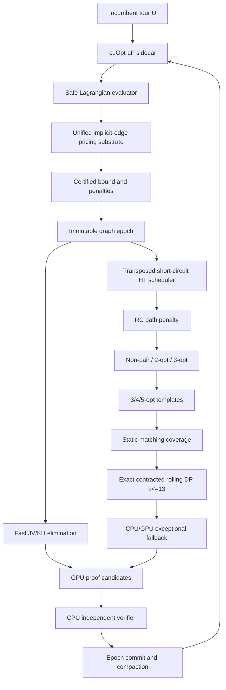

# GPU-ElimTSP 设计方案 v3

> **副标题**：基于 cuOpt、精确收缩 DP、转置短路调度与完整列定价的 TSP Local Elimination GPU 重构
>
> **文档状态**：研究与工程设计草案 v3.0
> **目标硬件**：RTX PRO 5000 Blackwell / RTX A5000 / RTX 4000 Ada
> **算法基线**：Cook–Helsgaun–Hougardy–Schroeder Local Elimination 与 `bicobico2/ElimTSP`
> **数值后端**：NVIDIA cuOpt PDLP / Barrier / Crossover，保留 CPU 严格认证与回退
> **日期**：2026-09-02

---

## 摘要

本文给出 GPU-ElimTSP 的第三版设计。与 v1 相比，v3 依据新增插桩结果完成四项实质性修订：

1. 将论文时间重新分解为 **LKH、Concorde/LP、Local Elimination** 三个阶段，避免将 core-seconds 当作 wall-clock Amdahl 权重，也避免把 LKH 时间错误标记为 LP 时间；
2. 放弃朴素层同步 BFS，改用**前沿 × 子索引转置的短路调度器**。该调度器在推测宽度 $s=1$ 时，对每个父状态保持与原 DFS 相同的有序短路求值，仅在不同目标边之间并行；
3. 将强制 outside-matching 边收缩后的精确 Held–Karp 型 DP 改造成**紧凑滚动层 DP**。在只存储有效状态 $(S,t,q)$、$t\in S$ 的条件下，$k=13$ 的最坏两层工作集约为 $86.625\,\mathrm{KiB}$，可在 CC 8.6/8.9 的 $99\,\mathrm{KiB/block}$ 上以一 block/SM 运行；
4. 将“LP 完整列 pricing”和“完整图 1-tree”统一到一个**隐式边空间查询基础设施**中，但保留不同的目标函数修正与证明层。完整 cutting-plane LP 的边 reduced cost 含 cut-dual 项，不能被纯加性几何权重完全替代。

v3 的推荐架构为：

> **cuOpt 生成高质量 primal–dual 候选；完整列定价与安全 Lagrangian evaluator 负责数值证明；自定义 CUDA 内核执行 Local Elimination 的 leaf predicates、3/4/5-opt、静态 matching coverage 和精确收缩 DP；转置短路调度器在 GPU 上保持 DFS 的短路语义；CPU 独立 verifier 作为最终信任边界。**

---

## 0. 证据等级与复现状态

本文使用以下标签区分证据来源：

- **[PAPER]**：原论文明确报告或证明；
- **[SOURCE]**：ElimTSP/Concorde/cuOpt 源码或公开接口明确支持；
- **[MEASURED]**：本项目新增插桩结果；
- **[DERIVED]**：由已给数据直接计算；
- **[PROPOSED]**：尚待实现和实机验证的设计；
- **[STRETCH]**：研究性上界，不作为交付承诺。

本轮新增的 early-exit、推测宽度和深层 $k$ 分布数据由项目方提供。由于相应 instrumentation patch、原始日志和运行环境清单尚未归档，v3 将这些数据作为 **[MEASURED, pending reproduction]** 使用。正式论文或性能承诺前必须保存：

```text
commit SHA
compiler and flags
machine topology
complete command line
input .tsp/.edg/.nonpairs/.fixed/.tour hashes
instrumentation patch
raw counters and replay traces
```

---

# 1. 性能口径的最终修订

## 1.1 三阶段时间分解

论文 Table 1 的 11 个共同实例包含两列前处理时间：LKH 生成 tour 上界，以及 Concorde 生成 LP relaxation。Table 4 给出 48-core network 上的 Local Elimination wall-clock。合计为：

| 阶段 | 合计 wall-clock | 全流程占比 |
|---|---:|---:|
| LKH | $69{,}549.7\,\mathrm{s}$ | $11.39\%$ |
| Concorde/LP | $469{,}779.5\,\mathrm{s}$ | $76.95\%$ |
| Local Elimination | $71{,}209\,\mathrm{s}$ | $11.66\%$ |
| 总计 | $610{,}538.2\,\mathrm{s}$ | $100\%$ |

因此：

- “LKH + Concorde 前处理”占 $88.34\%$；
- **纯 Concorde/LP 阶段不是 $88.3\%$，而是 $76.95\%$**；
- 若 incumbent tour $U$ 已经给定，则在“LP + Elimination”子流程中，LP 占

$$
\frac{469779.5}{469779.5+71209}=86.84\%.
$$

这三个口径必须分开报告。

## 1.2 三种端到端范围

定义：

- **Scope L**：只测 Local Elimination；
- **Scope P**：给定 incumbent $U$，从 LP 到 verified sparse graph；
- **Scope R**：从原始 TSP 到 verified sparse graph，包含 LKH；
- **Scope X**：最终 exact TSP solve，包含后续 cutting/branching，不在本阶段直接预测。

Scope R 的 Amdahl 模型为

$$
S_R=
\left(
\frac{0.1139}{S_{\mathrm{LKH}}}
+
\frac{0.7695}{S_{\mathrm{LP}}}
+
\frac{0.1166}{S_{\mathrm{elim}}}
\right)^{-1}.
$$

Scope P 的模型为

$$
S_P=
\left(
\frac{0.8684}{S_{\mathrm{LP}}}
+
\frac{0.1316}{S_{\mathrm{elim}}}
\right)^{-1}.
$$

### 1.2.1 修订后的算例

| $S_{LP}$ | $S_{elim}$ | $S_{LKH}$ | Scope R | Scope P | 解释 |
|---:|---:|---:|---:|---:|---|
| 1 | 550 | 1 | $1.132\times$ | $1.151\times$ | 只加速消除，端到端几乎不变 |
| 30 | 10 | 1 | $6.61\times$ | $23.75\times$ | cuOpt 很强，但原始流程仍受 LKH 限制 |
| 30 | 550 | 1 | $7.15\times$ | $34.26\times$ | 消除继续提高，Scope R 收益很小 |
| 30 | 10 | 10 | $20.53\times$ | $23.75\times$ | 同时加速或摊销 LKH |
| 30 | 550 | 10 | $26.84\times$ | $34.26\times$ | 极强组合，仍不采用 550× 作为承诺 |

**重要上限。** 若 LKH 保持不变，即使 LP 和 Elimination 无限快，Scope R 也有

$$
S_R\le \frac{1}{0.1139}=8.78\times.
$$

所以“完整原始输入到稀疏图 $20$–$50\times$”只有在以下至少一项成立时才合理：

1. incumbent 已预先存在，采用 Scope P；
2. LKH 被 GPU/多核化；
3. 多次 LP–Local 实验复用同一个 incumbent，将 LKH 成本摊销；
4. “端到端”明确不包含 tour generation。

## 1.3 工程优先级结论

Concorde/LP 是 Scope P 与 Scope R 中最大的单一 wall-clock 阶段，因此 cuOpt sidecar 必须提前。但 contracted DP 仍应先建立最小正确性闭环，因为它：

- 周期短；
- 可消除最大 Local leaf hotspot；
- 为 GPU leaf engine 提供规则精确核；
- 能同步提供可靠的 differential-test oracle。

建议 A0 与 B0/B1 **并行启动**，而不是串行等待。

---

# 2. 新增 early-exit 实测

## 2.1 测量结果

对 `pr299`、参数 `-z4`，项目方在 `try_extra_point` 和 `try_extra_edge` 的 OR/AND 循环中加入计数器，得到：

| depth | OR visited | OR available | $\rho_{OR}$ | OR success | AND visited | AND available | $\rho_{AND}$ | AND failure |
|---:|---:|---:|---:|---:|---:|---:|---:|---:|
| 2 | 1,256 | 1,258 | 1.002 | 0.6% | 1,733 | 3,672 | 2.119 | 99.6% |
| 3 | 5,341 | 6,492 | 1.216 | 28.7% | 20,032 | 32,159 | 1.605 | 84.2% |
| 4 | 17,824 | 21,872 | 1.227 | 30.6% | 64,721 | 193,775 | 2.994 | 90.0% |
| 5 | 24,369 | 32,692 | 1.342 | 40.7% | 122,194 | 391,232 | 3.202 | 89.3% |
| 6 | 8,549 | 10,997 | 1.286 | 41.9% | 63,817 | 168,602 | 2.642 | 86.6% |
| **Total** | **57,339** | **73,311** | **1.279** | — | **272,497** | **789,440** | **2.897** | — |

成功 OR candidate 的名次分布为：

```text
rank 0: 3611
rank 1: 1260
rank 2:  714
rank 3:  318
rank 4:  194
rank 5:   97
rank 6:   33
rank 7:    4
```

据此：

- OR 全量展开的局部冗余较小，但不是零；
- 58.6% 的成功 OR 节点在排名第一的 candidate 上成功，证明候选排序具有实际价值；
- AND 全量展开是主要冗余源，且 39.5% 的失败在第一个 child 上发生；
- “局部 TSP 只有 2% 找到改进”不能推导出“整棵 Hamilton–Tutte 树 early-exit 很少”。

## 2.2 不再使用 $3.71^L$ 作为定量结论

局部乘子

$$
1.279\times 2.897\approx 3.71
$$

说明朴素 BFS 存在严重风险，但不能直接写成

$$
\rho_{tree}=3.71^L
$$

并视为整棵树的实测放大率。原因是：

- OR/AND 节点数量随深度和父状态条件分布变化；
- 子树大小与 decisive-child 位置相关；
- 同一父节点内的 sibling 结果并非独立；
- 路径阈值、non-pairs、k-opt 和 DP 会改变后续分支。

v3 将指数式仅保留为“风险直觉”，正式结论必须来自**完整执行 trace replay**。

## 2.3 必须新增的 trace 格式

每个循环节点记录：

```c
struct ShortCircuitTrace {
    uint64_t state_id;
    uint64_t parent_id;
    uint32_t depth;
    uint16_t connective;       // OR or AND
    uint16_t child_count;
    uint16_t decisive_index;   // first success for OR, first failure for AND
    uint16_t visited_count;
    uint32_t subtree_work;
};
```

离线 replay 应直接输出：

- 总 leaf predicate 调用数；
- 总 DP transition 数；
- speculative child 数；
- 峰值 active continuations；
- 峰值证书记录数；
- 各 $s$ 下的真实树级 $\rho_s$；
- 与原 DFS wall-clock 的对应关系。

---

# 3. 转置短路调度器

## 3.1 基本思想

不采用：

- 每个线程独立递归一棵树；
- 一次性展开全部 siblings 的纯 BFS。

采用：

> **跨大量目标边并行；每个父状态按原有 child 顺序短路；将处于同一程序位置的 continuation 转置后批量执行。**

设父状态 $p$ 有有序 children

$$
c_{p,0},c_{p,1},\ldots,c_{p,b_p-1}.
$$

若 $p$ 是 OR 节点，其 decisive child 是第一个成功 child；若 $p$ 是 AND 节点，则是第一个失败 child。令 $J_p$ 为 DFS 实际需要评估的 child 数。

推测宽度为 $s$ 时，局部工作量为

$$
W_s
=
\sum_p
\min\left\{
 b_p,
 s\left\lceil\frac{J_p}{s}\right\rceil
\right\}.
$$

相对严格短路的冗余为

$$
\rho_s=\frac{W_s}{W_1}.
$$

当 $s=1$ 时，若 child 顺序与原程序一致，且一个 child subtree 在父状态推进前被解析到终态，则

$$
\rho_1=1.
$$

## 3.2 新增推测宽度实测

项目方基于当前 trace 得到：

| 推测宽度 $s$ | 求值次数 | $\rho_s$ | 每层扫描数 | 第二轮后仍活跃 |
|---:|---:|---:|---:|---:|
| 1 | 229,033 | 1.000 | 23 | 49.6% |
| 2 | 256,668 | 1.121 | 12 | 37.4% |
| 4 | 314,656 | 1.374 | 6 | 22.8% |
| 8 | 436,776 | 1.907 | 3 | 8.9% |
| $\infty$ | 563,841 | 2.462 | 1 | 0% |

这些结果支持将 $s=1$ 或 $s=2$ 作为首选，而不是纯 BFS。

## 3.3 重要语义条件

“$s=1$ 与 DFS 求值次数完全一致”成立需要以下条件：

1. candidate/reply 的顺序保持一致；
2. 父 continuation 在 child 返回终态前不能进入下一个 child；
3. 被取消 subtree 的迟到结果必须被丢弃；
4. leaf predicates 必须确定性或至少保持相同成功/失败语义；
5. 不能因为 GPU queue overflow 或时间片而跳过 child；
6. OR 节点如同时观察到多个成功结果，必须选择最小 child index；
7. AND 节点如同时观察到多个失败结果，同样选择最小 index。

跨不同目标边的执行次序可以任意交错，因为它们之间没有逻辑依赖。

## 3.4 Stackless continuation 表示

```c
struct Continuation {
    uint64_t state_id;
    uint64_t parent_cont;
    uint64_t root_edge_id;

    uint32_t pc;              // current program point
    uint16_t depth;
    uint16_t connective;      // OR / AND

    uint16_t next_child;
    uint16_t child_count;
    uint16_t speculation;
    uint16_t status;          // ACTIVE / SUCCESS / FAILURE / CANCELLED

    uint32_t generation;      // reject stale child returns
    uint32_t path_ref;
    uint32_t candidate_ref;
    uint32_t certificate_ref;
};
```

程序位置 `pc` 至少区分：

```text
LEAF_RC
LEAF_NONPAIR
LEAF_2OPT3OPT
LEAF_KOPT
LEAF_DP
TUTTE_SCORE
OR_NEXT_CANDIDATE
AND_NEXT_REPLY
WAIT_CHILD
PROPAGATE
```

## 3.5 Persistent scheduler 伪代码

```text
Algorithm TRANSPOSED-SHORT-CIRCUIT-ENGINE(roots):
    enqueue MAKE_ROOT_CONTINUATION(e) for every target edge e

    persistent CTAs repeat:
        B <- POP_BUCKET(pc, depth, path_count, k)
        if B is empty:
            steal from another SM-local queue
            continue

        switch B.pc:

        case LEAF_*:
            result <- EVALUATE_LEAF_BATCH(B)
            for each continuation q:
                if result[q] is terminal:
                    RESOLVE(q, result[q])
                else:
                    q.pc <- TUTTE_SCORE
                    enqueue q

        case TUTTE_SCORE:
            score every legal candidate in parallel
            stable segmented top-k by (score, candidate_id)
            initialize q.next_child <- 0
            q.pc <- OR_NEXT_CANDIDATE
            enqueue q

        case OR_NEXT_CANDIDATE:
            for q in B while q is ACTIVE:
                evaluate candidate indices
                    [q.next_child, q.next_child + s_OR)
                if a candidate succeeds:
                    choose smallest successful index
                    RESOLVE(q, SUCCESS)
                else if children remain:
                    q.next_child += s_OR
                    enqueue q
                else:
                    RESOLVE(q, FAILURE)

        case AND_NEXT_REPLY:
            for q in B while q is ACTIVE:
                evaluate reply indices
                    [q.next_child, q.next_child + s_AND)
                if a reply fails:
                    choose smallest failing index
                    RESOLVE(q, FAILURE)
                else if replies remain:
                    q.next_child += s_AND
                    enqueue q
                else:
                    RESOLVE(q, SUCCESS)

        case PROPAGATE:
            atomically update parent generation/status
            enqueue parent only if this result is current
```

## 3.6 调度策略

建议分别调节 OR 与 AND：

```text
s_OR  = 1 by default, because ranking makes first candidates valuable
s_AND = 1 while active continuation count is high
s_AND = 2 or 4 only when occupancy becomes insufficient
```

可按下式自动选择：

$$
s(q)=
\min\left\{
 s_{max},
 \max\left(1,
 \left\lceil\frac{W_{target}}{|Q_q|}\right\rceil
 \right)
\right\},
$$

其中 $|Q_q|$ 是当前桶内 active continuations，$W_{target}$ 是饱和 GPU 所需任务数。

## 3.7 Persistent kernel 并不消除所有调度成本

persistent kernel 可以摊销 host launch，但仍有：

- queue atomic；
- per-SM queue stealing；
- compaction；
- continuation global-memory traffic；
- canceled work；
- bucket fragmentation；
- 证书 arena 分配；
- block 间终止检测。

因此 v3 不将“kernel launch 次数归零”直接等同于“扫描次数没有代价”。需要分别测量：

$$
T=T_{leaf}+T_{queue}+T_{continuation}+T_{sync}+T_{certificate}.
$$

---

# 4. 强制边收缩与精确 DP

## 4.1 判定问题

对路径系统 $F$ 和 outside matching $O$，需判断是否存在包含 $O$ 的局部 Hamilton 回路 $T'$，满足

$$
c(T')<c(F)+c(O).
$$

将 $O$ 的每条匹配边收缩为双端口超点，未被 $O$ 覆盖的内部节点成为单端口超点。超点数为

$$
k=N-m=|F|.
$$

固定一个双端口根超点及其方向后，定义

$$
D[S,t,q]
$$

为从根出发、访问 $S$ 中全部超点、最后以方向 $q$ 穿越 $t$ 的最小连接代价。递推为

$$
D[S\cup\{u\},u,q_u]
=
\min_{t\in S,\,q_t}
\left\{
D[S,t,q_t]
+
d\bigl(\operatorname{out}(t,q_t),
        \operatorname{in}(u,q_u)\bigr)
\right\}.
$$

只要最优值小于 $c(F)$，便存在改进回路。

## 4.2 深层任务工作量

新增深参数统计按理论 transition 权重

$$
w(k)\propto 2^{k-1}k^2
$$

得到：

| $k$ | 调用占比 | DP 工作量占比 |
|---:|---:|---:|
| 9 | 26.4% | 7.1% |
| 10 | 32.2% | 21.5% |
| 11 | 16.8% | 27.2% |
| 12 | 4.9% | 18.9% |
| 13 | 2.7% | 24.4% |

因此 $k\ge12$ 虽仅占 7.6% 调用，却占 43.3% 理论 DP 工作量。将其全部送回 CPU 会形成新的 Amdahl 瓶颈。

## 4.3 紧凑滚动层状态

令根固定后剩余超点数为

$$
n=k-1.
$$

在 subset size 为 $\ell$ 的一层，仅存储合法状态

$$
(S,t,q),
\qquad |S|=\ell,
\quad t\in S,
\quad 0\le q<\nu(t).
$$

最坏情况下每个 terminal 有两个方向，故该层值数量满足

$$
N_\ell
\le
2\ell {n\choose \ell}.
$$

只保留相邻两层，32-bit cost 的最坏共享内存为

$$
M_k^{roll}
=
4\max_\ell(N_{\ell-1}+N_\ell).
$$

### 4.3.1 修正后的内存表

下表与按每个 subset 固定预留 `K×2` 位置的数组不同，只存储 $t\in S$ 的有效 terminal 状态：

| $k$ | 紧凑全表 | 紧凑滚动两层 | CC 8.6/8.9 理论 memory blocks/SM* |
|---:|---:|---:|---:|
| 9 | 8.0 KiB | 4.375 KiB | 16（受 resident-block 上限约束） |
| 10 | 18.0 KiB | 8.859 KiB | 11 |
| 11 | 40.0 KiB | 19.688 KiB | 5 |
| 12 | 88.0 KiB | 39.703 KiB | 2 |
| 13 | 192.0 KiB | **86.625 KiB** | **1** |

\* 尚未计入寄存器、距离矩阵和少量 scratch；实际 occupancy 以编译结果为准。

**结论：** 在紧凑索引和 32-bit 饱和 cost 下，$k=13$ 可以不走 global DP，而是在 CC 8.6/8.9 的 $99\,\mathrm{KiB/block}$ 限制内运行。

## 4.4 32-bit 饱和代价的正确性

DP 只关心是否

$$
\operatorname{OPT}(F,O)<c(F).
$$

若 $c(F)<2^{32}-1$，定义

$$
\operatorname{sat}_{c(F)}(z)=\min\{z,c(F)\}.
$$

所有 transition 使用无符号 32-bit 饱和加法：

$$
D'\leftarrow
\operatorname{sat}_{c(F)}(D+w).
$$

任何真实值 $\ge c(F)$ 都被合并为同一个 `INF=c(F)`，不会影响“是否严格小于 $c(F)$”的判定。因此这是精确压缩，而非近似。

若实例中 $c(F)$ 或中间加法可能超过 `UINT32_MAX`，任务转入：

- 64-bit global scratch；或
- 64-bit block kernel（在共享内存允许时）；或
- CPU exact fallback。

## 4.5 紧凑索引

推荐两种实现：

### 方案 A：mask-to-rank 只读表

对于 $k\le13$，非根 mask 数最多 $2^{12}=4096$。预计算

```text
rank_by_popcount[k][mask]
```

使用 `uint16_t` 即可，单个 $k=13$ 表约 8 KiB，可置于 constant/read-only memory，不占 DP shared memory。

### 方案 B：combinadic/colex rank

$$
\operatorname{rank}_{colex}(S)
=
\sum_{r=1}^{|S|}{s_r\choose r},
$$

其中 $s_1<\cdots<s_{|S|}$ 是集合元素。二项式表非常小，但每次 transition 需额外整数指令。

首版应同时实现二者并基准测试。

## 4.6 两遍 traceback

```text
Pass 1: value only
    rolling two-layer DP
    return best < c(F)?

Pass 2: successful tasks only
    rerun DP with parent storage or backward recomputation
    emit supernode order
    reconstruct inside matching witness
```

若成功率约为 2%，第二遍增加的算术工作接近 2%，而避免为 98% 失败任务保存 parent。该成功率目前只在特定实例/参数上测得，必须跨实例复测。

## 4.7 GPU kernel 草图

```text
Kernel EXACT-CONTRACTED-DP<K>:
    one CTA <- one (F, O)

    load endpoint coordinates and port maps
    build exact local distance matrix
    initialize layer 1

    for ell = 1 .. K-2:
        parallel over compact states (S,t,q) in layer ell
        for every u not in S and every valid direction q_u:
            dst <- compact_index(S union {u}, u, q_u)
            atomicMin/shared segmented min with saturated cost
        synchronize CTA
        swap current and next layer

    close tour to fixed root
    write best value and success flag
```

可进一步将 transition 转置为 `(destination state <- predecessor scan)`，消除 shared-memory atomics。两种版本都应测试。

---

# 5. Matching coverage

当 $m\le5$ 时：

$$
|\mathcal O_F|=2^{m-1}(m-1)!\le384,
$$

而 10 个端点上的全部 perfect matchings 数量为

$$
9!!=945.
$$

主路径采用静态表：

```text
outside_matching[m][outside_id]
inside_matching_id[canonical_matching]
coverage[m][inside_id] -> 384-bit mask
```

覆盖表大小为

$$
945\times384\text{ bits}=45{,}360\text{ bytes}.
$$

一次 inside matching 更新仅需最多 6 个 64-bit 位运算：

$$
B\leftarrow B\wedge\neg C(I).
$$

Lehmer 反秩保留用于：

- 离线生成/验证静态表；
- 未来 $m>5$ 的扩展；
- 低内存通用 fallback。

---

# 6. LP、完整列 pricing 与 1-tree 的统一方式

## 6.1 相同的抽象问题

稀疏模型与完整图之间都存在同一个元问题：

> 在未显式存储的边空间中，证明不存在会改善当前数值界或组合结构的边。

因此 LP pricing 与完整图 1-tree 可以共享：

- 点坐标 SoA；
- grid / kd-tree / LBVH；
- 空间节点的距离下界；
- endpoint potential 的区间界；
- exclusion mask；
- candidate compaction；
- deterministic min-reduction；
- CPU exact replay。

## 6.2 但目标函数并不相同

### 6.2.1 度约束/1-tree 情况

在节点势 $\pi$ 下，修改费用为

$$
\bar d_{ij}=d_{ij}-\pi_i-\pi_j.
$$

Borůvka 的一个基本查询是：对 component $C$，求

$$
\min_{i\in C,\ j\notin C}
\left(d_{ij}-\pi_i-\pi_j\right).
$$

这是带 component exclusion 的加性加权几何最近邻问题。

### 6.2.2 完整 cutting-plane LP 情况

含 cut constraints 时，遗漏边 $e=ij$ 的 reduced cost 一般为

$$
\bar c_{ij}
=
 d_{ij}
-
\alpha_i-
\alpha_j
-
\sum_r y_r a_{r,ij},
$$

其中 $a_{r,ij}$ 取决于边与 subtour/clique/comb/domino 等 cut 的关联。最后一项通常不能表示成两个 endpoint weights 的简单和。

因此：

> LP pricing 和 1-tree pricing 是同一个“隐式边搜索”基础设施上的两个 evaluator，而不是完全相同的一个 kernel。

## 6.3 共享三阶段 pricing framework

```text
Stage G: geometric lower-bound search
    produce cells/pairs that may beat threshold

Stage C: problem-specific correction
    1-tree: endpoint potentials and component exclusion
    LP: node duals + exact cut incidence contribution

Stage V: completeness certificate
    prove every omitted cell/edge is above threshold
    or fall back to Concorde exact pricing / CPU exhaustive verifier
```

### 6.3.1 统一接口

```c
struct ImplicitEdgeOracle {
    SpatialIndex index;
    CoordinateSoA points;

    CandidateBatch query_point_threshold(...);
    CandidateBatch query_component_min(...);
    CoverageProof  certify_cells(...);
};

struct OneTreeEvaluator {
    EndpointPotential pi;
    ComponentLabels component;
};

struct LPReducedCostEvaluator {
    NodeDual alpha;
    CutDual y;
    CutIncidenceIndex cuts;
};
```

## 6.4 对“一个 kernel 同时解决两个问题”的修订

可以统一的是：

- 空间索引；
- 候选生成；
- cell lower-bound 框架；
- 排序、压缩和归约；
- 证明记录格式。

不能直接统一的是：

- full LP 的 cut-dual correction；
- 1-tree component exclusion；
- forced-edge/excluded-edge 1-tree 条件界；
- 各自的完整性证书。

所以 v3 将其命名为**统一 pricing substrate**，而不是“单个相同 kernel”。

## 6.5 ElimTSP 中已有代码的边界

ElimTSP 引入的 `cc_heldkarp.c` 是 Local Elimination 叶节点使用的小型 Held–Karp 1-tree solver。它不等价于 Concorde TSP 模块中的：

```text
CCtsp_exact_price
CCtsp_addbad_variables
CCtsp_pricing_loop
CCtsp_edge_elimination
```

后者还需处理 LP cuts、完整列和 exact dual。完整列 GPU pricing 因此是新增工作包，不能仅以“已经链接 `cc_heldkarp.c`”视为完成。

## 6.6 1-tree 路线的正确定位

若 GPU 空间 oracle 能精确处理完整边空间，则完整图 Held–Karp 1-tree 不再受 restricted-edge 问题限制。此时它可以成为：

- 极快的 degree-only Lagrangian bound；
- LP epochs 之间的快速 filter；
- 目标边与 Tutte move 排序器；
- cuOpt 失败时的 fallback；
- 候选图生成器。

但它仍不等价于含大量 cuts 的 Concorde LP。应比较：

$$
\text{较弱但便宜的完整 1-tree}
\quad\text{vs.}\quad
\text{较强但昂贵的 cutting-plane LP}.
$$

最优系统很可能是两者共存，而不是二选一。

---

# 7. 安全 Lagrangian evaluator

## 7.1 一般形式

令 LP 写成

$$
\min c^\top x,
\qquad
A^Lx\ge b^L,
\qquad
A^Ux\le b^U,
\qquad
\ell\le x\le u.
$$

取任意满足行方向符号要求的乘子

$$
y^L\ge0,
\qquad
y^U\ge0,
$$

并定义

$$
r=c-(A^L)^\top y^L+(A^U)^\top y^U.
$$

则安全下界为

$$
L(y)=
(b^L)^\top y^L-(b^U)^\top y^U
+
\sum_j\min_{\ell_j\le z\le u_j}r_jz.
$$

对 $0\le x_j\le1$：

$$
L(y)=
(b^L)^\top y^L-(b^U)^\top y^U
+
\sum_j\min\{0,r_j\}.
$$

## 7.2 强制变量的通用 penalty

将变量 $x_j$ 强制为 $v$ 时：

$$
P_j(v)=
r_jv-
\min_{\ell_j\le z\le u_j}r_jz.
$$

因此

$$
L_j^{(v)}(y)=L(y)+P_j(v).
$$

对 TSP 二元变量：

$$
P_j(1)=\max\{0,r_j\},
\qquad
P_j(0)=\max\{0,-r_j\}.
$$

边消除与固定规则为：

$$
L(y)+\max\{0,r_j\}>U
\Longrightarrow x_j=0,
$$

$$
L(y)+\max\{0,-r_j\}>U
\Longrightarrow x_j=1.
$$

路径系统 $F$ 的 GPU leaf rule 为

$$
L(y)+\sum_{e\in F}\max\{0,r_e\}>U
\Longrightarrow F\text{ 与最优性不相容}.
$$

## 7.3 完整列要求

上述求和中的 $j$ 必须覆盖所声明模型的全部变量。若 cuOpt 只求 restricted master $E_R$，则必须：

1. 对 $E(K_n)\setminus E_R$ 做完整 pricing；或
2. 已有独立证书证明候选图包含所有最优 tours；或
3. 对遗漏列的负贡献给出严格总下界并加入 $L(y)$。

## 7.4 cuOpt 使用方式

```text
cuOpt PDLP / Barrier / Concurrent
    -> approximate primal and row multipliers
    -> normalize row senses
    -> project sign-constrained multipliers
    -> complete-column pricing
    -> directed-rounding / rational safe evaluator
    -> certified L^-, edge penalties, path penalties
```

cuOpt 解的精度影响界的强度，但安全 evaluator 决定最终 soundness。Crossover 用于改善解与 reduced costs，不作为安全性的必要条件。

---

# 8. GPU Local Elimination 完整流水线



## 8.1 Leaf pipeline 顺序

按预期成本排列：

```text
1. path validity / cycle check
2. certified RC path penalty
3. known non-pair lookup
4. universal 2-opt
5. universal 3-opt
6. table-driven 3/4/5-opt
7. static inside/outside matching coverage
8. exact contracted DP
9. exceptional CPU/global-memory fallback
```

## 8.2 Immutable graph epoch

一个 epoch 内使用只读图快照：

```c
struct GraphEpoch {
    int64_t* row_offsets;
    int32_t* neighbors;
    int32_t* lengths;
    int32_t* edge_ids;
    uint32_t* active_bits;
    uint32_t* fixed_bits;
    uint32_t* nonpair_index;
    uint32_t* path_penalty_scaled;
};
```

GPU 只写 proposal bitsets 与 witness。CPU 验证后统一 commit，再压缩 CSR。

---

# 9. 内存与距离

## 9.1 初始图不是 L2-resident

usa115475 在 reduced-cost elimination 后仍有 25,009,702 条无向边。根据表示方式，一次完整 pass 的最小内存流量可能约为 200–600 MB，而非仅 200 MB：

- 单向 edge tuple；
- 双向 CSR；
- length；
- edge ID；
- active/fixed bits；
- 坐标与输出。

理论峰值带宽计算

$$
200\,\mathrm{MB}/1344\,\mathrm{GB/s}\approx0.15\,\mathrm{ms}
$$

只是不可达到的传输下限，不能作为 kernel 时间预测。实际时间还包含：

- 非连续 adjacency access；
- 坐标读取；
- exact distance；
- predicate branches；
- queue output；
- achieved bandwidth 与峰值带宽的差距。

正确方法是建立 roofline：

$$
T\ge
\max\left\{
\frac{\text{bytes}}{B_{achieved}},
\frac{\text{integer operations}}{P_{achieved}}
\right\}.
$$

坐标约 1.85 MB，可长期驻留缓存；后期 30–40 万边图也可能高度缓存友好。

## 9.2 位精确距离

EUC_2D 对整数坐标可用整数平方和与整数平方根实现，避免 CPU/GPU `sqrt` 边界差异。令

$$
s=(x_i-x_j)^2+(y_i-y_j)^2,
\qquad q=\lfloor\sqrt{s}\rfloor.
$$

最近整数距离可通过比较 $s$ 与半整数平方阈值决定。CEIL_2D 同样可精确判定。GEO、ATT 等类型在首版中：

- 使用逐类型严格实现；或
- GPU 提议，CPU 重算 witness；或
- 直接 CPU fallback。

---

# 10. 正确性与证书

## 10.1 信任协议

GPU 返回：

```text
PROVEN(witness)
UNRESOLVED
ERROR
```

只有 `PROVEN` 且 CPU 重放成功才能：

- eliminate edge；
- fix edge；
- register non-pair；
- compact graph。

## 10.2 新增 witness 类型

```text
RC_PATH:
    LP certificate id
    path edge ids
    integer-scaled penalty sum

KOPT:
    outside matching id
    deleted edges
    added edges
    exact integer gain

CONTRACTED_DP:
    outside matching id
    supernode traversal
    reconstructed local tour
    inside matching id

HT_INTERNAL:
    Tutte move
    ordered Hamilton replies
    chosen child index
```

## 10.3 Deterministic mode

- candidate score tie-break by node/edge ID；
- OR/AND choose minimum decisive index；
- fixed queue drain order；
- deterministic reductions；
- certificate arena uses deterministic prefix allocation；
- cuOpt/LP certificate records solver version and settings。

---

# 11. 修订后的工作包与周期

## A0：Contracted DP 复现与 CPU 基线（1–2 周）

- 获取 `dpswap.c`、`improve.c.patch` 与原始日志；
- 全排列 differential test；
- static matching table；
- arena allocation；
- table-driven 3/4/5-opt；
- trace/replay 框架。

**交付：** 精确 leaf oracle、可重放 benchmark、Local-only CPU 加速。
**Scope R 预期：** 约 $1.04$–$1.10\times$，而不是笼统写成 $1.1\times$ 以上。

## B0/B1：cuOpt sidecar + 完整列认证（与 A0 并行，3–6 周）

- 导出 LP checkpoint；
- PDLP/barrier/concurrent A/B；
- primal/dual warm start；
- row-sense normalization；
- complete-column pricing adapter；
- safe Lagrangian evaluator；
- CPU exact replay。

**交付：** 经认证的 lower bound、edge penalties 和 path penalties。
**性能口径：** sidecar 单独不承诺 $5$–$15\times$ Scope R；若 LP 阶段分别获得 $5\times/10\times/15\times$，而其他阶段不变，则 Scope R 约为 $2.60\times/3.25\times/3.55\times$。

## A1：GPU leaf engine，覆盖 $k\le13$（3–6 周）

- exact distance；
- RC/nonpair/2-opt/3-opt；
- 3/4/5-opt templates；
- matching bitsets；
- compact rolling DP；
- success-only traceback；
- CPU fallback。

**交付：** CPU tree + GPU leaf 的可信版本。

## C1：转置短路引擎（6–10 周）

- continuation interpreter；
- per-SM queues；
- $s_{OR}$、$s_{AND}$ adaptive policy；
- cancellation generations；
- stable top-k；
- certificate arena；
- trace-equivalence test。

**交付：** 深层不必默认回 CPU，且 $s=1$ 模式保持原 DFS 短路求值。

## C2：统一隐式边 pricing substrate（可与 C1 并行）

- grid/LBVH/kd-tree baseline；
- additively weighted point/component queries；
- cut-incidence correction；
- spatial-cell lower-bound certificate；
- complete-graph 1-tree；
- full LP omitted-column audit。

**交付：** 同一空间基础设施服务两个 evaluator。

## C3：LP–Local 固定点

```text
LP solve
 -> certified complete pricing
 -> RC/path penalties
 -> Local Elimination
 -> graph compaction
 -> LP rebuild/warm start
 -> repeat
```

**交付：** 降低变量数、LP epoch 数与 Local tree 工作量的协同系统。

## C4：LKH 成本处理

若项目采用 Scope R 且目标超过 $8.78\times$，必须至少实现一项：

- 复用已有高质量 incumbent；
- 多 GPU/多进程 LKH runs；
- 将高质量 tour generation 作为离线输入；
- 使用 GPU-friendly tour heuristic；
- 明确将 benchmark 改为 Scope P。

---

# 12. 修订后的性能目标

## 12.1 不含算法工作量变化的组件加速

| 版本 | LP 阶段 | Elimination 阶段 | LKH | Scope R 参考区间 | Scope P 参考区间 |
|---|---:|---:|---:|---:|---:|
| A0 | 1× | 1.5–4× | 1× | 1.04–1.10× | 1.05–1.12× |
| B1 + A0 | 3–10× | 1.5–4× | 1× | 2.23–4.55× | 2.65–8.35× |
| B1 + A1 | 5–15× | 5–15× | 1× | 3.43–5.78× | 5–15× |
| C1/C2 mature | 10–30× | 10–35× | 1× | 4.94–7.00× | 10–30.57× |
| 同时处理 LKH | 10–30× | 10–35× | 5–10× | 8.98–24.77× | 10–30.57× |

这些区间只是 Amdahl 规划值，不是实测保证。

## 12.2 LP–Local 协同可能突破固定阶段模型

若 C3 减少了：

- LP columns；
- cut epochs；
- pricing passes；
- Hamilton replies；
- DP tasks；

则原始固定阶段占比不再成立。可定义算法工作量缩减因子

$$
R_{LP},R_{elim}\ge1,
$$

并写成

$$
S_R=
\left(
\frac{f_{LKH}}{S_{LKH}}
+
\frac{f_{LP}}{S_{LP}R_{LP}}
+
\frac{f_{elim}}{S_{elim}R_{elim}}
\right)^{-1}.
$$

但只要 LKH 仍在 Scope R 且不加速，$8.78\times$ 上限仍存在。

## 12.3 Stretch targets

以下只保留为研究目标：

- Local leaf arithmetic 相对旧单核 $100\times+$；
- 完整 Local Elimination 相对旧单核 $300\times+$；
- 旧 48-core network 相对单卡 $6$–$17\times$；
- Scope P 在 LP 和 Local 同时极强时 $20\times+$。

禁止把这些值直接转换为 Scope R 承诺。

---

# 13. 实验矩阵

## 13.1 必须覆盖的实例

```text
Correctness:
    pr299
    small random n <= 14 exhaustive cases

Mid-size:
    pcb3038
    fl3795
    rl5915
    pla7397
    d18512

Large:
    pla33810
    pla85900

100k+:
    E100k.0
    mona-lisa100k
    usa115475
```

## 13.2 调度 ablation

```text
CPU DFS
naive BFS
transposed s=1
transposed s=2
transposed s=4
adaptive s
CPU DFS + GPU leaves
full persistent continuation engine
```

指标：

- exact leaf calls；
- DP transitions；
- queue bytes；
- canceled work；
- peak frontier；
- certificate size；
- wall-clock；
- energy。

## 13.3 DP ablation

```text
original Held-Karp B&B
CPU full-mask DP
CPU compact DP
GPU full-table DP
GPU rolling compact DP
GPU rolling + success-only traceback
k=13 shared vs global
```

## 13.4 Pricing ablation

```text
Concorde exact pricing
CPU kd-tree pricing
GPU brute-force tiled pricing for small n
GPU LBVH candidate generation + CPU correction
GPU LBVH + GPU cut correction
complete 1-tree oracle
restricted 1-tree without certificate (diagnostic only)
```

---

# 14. Go/No-Go 决策点

## G1：DP 正确性

**Go：** contracted DP 与 exhaustive/original oracle 对所有测试一致。
**No-Go：** 发现路径收缩、方向或 traceback 无法稳定复现 inside matching。

## G2：$k=13$ shared feasibility

**Go：** 86.625 KiB compact layer kernel 可启动，且比 global scratch 快。
**Fallback：** k=13 global scratch；不可退回 CPU 作为默认，因为其工作量占比高。

## G3：cuOpt bound quality

**Go：** 经完整列认证后，bound 与有效 elimination count 具有优势。
**Fallback：** cuOpt 仅提供 primal/candidate dual；CPU simplex 完成 polish。

## G4：transposed engine

**Go：** s=1 replay 与 DFS leaf-call 集合相同，queue overhead 小于算术收益。
**Fallback：** CPU tree + GPU leaf engine 作为长期稳定版本。

## G5：pricing unification

**Go：** 共享空间索引对 1-tree 和 LP candidate generation 都有收益。
**Fallback：** 保留共同数据布局，但分别实现两个查询器。

---

# 15. 最终结论

本轮新增数据实质性改变了 GPU 搜索架构：

1. 朴素层同步 BFS 不应继续作为主方案；
2. `rank_extra_points` 必须保留并 GPU 化；
3. 深层 $k=12,13$ 不能默认回退 CPU；
4. 转置短路调度可在跨边并行的同时保存单树 DFS 的短路语义；
5. 紧凑滚动层进一步表明 $k=13$ 也有机会完全留在 A5000/Ada shared memory；
6. LP 与 1-tree 确实共享“隐式完整边空间”的核心工程问题，但完整 LP 的 cut-dual correction 要求独立 evaluator 与 completeness certificate；
7. LP 路线应提前，但性能报告必须把 LKH 与 Concorde 分开。

因此 v3 的核心技术栈确定为：

> **cuOpt numerical candidate generation + complete-column safe pricing + exact Lagrangian certification + static matching automata + exact contracted rolling DP + transposed short-circuit Hamilton–Tutte scheduler + immutable graph epochs + independent CPU verification.**

---

# 参考资料

1. W. Cook, K. Helsgaun, S. Hougardy, R. T. Schroeder, *Local elimination in the traveling salesman problem*, 2023.
2. ElimTSP: `https://github.com/bicobico2/ElimTSP`.
3. Concorde callable-library documentation, especially `CCtsp_exact_price`, `CCtsp_addbad_variables`, `CCtsp_pricing_loop`, and `CCtsp_edge_elimination`.
4. NVIDIA cuOpt 26.08, Convex Optimization Features and Release Notes.
5. NVIDIA CUDA Programming Guide, compute capabilities and shared-memory limits.
