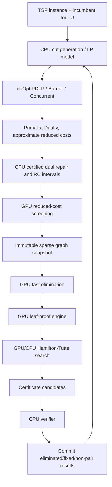

# 基于 NVIDIA cuOpt 与 CUDA 的 Local Elimination GPU 加速方案

> **文档性质**：研究与工程设计草案（v0.1）  
> **日期**：2026-09-01  
> **算法基线**：Cook、Helsgaun、Hougardy 与 Schroeder 的 *Local elimination in the traveling salesman problem*，以及 `bicobico2/ElimTSP` 主分支源码（审阅时 HEAD：`d7bacf0d79ddc1f6f9e77b027df16d446458e58c`）。  
> **cuOpt 基线**：NVIDIA cuOpt 26.08 的公开文档与源码。  
> **重要说明**：本文给出的性能区间是基于算法结构、公开结果与 Amdahl 模型的工程预测，不是对 RTX PRO 5000、RTX A5000 或 RTX 4000 Ada 的实测结果。

---

## 摘要

Local Elimination 通过构造 Hamilton–Tutte 博弈树，证明某些边不可能出现在任意最优旅行商回路中，或者证明某些边必须出现在所有最优回路中 [1]。其核心优势是证明局部化、可生成证书，并可与 LP reduced-cost elimination 组合。其主要计算负担来自两个相互作用的部分：

1. 切割平面流程中的大规模稀疏 LP 求解、定价与 reduced-cost 计算；
2. Hamilton–Tutte 搜索中的大量局部路径系统验证、outside matching 枚举、3/4/5-opt 搜索以及局部 Held–Karp 搜索。

本文提出一种**证明保持的 CPU–GPU 协同体系**。其中，NVIDIA cuOpt 被用作大规模 LP 的 GPU 数值后端，CUDA 自定义内核承担 Local Elimination 的批量组合计算；CPU 保留切割分离、严格 reduced-cost 认证、困难长尾搜索和最终证书验证。进一步地，原有递归搜索被等价表示为 AND–OR 状态图，并可通过持久化工作队列与 wavefront 调度转化为 GPU 友好的形式。

方案的核心原则是：

> **GPU 负责高吞吐候选生成与证明搜索；所有会导致删边或固定边的结论均由可独立复核的证书或严格数值界确认。**

建议分三阶段推进：

- **阶段 A：cuOpt LP sidecar + GPU fast elimination**，目标端到端加速约 `2.5×–5×`；
- **阶段 B：GPU leaf-proof engine + reduced-cost 深度集成**，目标约 `5×–10×`；
- **阶段 C：Hamilton–Tutte wavefront、LP/消边交替和多 GPU 调度**，目标约 `8×–18×`，特别有利的大实例可进一步探索 `20×` 量级。

---

## 1. 研究目标与范围

### 1.1 目标

本项目的目标不是简单地将现有 C 代码逐行改写为 CUDA，而是建立一个满足以下条件的新系统：

1. **数学正确性不弱于原算法**：任何被消除或固定的边均有可验证证明；
2. **LP 与组合消边协同**：不再把 LP reduced costs 仅用于初始化边集，而是将其用于 Hamilton–Tutte 树的叶节点判定与搜索排序；
3. **高吞吐 GPU 执行**：把大量小而同构的局部任务批处理；
4. **保持 CPU 长尾能力**：高度不规则、任务数量很少或需要严格数值处理的工作继续在 CPU 上执行；
5. **支持现有硬件**：首先面向 RTX A5000、RTX 4000 Ada、RTX 5000 Ada 或 RTX PRO 5000 等工作站 GPU；
6. **保留或扩展证书机制**：GPU 可以是不可信计算设备，最终结果必须可由独立 verifier 重放。

### 1.2 非目标

第一阶段不追求：

- 将 Concorde 的所有 separator、cut pool 和 branch-and-cut 控制完全搬到 GPU；
- 使用 cuOpt MIP 直接证明完整 TSP 最优；
- 取消 CPU verifier；
- 在第一版中实现完全 GPU 化的精确 Held–Karp branch-and-bound；
- 保证 GPU 版本与原程序在启发式限时下消除完全相同的边集。

在启发式候选限制和时间限制存在时，不同调度次序可能得到不同但都正确的稀疏图。项目的首要不变量是**soundness**，其次才是 reduction strength。

### 1.3 证据边界与方案标记

本文将三类内容严格区分：

- **文献与源码事实**：来自论文 [1]、ElimTSP 主分支 [2] 或 NVIDIA 官方 cuOpt 文档 [3–10]；
- **等价重构**：保持 Hamilton–Tutte AND–OR 逻辑与 leaf proof 判据不变，仅改变数据结构、执行顺序或并行调度；
- **研究性建议**：例如 cuOpt routing oracle、GPU wavefront、LP–Local 交替固定点及性能区间，均需通过差分测试和实机 benchmark 验证。

除非明确说明，本文中的 GPU 结果都采用“候选生成—CPU 复核”协议，不把浮点数值输出直接视为消边证书。

---

## 2. 数学背景与计算结构

### 2.1 TSP LP 松弛

设无向完全图为

$$
K_n=(V,E(K_n)),\qquad c_e\in\mathbb{Z}_{\ge 0}.
$$

标准 TSP LP 使用变量 $x_e\in[0,1]$。其基础 subtour 松弛可写为

$$
\begin{aligned}
\min\quad & \sum_{e\in E} c_e x_e,\\
\text{s.t.}\quad
& x(\delta(v))=2, && \forall v\in V,\\
& x(\delta(S))\ge 2, && \varnothing\ne S\subsetneq V,\\
& 0\le x_e\le 1, && \forall e\in E.
\end{aligned}
$$

在第 $t$ 个 cutting-plane epoch 中，可统一表示为

$$
\mathrm{LP}_t:
\quad
\min c^\top x
\quad \text{s.t.}\quad
\ell_t\le A_t x\le u_t,
\qquad 0\le x\le 1,
$$

其中 $A_t$ 包含度约束、subtour inequalities、comb/local cuts、domino-parity cuts 或其他有效不等式。该形式与 cuOpt 的 CSR 约束矩阵接口直接匹配。

### 2.2 Reduced-cost elimination

设当前已知 tour 长度为 $U$，经严格验证的 LP 下界为 $L$，定义

$$
\Delta=U-L\ge 0.
$$

采用论文中的 reduced-cost 符号约定，若变量 $x_e$ 的 reduced cost 为 $r_e$，则

$$
r_e>\Delta \Longrightarrow x_e=0,
$$

以及

$$
r_e<-\Delta \Longrightarrow x_e=1.
$$

在数值实现中，cuOpt 给出的 $\widehat r_e$ 只能作为浮点候选。令经 CPU 严格认证得到的区间为

$$
r_e\in[\underline r_e,\overline r_e],
$$

并令 $L^-$ 为严格有效的 LP 下界，则使用

$$
\Delta^+=U-L^-.
$$

安全规则为

$$
\underline r_e>\Delta^+
\Longrightarrow x_e=0,
$$

$$
\overline r_e<-\Delta^+
\Longrightarrow x_e=1.
$$

### 2.3 Reduced costs 在 Local Elimination 内部的作用

原论文指出，若 Hamilton 已揭示的边集为 $F$，且 [1, §5.1.4]

$$
\sum_{e\in F} r_e>\Delta,
$$

则 $F$ 与 TSP 最优性不相容，无须再证明 $F$ 是 nowhere $k$-optimal。

为保证 GPU 上的求和也是严格安全的，本文建议在 CPU 上将 verified reduced-cost 下界量化为整数。取缩放因子 $S=2^q$，定义

$$
R_e=\left\lfloor S\underline r_e\right\rfloor,
\qquad
D=\left\lceil S\Delta^+\right\rceil.
$$

由于 $R_e\le S\underline r_e$，故

$$
\sum_{e\in F}R_e>D
\Longrightarrow
\sum_{e\in F}\underline r_e>\Delta^+.
$$

于是 GPU 叶节点可以仅使用 `int64` 完成严格的 reduced-cost 证明。

### 2.4 Hamilton–Tutte 搜索的 AND–OR 语义

令 $F$ 表示当前 Hamilton 揭示边集，$\mathcal C(F)$ 表示候选 Tutte moves，$\mathcal H(F,v)$ 表示对 move $v$ 的全部 Hamilton replies。定义

$$
\operatorname{Leaf}(F)=
\begin{cases}
1, & F\text{ 已被证明与最优性不相容},\\
0, & \text{否则}.
\end{cases}
$$

原递归算法可表示为

$$
\operatorname{HT}(F)
=
\operatorname{Leaf}(F)
\lor
\bigvee_{v\in\mathcal C(F)}
\left(
\bigwedge_{H\in\mathcal H(F,v)}
\operatorname{HT}(F\cup H)
\right).
$$

其含义为：

- Tutte 只需找到一个成功 move，因此是 OR；
- 对一个给定 Tutte move，必须处理所有 Hamilton replies，因此是 AND；
- 叶节点的不相容性证明结束该分支。

这一表示为 GPU wavefront 和原子计数传播提供了严格语义基础。

### 2.5 Path ordering 与 matching

若 $F$ 表示为 $m$ 条节点不交路径组成的路径系统

$$
P_F=\{p_1,\ldots,p_m\},
$$

则需考虑的 outside matchings 数量为

$$
N_m=2^{m-1}(m-1)!.
$$

原实现限制 $m\le 5$ [1, §2.3]，因此

$$
N_5=2^4\cdot 4!=384.
$$

在 $2m=10$ 个端点上，所有 perfect matchings 的数量为

$$
(2m-1)!!=9!!=945.
$$

故可预计算一个 `945 × 384` bit 的 compatibility table，大小约为 45 KB。找到 inside matching $I$ 后，只需执行

$$
B\leftarrow B\setminus C(I),
$$

其中 $B$ 是尚未覆盖的 outside matching bitset，$C(I)$ 是与 $I$ 共同形成单一回路的 outside matchings 集合。这将原来的逐 matching 图遍历转化为少量 64 位按位运算。

---

## 3. 现有源码的热点映射

下表区分原源码事实与本文建议的 GPU 映射；源码函数名称来自 ElimTSP 主分支 [2]。

| 原源码位置 | 当前职责 | 性能特征 | 建议实现 |
|---|---|---|---|
| `src/elimmain.c` | bootstrap、boss-worker、任务分发 | 边级任务可并行，但网络粒度较粗 | CPU orchestrator + GPU epoch scheduler |
| `src/elim.c::CCelim_run_elim_edge` | 目标边入口、候选 $(c,d)$、递归搜索 | 分支不规则，适合任务图而非单 kernel | AND–OR wavefront 或 CPU/GPU 混合 DFS |
| `src/elim.c::potential_cd` | 候选 Tutte 点对排序 | 小集合两两组合、重复距离比较 | warp/block 批量候选生成与 top-$k$ |
| `src/elim.c::CCelim_check_neighbors_three_swap` | 枚举邻居对并做 2/3-opt 过滤 | 高度数据并行 | 一个 warp 处理一个中心点 |
| `src/path.c::CCelim_validate_paths` | 合并路径、检查重复节点与回路 | 当前会分配大数组 | 固定容量 SoA + generation marks |
| `src/path.c::CCelim_test_paths` | matching、距离矩阵、k-opt、局部 TSP | 最重要 leaf hotspot | GPU leaf-proof engine |
| `src/path.c::build_omatch_list` | 生成 outside matchings | 对 $m\le 5$ 完全静态 | 离线预计算 |
| `src/path.c::check_match` | inside/outside matching 覆盖 | 重复的小图遍历 | 预计算 bitset table |
| `src/improve.c::CCelim_try_swaps` | 3/4/5-opt 删除边组合 | 规则固定，计算密集 | warp-per-deletion-set |
| `src/swap.c` | 代码生成的 reconnect cases | 大量直线型整数比较 | 常量内存 reconnect templates |
| `src/improve.c::CCelim_tsp_swap` | 局部小 TSP 改进搜索 | 单任务不规则，批量后可并行 | cuOpt routing 候选或自定义 batch B&B |
| `src/cc_heldkarp.c` | 1-tree bound + B&B | 长尾显著 | CPU fallback；后期批量 GPU 1-tree |
| `src/graph.c` | 可变邻接表和删边 | GPU 锁不友好 | immutable CSR snapshot + bitset commit |
| `KH-elim/kh-elim_omp.c` | 浅层 OpenMP 消边 | 最容易做端到端 CUDA 原型 | 第一版 GPU correctness harness |

---

## 4. cuOpt 能直接提供的能力

### 4.1 适合作为核心依赖的能力

#### 4.1.1 C API 与 CSR 建模

cuOpt 提供 C API，可以用 CSR 直接构建 [4,5]

$$
\ell\le Ax\le u,
\qquad l\le x\le u_x.
$$

这与 Concorde cutting-plane LP 的稀疏矩阵表示天然一致。生产集成应优先使用 `libcuopt` C API，而不是 Python 服务，以减少序列化和进程间通信。

#### 4.1.2 四种 LP 方法

cuOpt 当前提供 [3,4,6]：

- **PDLP**：GPU first-order solver，无需矩阵分解，适合超大稀疏 LP；
- **Barrier**：GPU primal-dual interior-point，使用 cuDSS 与 cuSPARSE，适合要求较高精度且分解可放入显存的 LP；
- **Dual simplex**：CPU 方法，适合中小 LP 或需要基本解的场景；
- **Concurrent**：同时运行 PDLP、barrier 与 dual simplex，先完成者返回。

推荐用法不是固定一种算法，而是按 cutting-plane 阶段自适应：

- 早期、矩阵很大、主要用于筛选：PDLP；
- 中后期、需要稳定 dual/reduced cost：barrier；
- 小 LP 或最终基本解：dual simplex 或 CPU 原 solver；
- 初期 benchmark：concurrent。

#### 4.1.3 Primal/dual warm start

PDLP 可接收上一轮的 primal 与 dual 向量 [4,5]。切割平面 LP 相邻 epoch 的模型高度相似，因此 warm start 具有直接价值。

需要注意：当前官方 server warm-start 示例明确要求 PDLP warm start 时关闭 presolve，因为 presolve 改变模型维度与变量映射。生产实现应把这一点作为版本相关约束进行自动测试，而不是默认假设 presolve 与 warm start 可同时安全使用。

#### 4.1.4 Crossover

PDLP 与 barrier 默认返回的解不一定是顶点解。crossover 可将其转化为高质量 basic solution [3,6]。对 TSP cutting-plane 而言，这可能改善：

- reduced costs 的稳定性；
- 定价结果；
- 退化 LP 的可解释性；
- 与 CPU simplex polish 的衔接。

但是，当前公开 C API 中虽有 crossover，却未发现稳定、公开的 basis-status 导入/导出接口。因此第一版不应假设 cuOpt 可以无缝替代 Concorde/QSopt 的 basis warm start。

#### 4.1.5 Dual、dual objective 与 reduced costs

C API 可读取 [5]：

- primal solution；
- dual solution；
- primal objective；
- dual objective；
- reduced costs；
- termination status。

这正是 reduced-cost elimination 所需的数据面。

#### 4.1.6 精度与确定性控制

可用参数包括：

- primal/dual/gap absolute 与 relative tolerances；
- PDLP `single`、`mixed`、`double` precision；
- barrier iterative refinement；
- deterministic cuDSS；
- presolve、folding、dualization、dense-column elimination。

建议：

- `mixed` 仅用于快速筛选；
- `double` 或 barrier 用于 checkpoint；
- 最终删边条件必须经过严格 CPU 认证；
- 启用 deterministic mode 建立可重复性能基线。

#### 4.1.7 多 GPU

cuOpt 26.08 release notes 报告了基于 METIS 分区的多 GPU PDLP，并给出了 8 张 NVLink B200 上的扩展结果 [10]。与此同时，当前公开 convex feature/settings 页面中的 `num_gpus` 参数仍明确描述为：在 concurrent 模式下最多使用 2 张 GPU，将 PDLP 与 barrier 分置到不同 GPU。本文将二者视为不同层级的接口能力；实际可用范围必须以安装版本、C API 行为与目标拓扑的实测为准。

对于工作站 RTX，第一选择仍应是：

- 一张 GPU 专用于 cuOpt LP；
- 另一张 GPU 专用于 Local Elimination CUDA kernels；
- 或者一 GPU 分阶段复用，避免 cuOpt 与自定义内核争抢显存和带宽。

多 GPU PDLP 在 PCIe 工作站卡上的收益必须实测，不应直接外推 B200 NVLink 结果。

### 4.2 可作为实验性候选生成器的能力

#### 4.2.1 Routing TSP BatchSolve

cuOpt routing Python API 支持批量求解许多小 TSP [7]。它可用于 `CCelim_tsp_swap` 的**启发式替代候选器**：

1. 对每个 outside matching 构造局部 TSP；
2. 对必须保留的 matching edges 使用论文中的大常数技巧；
3. 批量求一组更短 tour；
4. CPU 验证返回 tour 是否确实更短且保留所需边。

该路径不承担“无改进存在”的证明，只承担“快速找到一个改进”的任务。由于 routing API 目前主要是 Python/服务接口，生产版很可能仍应使用自定义 CUDA k-opt 与局部搜索内核；BatchSolve 更适合快速研究原型。

#### 4.2.2 cuOpt MIP

可以把局部 TSP 表述为小 MIP，但当前 cuOpt MIP 仍以快速找到高质量可行解为主要优势，证明最优仍在发展中。因此：

- 可作为 local-tour 候选生成器；
- 不应成为证书链中的唯一精确 oracle；
- 不建议替代 `CCheldkarp_small_elist` 的证明职责。

### 4.3 不应依赖或需要谨慎使用的能力

1. **LP batch API**：当前 convex LP batch mode 已标记 deprecated [4]；本项目应自行用进程、CUDA streams 或 job queue 管理并行。
2. **未公开稳定的 C++ API**：cuOpt 开源且为 Apache-2.0，但官方说明 C++ API 可能显著变化；生产边界应优先放在 C API。
3. **未发现公开 incremental-row/basis API**：Concorde 每轮增加 cuts，若每轮重建 CSR，模型构建与 H2D 成本可能显著。必须通过 epoch batching 和 warm start 摊销。
4. **工作站 GPU 性能外推**：官方高性能结果主要来自 H100、GH200 或 B200；RTX 的 FP64、显存带宽和稀疏分解能力不同。
5. **浮点 reduced cost 直接删边**：禁止。

### 4.4 cuOpt 采用矩阵

| cuOpt 能力 | 本项目用途 | 优先级 | 证明角色 |
|---|---|---:|---|
| C API + CSR | Concorde LP sidecar/backend | 必须 | 数值候选 |
| PDLP | 大规模早期 LP、warm start | 高 | 候选与近似下界 |
| Barrier | 高精度 checkpoint LP | 高 | 高质量数值解，仍需认证 |
| Concurrent | 初始方法选择 benchmark | 中 | 无直接证明 |
| Crossover | 基本解、稳定 reduced costs | 高 | 提高候选质量 |
| Dual/reduced-cost getters | reduced-cost elimination | 必须 | 经 CPU 认证后进入证明 |
| Mixed precision | 快速预筛选 | 中 | 不直接证明 |
| Deterministic cuDSS | 可重复实验 | 中 | 辅助 |
| Multi-GPU PDLP | 超大 LP | 低至中 | 数值候选 |
| Routing BatchSolve | 局部 TSP 候选 | 低至中 | CPU 验证后有效 |
| MIP | 实验性局部 tour 候选 | 低 | 不承担最终证明 |

---

## 5. 总体系统架构



系统分为四个信任层：

1. **数值候选层**：cuOpt；
2. **组合搜索层**：CUDA Local Elimination；
3. **认证层**：CPU reduced-cost verifier 与 Hamilton–Tutte verifier；
4. **提交层**：只有认证成功的结果才更新图。

---

## 6. cuOpt LP 后端设计

### 6.1 三阶段集成策略

#### 阶段 LP-A：Sidecar benchmark

不修改 Concorde 内核，仅导出每个 checkpoint LP 为 MPS 或 CSR：

1. Concorde/QSopt 求解基准；
2. cuOpt 分别运行 PDLP、barrier、concurrent；
3. 比较 objective、residual、reduced-cost candidates 与 wall-clock；
4. 所有候选由原 CPU 路径验证。

这是最低风险路径，可回答三个关键问题：

- TSP LP 的稀疏模式是否适合 cuOpt；
- barrier 分解是否能放入目标 RTX 显存；
- PDLP warm start 在连续 cut epochs 中是否有效。

#### 阶段 LP-B：Periodic accelerator

Concorde 仍掌控 cut loop，但每积累一批新 cuts 后调用 cuOpt：

- 小变更继续用 CPU simplex；
- 达到 row/nnz 增量阈值时重建 cuOpt CSR；
- cuOpt 返回 primal/dual；
- CPU separator 使用 primal；
- CPU verifier 认证 dual/reduced costs。

#### 阶段 LP-C：Hybrid backend

若 LP-B 证明有效，再实现抽象接口：

```text
LPBackend.create(model)
LPBackend.solve(method, warm_start)
LPBackend.get_primal()
LPBackend.get_dual()
LPBackend.get_reduced_costs()
LPBackend.checkpoint()
LPBackend.destroy()
```

CPU simplex 与 cuOpt 共存，由模型规模、精度需求和最近求解历史进行选择。

### 6.2 自适应方法策略

```text
Algorithm CUOPT-SOLVE-EPOCH(A, c, bounds, warm, phase):
    require cuOptGetFloatSize() == 8 for proof-oriented checkpoints

    if phase == EARLY_SCREENING:
        method      <- PDLP
        precision   <- MIXED or DOUBLE
        crossover   <- OFF
        presolve    <- OFF when warm start is used
        tolerance   <- moderate

    else if phase == ACCURATE_CHECKPOINT and factorization_fits_GPU(A):
        method      <- BARRIER
        precision   <- DOUBLE
        crossover   <- ON
        refinement  <- ON
        tolerance   <- strict

    else if phase == SMALL_OR_FINAL:
        method      <- DUAL_SIMPLEX or existing CPU LP solver

    else:
        method      <- CONCURRENT

    solve
    return primal, dual, dual_objective, reduced_costs, residuals, status
```

### 6.3 严格 reduced-cost 认证

```text
Algorithm CERTIFY-REDUCED-COSTS(model, cuopt_solution, U):
    1. Read approximate dual y_hat and reduced costs r_hat.
    2. Select candidates with a conservative screening margin tau.
    3. Repair/project y_hat to a dual-feasible y_sharp, or polish it with
       CPU dual simplex / exact rational arithmetic.
    4. Compute a certified lower bound L_minus.
    5. Recompute each candidate reduced cost with directed rounding,
       obtaining [r_lower[e], r_upper[e]].
    6. Delta_plus <- U - L_minus.
    7. Eliminate e only if r_lower[e] > Delta_plus.
    8. Fix e only if r_upper[e] < -Delta_plus.
    9. Quantize r_lower for GPU path-system proofs.
```

### 6.4 Cut loop 与模型重建

由于当前公开 C API 未显示通用的增量线性行添加和 basis 导出接口，建议采用**epoch 化重建**：

$$
A_{t+1}=
\begin{bmatrix}
A_t\\
C_t
\end{bmatrix},
$$

其中 $C_t$ 是一批新 cuts，而不是每发现一条 cut 就重建模型。

重建触发条件可设为

$$
\frac{|C_t|}{m_t}>\theta_r
\quad\lor\quad
\frac{\operatorname{nnz}(C_t)}{\operatorname{nnz}(A_t)}>\theta_z
\quad\lor\quad
T_{\text{CPU-LP}}>T_{\text{trigger}}.
$$

---

## 7. GPU Local Elimination 数据结构

### 7.1 Immutable graph snapshot

建议采用双向 CSR：

```c
struct GpuGraphSnapshot {
    int32_t  n;
    int64_t  m_undirected;
    int64_t* row_offsets;      // n + 1
    int32_t* neighbors;        // 2m
    int32_t* edge_length;      // 2m
    int32_t* edge_id;          // 2m -> undirected edge id
    uint32_t* active_bits;     // m bits
    uint32_t* fixed_bits;      // m bits
    int32_t* degree_active;    // n
    int64_t* rc_lower_scaled;  // m, certified fixed-point lower bounds
};
```

一个 epoch 内图只读。所有 kernels 仅输出：

- `eliminate_candidate[e]`；
- `fix_candidate[e]`；
- `nonpair_candidate[p]`；
- witness/certificate records。

epoch 末由 CPU verifier 认证后统一提交。

### 7.2 任务 SoA

```c
struct PathTaskBatch {
    int32_t  count;
    int32_t* target_edge;
    int32_t* path_count;
    int32_t* node_count;
    int32_t* path_offsets;
    int32_t* path_nodes;
    int32_t* level;
    int32_t* parent_state;
    uint64_t* uncovered_matchings;
};
```

按以下维度分桶：

$$
(m,\ |V_F|,\ k_{\max},\ \text{degree bucket},\ \text{search depth}).
$$

同一桶中的线程具有相似控制流，可显著降低 warp divergence。

### 7.3 精确欧氏距离

对于 TSPLIB `EUC_2D` 且坐标为整数，令

$$
s=(x_i-x_j)^2+(y_i-y_j)^2,
\qquad q=\lfloor\sqrt{s}\rfloor.
$$

最近整数距离可精确判定为

$$
d_{ij}=
\begin{cases}
q+1, & 4s\ge 4q^2+4q+1,\\
q, & \text{否则}.
\end{cases}
$$

`CEIL_2D` 为

$$
d_{ij}=
\begin{cases}
q, & q^2=s,\\
q+1, & q^2<s.
\end{cases}
$$

因此可在 GPU 上使用 64 位整数平方和与整数平方根，避免 CPU/GPU `sqrt` 舍入差异。`GEOM` 等三角函数型距离第一版应由 CPU 复核或预计算。

---

## 8. GPU 叶节点证明引擎

### 8.1 证明流水线

对路径系统 $F$，按成本从低到高执行：

1. reduced-cost sum；
2. non-pair lookup；
3. 通用 2-opt incompatibility；
4. 通用 3-opt incompatibility；
5. 3/4/5-opt template search；
6. inside matching coverage；
7. 可选 cuOpt routing 小 TSP 候选；
8. CPU Held–Karp fallback。

### 8.2 叶节点伪代码

```text
Algorithm GPU-LEAF-PROVE(F, target_edge, Delta_scaled):
    if SUM_RC_LOWER_SCALED(F) > Delta_scaled:
        return PROVEN_BY_REDUCED_COST

    P <- NORMALIZE_AND_MERGE_PATHS(F)
    if P is invalid or already contains a circuit:
        return PROVEN_BY_PATH_INFEASIBILITY

    m <- number_of_paths(P)
    B <- bitset of all N_m outside matchings

    while B != empty:
        O <- SELECT_ONE_UNCOVERED_MATCHING(B)

        witness <- SIMPLE_2OPT_OR_3OPT(P, O)
        if witness == NONE:
            witness <- BATCH_KOPT_3_4_5(P, O, target_edge)

        if witness != NONE:
            I <- EXTRACT_INSIDE_MATCHING(witness)
            B <- B AND NOT COVERAGE_TABLE[m][I]
        else:
            append (F, O) to hard_local_tsp_queue
            mark current task UNRESOLVED
            break

    if B == empty:
        return PROVEN_BY_KOPT
    else:
        return UNRESOLVED
```

### 8.3 k-opt kernel

设删除边集为 $D$，加入边集为 $A$。改进量为

$$
g(D,A)=\sum_{e\in D}d_e-\sum_{e\in A}d_e.
$$

若 $g(D,A)>0$，则得到合法改进。所有长度和增益使用 `int64_t`。

```text
Kernel KOPT-TEMPLATES(task_bucket):
    one warp <- one (path task, outside matching, deletion set D)

    deleted_cost <- sum lengths in D

    for each reconnect template assigned to lane:
        added_cost <- sum lengths selected by template
        success[lane] <- (added_cost < deleted_cost)

    mask <- warp_ballot(success)
    if mask != 0:
        leader writes first valid template and inside matching
```

`src/swap.c` 中的生成代码应转换为紧凑的 endpoint-index tables，而不是保留数百个分支语句。

### 8.4 Optional cuOpt routing oracle

```text
Algorithm ROUTING-ORACLE-BATCH(hard_queue):
    group local TSPs by node count
    construct penalized cost matrices preserving outside matching
    call cuOpt routing BatchSolve
    for each returned route:
        if CPU_VERIFY_IMPROVEMENT(route):
            emit inside matching witness
        else:
            keep task unresolved
```

该 oracle 只增加成功率，不影响正确性。

---

## 9. GPU 化的 Hamilton–Tutte 搜索

### 9.1 Continuation records

每个状态 $s$ 存储：

- 路径系统；
- 候选 Tutte moves；
- parent candidate ID；
- 剩余未完成 child 数；
- 状态 `UNKNOWN/SUCCESS/FAILURE`。

对候选 move $v$，定义

```c
struct CandidateRecord {
    int32_t parent_state;
    int32_t remaining_children;
    int32_t failed;
};
```

逻辑为：

- 任一 child `FAILURE` $\Rightarrow$ candidate `FAILURE`；
- 所有 child `SUCCESS` $\Rightarrow$ candidate `SUCCESS`；
- 任一 candidate `SUCCESS` $\Rightarrow$ parent state `SUCCESS`；
- 所有 candidates `FAILURE` $\Rightarrow$ parent state `FAILURE`。

### 9.2 Wavefront 伪代码

```text
Algorithm GPU-HAMILTON-TUTTE(target_edges, graph_snapshot):
    Q <- initial states for target edges

    while Q is not empty:
        batch <- POP_BUCKETED_STATES(Q)

        leaf_result <- GPU-LEAF-PROVE(batch)
        PROPAGATE_COMPLETED_STATES(leaf_result)

        unresolved <- COMPACT(leaf_result == UNRESOLVED)

        for each state s in unresolved in parallel:
            if complexity(s) exceeds threshold:
                COMPLETE(s, FAILURE)
                continue

            candidates <- GENERATE_AND_RANK_TUTTE_MOVES(s)

            for candidate v in candidates:
                replies <- GENERATE_ALL_HAMILTON_REPLIES(s, v)
                create CandidateRecord(v, |replies|)
                append child states s union H to Q

        PROPAGATE_ATOMIC_COUNTERS()

        move rare, deep, or oversized states to CPU_LONG_TAIL_QUEUE

    return successful certificate roots
```

### 9.3 与原递归算法的等价性

**命题 1：AND–OR 等价性。**  
若 wavefront 实现对每个状态枚举与原算法相同的候选 Tutte moves 和全部 Hamilton replies，并使用相同的 leaf predicate，则其成功/失败结果与递归 Algorithm 1 相同。

理由是二者计算同一布尔递归式

$$
\operatorname{Leaf}(F)
\lor
\bigvee_v\bigwedge_H\operatorname{HT}(F\cup H),
$$

仅求值顺序不同。

**命题 2：同步图快照的 soundness。**  
若 $G_{t+1}\subseteq G_t$ 且 $G_t$ 仍包含所有最优 tours，则在 $G_t$ 上获得的有效消边证明在 $G_{t+1}$ 上仍有效。

同步快照可能因为在较大的 $G_t$ 上存在更多 Hamilton replies 而暂时漏掉某些可消边，但不会错误消边。重复到固定点后，若候选集合与规则被穷尽处理，则可达到与相同规则的异步实现相同的闭包；若存在时间或候选限制，则结果可能不同但仍保持 soundness。

### 9.4 混合 DFS/wavefront

完全 BFS 会导致状态爆炸，完全 DFS 又不足以填满 GPU。因此建议：

- 深度 $d\le d_g$：GPU wavefront；
- 每桶任务数大于 $B_{\min}$：GPU；
- 深层、极不规则或桶太小：CPU DFS；
- GPU persistent blocks 可在 block-local memory 中做有限深度 DFS。

---

## 10. LP 与 Local Elimination 的协同固定点

原工作流通常是“先 LP，再 Local Elimination” [1, §3.2–3.4]。本文建议改成交替固定点：

```text
Algorithm LP-LOCAL-COOPT(instance, incumbent U):
    E <- initial candidate edge set
    C <- initial cut set
    warm <- NONE

    repeat:
        # LP epoch
        sol <- CUOPT-SOLVE-EPOCH(E, C, warm)
        cert <- CERTIFY-REDUCED-COSTS(sol, U)
        commit cert.eliminated and cert.fixed to E

        # Cut generation epoch
        new_cuts <- CPU-SEPARATE-AND-VERIFY(sol.primal)
        C <- C union new_cuts

        # Local elimination epoch
        snapshot <- BUILD-GPU-SNAPSHOT(E, cert.rc_scaled)
        gpu_candidates <- GPU-HAMILTON-TUTTE(E_target, snapshot)
        verified <- CPU-VERIFY-CERTIFICATES(gpu_candidates)
        commit verified eliminations, non-pairs, and fixed edges

        # Warm start projection to changed model
        warm <- PROJECT-PRIMAL-DUAL(sol, E, C)

    until no significant cuts, eliminations, fixes, or bound improvement

    return sparse graph, fixed edges, non-pairs, certificates
```

该交替过程具有双向收益：

1. 更强 LP $\Rightarrow$ 更小 $\Delta$ 和更强 reduced-cost leaf tests；
2. 更稀疏图 $\Rightarrow$ 更少 LP variables、更少 Hamilton replies；
3. Local Elimination 可删除 LP 正值边，可能进一步改善 LP bound；
4. non-pairs 与 fixed edges 可降低后续组合搜索复杂度。

---

## 11. 证书、验证与数值安全

### 11.1 GPU 作为不可信 oracle

GPU 返回三态：

```text
PROVEN(witness)
UNRESOLVED
ERROR
```

不存在“GPU 说失败，所以边可删除”的逻辑。只有 `PROVEN` 且 CPU 重放成功，结果才能提交。

### 11.2 叶证明记录

建议扩展证书格式，增加可选 leaf witness：

- `RC_SUM`：边列表、量化 reduced-cost 总和、LP certificate ID；
- `KOPT`：删除边、加入边、outside/inside matching IDs；
- `LOCAL_TOUR`：原 tour 与改进 tour；
- `NONPAIR`：引用已认证 non-pair ID。

原 verifier 可以继续重算；新版 verifier 可直接验证 witness，减少论文中报告的巨大 verification 时间。

### 11.3 证书存储

用 append-only SoA 替代指针树：

```c
struct CertificateArena {
    int32_t* parent;
    int32_t* first_child;
    int32_t* next_sibling;
    uint8_t* hamilton_type;
    int32_t* hamilton_nodes;
    uint8_t* tutte_type;
    int32_t* tutte_nodes;
    uint8_t* leaf_witness_type;
    int64_t* leaf_payload_offset;
};
```

文件输出使用：

- binary versioned format；
- varint/delta coding；
- block compression；
- 每块独立 hash；
- 最终 manifest 记录图、LP certificate 与参数哈希。

### 11.4 数值策略

1. 所有 TSP 距离与 k-opt gain 使用整数；
2. 不使用 `--use_fast_math`；
3. reduced-cost proof 使用 verified interval + fixed-point integer；
4. cuOpt `mixed/single` 结果只用于 screening；
5. 对 barrier numerical error 自动回退到 PDLP/CPU；
6. 记录 cuOpt 版本、CUDA 版本、GPU、参数和 termination status；
7. 必须查询 `cuOptGetFloatSize()`，proof checkpoint 要求 8 字节浮点构建。

---

## 12. 实现工作包

### WP0：基准、剖析与可重复性

**任务**

- 固定 ElimTSP commit 和编译器；
- 加入函数级与事件级 profiling；
- 统计 `CCelim_test_paths`、path count、node count、outside matchings、Held–Karp 调用；
- 保存 Concorde 每个 cut epoch 的 rows、columns、nnz、LP time、separation time；
- 建立 CPU reference outputs。

**退出条件**

- 运行结果可重复；
- 至少三类实例的火焰图和阶段时间可用；
- 能计算 Amdahl 上限。

### WP1：CPU 数据结构重构

**任务**

- 消除 inner-loop `malloc/free`；
- flat distance matrix；
- precomputed outside/inside matching tables；
- table-driven 3/4/5-opt；
- immutable CSR snapshot reference implementation。

**退出条件**

- 输出与原 CPU 版在确定性模式下等价；
- CPU 单线程至少有可测加速；
- 数据结构可直接传入 GPU。

### WP2：cuOpt LP sidecar

**任务**

- MPS/CSR exporter；
- C API wrapper；
- PDLP/barrier/concurrent benchmark；
- primal/dual/reduced-cost extraction；
- CPU certificate pipeline。

**退出条件**

- 所有删边候选可由 CPU 认证；
- 在至少一个大型实例上 cuOpt 数值阶段优于 CPU baseline；
- 明确模型重建与传输成本。

### WP3：GPU KH-elim / fast elimination

**任务**

- CSR graph；
- distance oracle；
- JV、2-opt、3-opt、$(c,d)$ kernels；
- epoch bitset commit。

**退出条件**

- `pr299`、`pcb3038` 等结果通过 differential test；
- 大实例达到高边吞吐；
- 无锁动态删边被完全移除。

### WP4：GPU leaf-proof engine

**任务**

- path normalization；
- matching bitsets；
- k-opt templates；
- reduced-cost sum；
- hard-task queue；
- CPU Held–Karp fallback。

**退出条件**

- GPU 产生的每个 witness 均被 CPU verifier 接受；
- `CCelim_test_paths` 的多数调用在 GPU 解决；
- 数据传输不主导时间。

### WP5：Hamilton–Tutte wavefront

**任务**

- AND–OR continuation records；
- persistent queue；
- task bucketing；
- GPU/CPU long-tail migration；
- certificate arena。

**退出条件**

- 无资源限制的小实例与原递归结果一致；
- 状态峰值内存可控；
- 相比“CPU tree + GPU leaves”有额外收益。

### WP6：LP–Local co-optimization

**任务**

- reduced-cost leaf test；
- edge/Tutte candidate scoring；
- LP/消边交替；
- warm-start projection；
- sparse LP rebuild policy。

**退出条件**

- 相比单向“LP 后再消边”，LP 总工作量或 Local Elimination 工作量显著降低；
- 所有结果仍通过独立验证。

### WP7：多 GPU 与工程化

**任务**

- GPU 角色分配；
- failure recovery；
- binary certificates；
- CI、fuzzing、sanitizers；
- Nsight 性能调优。

---

## 13. 评测方案

### 13.1 数据集

建议分层：

1. **正确性小实例**：`pr299`，以及可穷举或 Concorde 已知最优的小随机实例；
2. **论文中型实例**：`pcb3038`、`fl3795`、`fnl4461`、`rl5915`、`d15112`；
3. **大规模实例**：`pla33810`、`pla85900`；
4. **100k+ 压力实例**：`E100k.0`、`mona-lisa100k`、`usa115475`。

### 13.2 指标

#### LP 指标

- rows、columns、nnz；
- model build 与 H2D time；
- solve time；
- primal/dual residual；
- objective 与 certified lower bound；
- reduced-cost candidate count 与 certified count；
- warm-start iteration reduction。

#### Local Elimination 指标

- processed edges/s；
- leaf tasks/s；
- 各证明层命中率；
- k-opt combinations/s；
- GPU occupancy、branch efficiency、memory bandwidth；
- CPU fallback rate；
- 状态队列峰值；
- 最终 edges/$n$、fixed/$n$、non-pair ratio。

#### 端到端指标

- 从输入 TSP + incumbent 到 verified sparse graph 的 wall-clock；
- 总 CPU core-hours；
- 总 GPU-hours；
- 能耗；
- certificate size 与 verification time。

### 13.3 正确性测试

1. 对已知 optimal tour，禁止消除 tour edges；
2. 只允许固定 tour edges；
3. 所有 GPU certificates 必须通过 CPU verifier；
4. 小 $n$ 实例使用 exhaustive TSP 验证；
5. CPU/GPU 距离函数逐对比；
6. reduced-cost 边界附近进行 adversarial numeric tests；
7. 随机改变 GPU 调度次序，验证结果均 sound。

### 13.4 Ablation study

至少比较：

- 无 reduced-cost leaf test；
- 无 matching coverage table；
- CPU tree + GPU leaves；
- GPU wavefront；
- PDLP vs barrier vs concurrent；
- PDLP double vs mixed；
- 不同 CPU fallback 阈值；
- 单向 LP→Local 与交替 fixed-point。

---

## 14. 性能模型与目标

设完整流程中 LP、Local Elimination 与不可加速部分的比例分别为

$$
f_{LP},\quad f_{LE},\quad f_S,
\qquad f_{LP}+f_{LE}+f_S=1.
$$

相应加速为 $S_{LP}$、$S_{LE}$、$S_S$，则

$$
S_{E2E}
=
\frac{1}
{f_{LP}/S_{LP}+f_{LE}/S_{LE}+f_S/S_S}.
$$

论文显示，不同实例中 cutting-plane 时间被 LP solver 占据的比例可从约 29% 到 97.5% [1, Table 10]，因此端到端加速高度实例相关。

### 14.1 建议目标

| 阶段 | 技术范围 | Local Elimination | LP 数值阶段 | 端到端目标 |
|---|---|---:|---:|---:|
| A | cuOpt sidecar + GPU fast elimination | `3×–8×` | `1.5×–4×` | `2.5×–5×` |
| B | GPU leaves + RC integration | `8×–20×` | `3×–8×` | `5×–10×` |
| C | wavefront + LP/消边交替 | `15×–40×` | 有效 `6×–15×` | `8×–18×` |

“有效 LP 加速”包含：

$$
\text{solver speedup}
\times
\text{fewer columns}
\times
\text{fewer epochs}
\times
\text{warm-start benefit}.
$$

对于特别 LP-dominated 且边集可快速稀疏化的实例，可以探索 `20×` 左右；不应在实测前把该数字作为常规承诺。

---

## 15. 主要风险与缓解措施

| 风险 | 影响 | 缓解措施 |
|---|---|---|
| RTX 上 barrier FP64 性能不足 | LP 加速低于预期 | PDLP/mixed screening；CPU polish；分阶段 benchmark |
| cuOpt 缺少公开 incremental basis API | cut loop 重建成本高 | epoch batching；sidecar；PDLP warm start；保留 CPU simplex |
| wavefront 状态爆炸 | 显存溢出 | 深度阈值、bucketing、persistent DFS、CPU long tail |
| 小任务 kernel launch overhead | GPU 利用率低 | persistent kernels、CUDA Graphs、批量队列 |
| 图动态删边竞争 | 错误或锁开销 | immutable snapshot + epoch commit |
| 数值 reduced cost 错删边 | 破坏正确性 | interval certification + fixed-point GPU test |
| 距离舍入不一致 | k-opt witness 错误 | integer sqrt；CPU replay |
| verifier 成为新瓶颈 | 端到端收益受限 | leaf witness 证书；GPU-assisted verification |
| cuOpt API 版本变化 | 维护成本 | C API 边界；版本探测；封装 adapter |
| routing/MIP oracle 不稳定 | 候选命中率波动 | 仅作为 optional oracle，永不承担 soundness |

---

## 16. 建议代码组织

```text
ElimTSP-GPU/
├── cpu/
│   ├── original_adapter/
│   ├── verifier/
│   ├── certified_reduced_cost/
│   └── long_tail_search/
├── lp/
│   ├── cuopt_backend.c
│   ├── cuopt_settings.c
│   ├── csr_builder.c
│   ├── warm_start_projection.c
│   └── lp_epoch_scheduler.c
├── gpu/
│   ├── graph_snapshot.cu
│   ├── distance_exact.cuh
│   ├── neighborhood_kernels.cu
│   ├── cd_candidate_kernels.cu
│   ├── path_normalization.cu
│   ├── matching_tables.cuh
│   ├── kopt_templates.cuh
│   ├── leaf_proof_kernels.cu
│   ├── wavefront_search.cu
│   ├── certificate_arena.cu
│   └── gpu_verify.cu
├── generated/
│   ├── reconnect_3opt.inc
│   ├── reconnect_4opt.inc
│   ├── reconnect_5opt.inc
│   └── matching_coverage_m1_m5.inc
├── tests/
│   ├── differential/
│   ├── exhaustive_small_tsp/
│   ├── numeric_rc/
│   └── distance_parity/
└── benchmarks/
    ├── lp_epochs/
    ├── leaf_tasks/
    └── end_to_end/
```

### 16.1 建议公共 API

```c
int le_gpu_build_snapshot(
    const CpuGraph* graph,
    const CertifiedReducedCosts* rc,
    GpuGraphSnapshot** out);

int le_gpu_eliminate_batch(
    const GpuGraphSnapshot* graph,
    const ElimParameters* params,
    const EdgeBatch* targets,
    GpuProofBatch** proofs,
    EdgeBatch** unresolved);

int le_cpu_verify_gpu_proofs(
    const CpuGraph* graph,
    const GpuProofBatch* proofs,
    VerifiedChanges** changes);

int le_cuopt_solve_epoch(
    const SparseLPModel* model,
    const LPWarmStart* warm,
    CuOptEpochResult** result);

int le_certify_lp_epoch(
    const SparseLPModel* model,
    const CuOptEpochResult* result,
    double incumbent,
    CertifiedReducedCosts** certified);
```

---

## 17. 推荐的首个可执行原型

首个原型不应直接实现完整 wavefront，而应选择可在短周期内回答关键问题的最小闭环：

1. 在 `KH-elim_omp` 的边集上构造 immutable CSR；
2. 实现 GPU `potential_cd_nodes`、JV 和 HS shallow elimination；
3. 实现 CPU 验证与 epoch commit；
4. 同时实现 cuOpt MPS/CSR sidecar，读取 dual 与 reduced costs；
5. 在 `CCelim_test_paths` 前增加 certified fixed-point RC sum；
6. 记录每种 leaf proof 的命中率。

这个原型可回答：

- 工作站 RTX 是否能有效运行 cuOpt；
- LP 求解与模型重建哪个占主导；
- reduced-cost leaf test 能减少多少 k-opt/Held–Karp 工作；
- GPU shallow elimination 是否达到足够任务吞吐；
- 证书与 CPU replay 的开销是否可接受。

若这些问题得到积极结果，再进入 GPU leaf engine 和 AND–OR wavefront。

---

## 18. 结论

cuOpt 对本项目最有价值的部分不是其 MIP 或 routing 求解器，而是：

1. **GPU PDLP**：用于超大稀疏 LP 的快速求解与 warm start；
2. **GPU barrier**：用于高精度 checkpoint；
3. **crossover**：生成高质量 basic solution；
4. **dual/reduced-cost C API**：为 reduced-cost elimination 和路径系统证明提供数据；
5. **CSR、mixed precision、deterministic cuDSS 与多 GPU 机制**：用于工程化调优。

Local Elimination 本身应由自定义 CUDA 内核实现，因为它的核心是固定规模的组合枚举、bitset coverage、整数 k-opt 比较和 AND–OR 搜索，而不是通用 LP/MIP [1,2]。

最终推荐架构为：

> **cuOpt 负责 LP 数值加速；CUDA 负责 Local Elimination 的高吞吐组合证明；CPU 负责切割控制、严格认证、长尾搜索与独立验证。**

在此架构下，递归与动态删边并非不可 GPU 化，而是需要分别转换为 AND–OR wavefront 和同步图快照。完整 GPU-friendly 重构具有达到 `8×–18×` 端到端加速的合理研究潜力，但必须以实测 profiling、严格数值认证和分阶段退出条件为依据。

---

## 参考资料

1. W. Cook, K. Helsgaun, S. Hougardy, R. T. Schroeder, “Local elimination in the traveling salesman problem,” 2023, arXiv:2307.07054.
2. ElimTSP source repository: https://github.com/bicobico2/ElimTSP
3. NVIDIA cuOpt 26.08 documentation: https://docs.nvidia.com/cuopt/user-guide/latest/
4. cuOpt Convex Optimization Features: https://docs.nvidia.com/cuopt/user-guide/latest/convex-features.html
5. cuOpt Convex Optimization C API: https://docs.nvidia.com/cuopt/user-guide/latest/cuopt-c/convex/convex-c-api.html
6. cuOpt Convex Optimization Settings: https://docs.nvidia.com/cuopt/user-guide/latest/convex-settings.html
7. cuOpt Routing TSP Batch example: https://docs.nvidia.com/cuopt/user-guide/latest/cuopt-python/routing/routing-examples.html
8. NVIDIA cuOpt source repository: https://github.com/NVIDIA/cuopt
9. NVIDIA Technical Blog, GPU-accelerated cuOpt barrier method: https://developer.nvidia.com/blog/solve-linear-programs-using-the-gpu-accelerated-barrier-method-in-nvidia-cuopt/
10. NVIDIA cuOpt release notes 26.08: https://docs.nvidia.com/cuopt/user-guide/latest/release-notes.html
