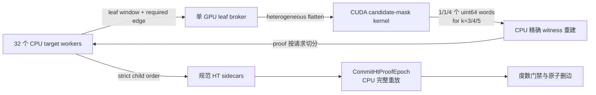

# V3 单 GPU 跨目标 Leaf Broker

## 结论

V3 C1 的第一个跨目标执行版本已经落地：32 个 CPU target workers 可以把不同目标边、不同 required edge 的 transposed leaf windows 交给单个 GPU dispatcher 合批。GPU 不再回传完整 k-opt cost matrix，而是每个 task 只回传“可能严格改善”的规范模板位图；CPU 仍逐个重建和验证命中的 witness，最终删边前再由 epoch commit 完整重放 HT proof。

d15112 的 5 对 clean-commit A/B 表明，该实现已经把单 GPU transposed 搜索推到与当前最佳 CPU transposed 基线基本持平：

- target execution 中位数从 `14,130.933 ms` 降到 `14,001.421 ms`，约 `1.009x`；
- algorithm total 中位数从 `17,960.265 ms` 降到 `17,948.009 ms`，约 `1.001x`；
- 外部 process wall 中位数为 `18,180.282/18,228.316 ms`，比值 `0.997x`，即 GPU 侧约慢 `0.26%`。

这不是显著的端到端加速，更没有达到 `1.25x` 的默认后端采用门槛。当前决策仍是：`wavefront` 保持默认，`transposed` 与 leaf broker 保持 opt-in 研究路径。

## 实现数据流



### 异构 leaf 批处理

`ProvePathSystemsByKOptWithRequiredEdges` 为每个 path system 携带同下标 required edge。内部 cursor 仍保留各自的 outside matching、删边组合位置、逻辑预算和规范枚举顺序；只有同一 `k` 的 cost tasks 在评估时被展平。因此合批不会使一个 target 的短路结果或预算消耗泄漏到另一个 target。

dispatcher 为专用 `jthread`，绑定唯一可见 CUDA ordinal。worker 的 `Evaluate` 是同步请求；dispatcher 一次取走当前 pending 集合，并把物理 batch 指标只记到一个 response，避免重复统计。worker 正常结束、线程创建中途失败和 dispatcher 异常都会更新活跃数或向所有等待者传播同一异常，不留悬挂请求。

最初版本等待全部 active workers 同时到达，d15112 上存在明显的头阻塞。当前改为两请求微批：空闲 dispatcher 最多等两个同步请求，GPU 执行期间新请求自然聚合为下一批。该改动把单次 pilot 的 target execution 从约 `14.37 s` 降到 `13.87–13.99 s`。

### CUDA candidate mask

proper 3/4/5-opt 分别有 `4/25/208` 个规范模板。新 kernel 每 task 使用一个 CTA，每个线程评估一个模板；当 `added_cost < deleted_cost` 时用 `atomicOr` 置位。每 task D2H 从完整矩阵的 `32/200/1,664 bytes` 降到 `8/8/32 bytes`，即分别缩小 `4x/25x/52x`。

public `EvaluateKOptTemplateCosts` 仍保留原来的完整 CPU/CUDA 逐 cell 差分契约；candidate mask 只供内部 broker 使用。单元测试由 CPU 完整矩阵独立构造预期位图，并对 `k=3/4/5` 全部位做精确差分。

### 短路与 speculation

target 内部仍严格按规范 reply 顺序消费结果。固定 `s=4` 使用窗口预取 leaf；窗口内已发出的尾部任务允许完成，但不改变逻辑 states/replies/leaf calls 或 proof。`auto` 已能根据剩余 active workers 在 `1/2/4/8` 之间调节，但 d15112 单次 pilot 比固定 `s=4` 慢，所以正式 A/B 仍使用固定值。

## 安全边界

candidate mask 不是证书，也不能证明“没有改善”。它的两类错误都按以下规则失败关闭：

- 多置一个 bit：CPU 重建后拒绝无效或不严格改善的 witness；
- 少置一个 bit：对应 outside matching 无法被覆盖，leaf 不会 proven，最终保留边。

只有 CPU `TryReconnect` 重建出的 witness 才能进入 leaf proof。broker 内不再对同一 proven leaf 重复运行完整 verifier；但任何图修改之前，`CommitHtProofEpoch` 仍在同一不可变快照上独立重放每份 HT sidecar 及其所有 leaf witness。任何重放失败、快照错配、证书不完整或度数门禁失败都不发布修改。

## d15112 正式 A/B

### 协议

- 实现提交：`4de281c1158095624bb6e513052d3105049e5023`，`git_dirty=0`；
- 主机：`cuda08.ecs.vuw.ac.nz`；单张 RTX A5000 物理 GPU 2；
- CUDA 12.6，驱动 610.43.02，GCC 16.1.1；
- CPU 和 hybrid 各预热一次，五对计时按奇数 CPU→hybrid、偶数 hybrid→CPU 交替；
- 两路都使用 32 target workers；CPU 使用 transposed `s=1`，hybrid 使用单 GPU broker 和 `s=4`；
- JV 固定点后有 159,187 条活动边，扫描最高权重 32 targets，受保护 tour 成本为 1,573,084。

### 端到端结果

| 指标 | CPU 中位数 [P25,P75] (ms) | 单 GPU 中位数 [P25,P75] (ms) | CPU/GPU |
|---|---:|---:|---:|
| target execution | 14,130.933 [14,126.045,14,141.940] | 14,001.421 [13,992.797,14,016.342] | 1.009x |
| algorithm total | 17,960.265 [17,960.115,17,981.235] | 17,948.009 [17,928.554,17,962.602] | 1.001x |
| process wall | 18,180.282 [18,171.696,18,186.243] | 18,228.316 [18,208.634,18,246.235] | 0.997x |
| commit | 3,799.372 [3,794.541,3,805.160] | 3,770.842 [3,754.232,3,778.395] | 1.008x |

按同一 pair 直接计算的 speedup 中位数为 target execution `1.0089x`、algorithm total `1.0010x`、process wall `0.9988x`。比值中位数和配对中位数都表明端到端差异小于 1%，应报告为持平。

### leaf 细分

下表是 32 个并行 target 的分阶段耗时求和，可用于定位热点，不能与 target wall 相加。

| 指标 | CPU 中位数 | 单 GPU 中位数 | CPU/GPU |
|---|---:|---:|---:|
| leaf cost evaluate | 11,472.985 ms | 1,081.705 ms | 10.606x |
| leaf cursor consume | 23,510.054 ms | 4,320.138 ms | 5.442x |
| candidate recheck | 2,994.144 ms | 660.355 ms | 4.534x |
| leaf apply | 19,840.008 ms | 3,025.263 ms | 6.558x |
| leaf setup | 2,976.309 ms | 581.491 ms | 5.118x |
| cost batches | 53,731 | 14,185 | 3.788x 更少 |
| peak device cache | 0 | 343,651 bytes | — |

GPU 规则核本身已经明显快于 CPU。但 hybrid `s=4` 对 19,498 个规范 leaf calls 实际评估了 24,110 个物理 leaf states，比 CPU `s=1` 多 `23.62%`；cost cells 为 53,173,899，比 CPU 的 30,341,506 多 `75.25%`。此外，同步 broker 等待被计入各 target 的 `leaf_ms`，使其求和从 CPU 的 `76.967 s` 增到 GPU 的 `123.689 s`。因此剩余瓶颈是 host continuation、同步等待和投机空洞，不是 candidate-mask kernel 的算力。

### 一致性与可复现性

两次预热和十次计时运行全部保持：

- 19,498 states、35,401 replies、19,498 leaf calls、18 个 committed targets；
- 边集 SHA-256：`2b941082f6931a4039f22f629971385fcfdbed91ddee2f0060e776ccac99442b`；
- 规范 proof SHA-256：`ff40bdf53528230d5f1243b4293fbca91c6741fad62e86b693b74fa7b8ebc3c5`；
- 工作签名 SHA-256：`86c0afd7a053d1cbba2a05ff8f3075326f642c49a61b1876facb526f61a2b3b6`；
- 每次 proof 由 CPU binary 独立重放，每次输出都通过 1,573,084 最优 tour 的零缺边检查。

完整原始结果位于忽略提交的 `artifacts/d15112-v3-single-gpu-ab-20260902T115833Z-3505078/`，其 manifest 记录完整提交、软硬件、GPU UUID、输入哈希和始末 GPU 快照。报告格式为 `CUDAEE_HT_SCAN_REPORT_V19`。

## 与论文 d15112 的关系

论文 Table 7 的 d15112 是完整 Local Elimination 协议：从 166,499 条边降到约 73,850 条边，报告单核 `39.6 s` 与 44 核 `1.9 s`。本次从 JV 后的 159,187 条边中只扫描 32 个 targets，最终只删除 18 条边。

因此，虽然 instance 名称相同，两者的输入阶段、搜索覆盖、输出强度和并行资源都不同，不能用 `18.23 s / 1.9 s` 或 `39.6 s / 18.23 s` 声称减速或加速。当前唯一有效的性能结论是本项目同一 32-target 切片上的 CPU/GPU 配对 A/B。直接论文对齐仍需跑完整 `kh-elim -Jq` 等强度协议，或至少达到约 73,850 条剩余边。

## 验证状态

- CPU Debug CTest `23/23`；
- A5000 `cuda-sm86-release` CTest `26/26`；
- k-opt 与 Hamilton–Tutte `compute-sanitizer --tool memcheck`：均 `0 errors`；
- candidate mask 对 `k=3/4/5` 逐 bit CPU/CUDA 差分；
- 两 worker 单 GPU broker 与 serial transposed 的最终图和序列化 proof 一致；
- `tools/check_workspace.py`、`git diff --check`、benchmark shell 语法和 clean-worktree 门禁通过。

## 下一阶段

1. 把 target 内的同步递归与 leaf 等待改为真正的 continuation ready queue，使一个 target 等 GPU 时 CPU worker 可继续处理其他 ready continuation。
2. 引入 generation/cancellation token，丢弃短路后迟到的 speculative result，然后重新扫描 `s=1/2/4/8`。
3. 只在新画像证明 launch/sync 占比足够高时，才将 ready rounds 固化为 CUDA Graph 或设备常驻 dispatcher。
4. 继续保留 CPU 完整 epoch verifier 作为唯一删边信任边界，不将 candidate mask 或调度 token 序列化为证书。
5. 在局部 32-target 门禁达到至少 `1.25x` 后，再运行完整 d15112 论文对齐协议。

正式复现入口为：

```bash
CUDAEE_CUDA_PRESET=cuda-sm86-release \
CUDAEE_BENCHMARK_TOUR=artifacts/lkh-tours/d15112.opt.tour \
tools/run_v3_transposed_single_gpu_ab.sh d15112 2 5
```
